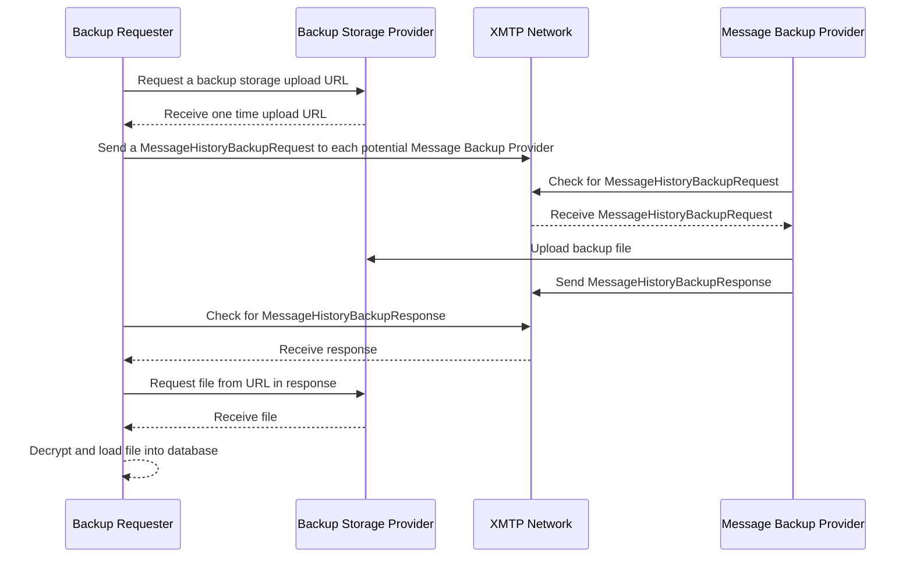

## Abstract

A proposed system for transferring backups of message history between installations as part of XMTP V3.

## Motivation

The current [XMTP V3 Protocol Specification](https://github.com/xmtp/libxmtp) creates a new XMTP identity for each installation associated with a blockchain account, instead of sharing a single set of keys across all installations like V1/V2. New installations will receive all messages sent to a blockchain account after they are created, but V3 does _not_ specify how to receive messages sent before installation creation. Having conversation history sync between devices is a popular feature of V1 and V2 of the XMTP protocol and there is clear demand from developers for this to be possible as part of V3.

There are a number of cases where message history synchronization is desirable:

- User installs App A and starts engaging in conversations. Later, they install App B on the same device and want access to their existing conversations and messages.
- User installs App A and starts engaging in conversations. Later, they install App B (or another copy of App A) on a second device and desire access to their existing conversations and messages.
- User installs App A and starts engaging in conversations. They lose access to the device App A was installed on and purchase a new device. They then need to restore their previous conversations and messages to the new device.
- User installs App A and starts engaging in conversations. App A is later compromised, and they need to migrate their messages and conversations to a different application.

It's also worth noting that there are many use-cases for XMTP where message history synchronization is not necessary or desirable.

- A bot that replies to messages from users. Many bots don't care about messages sent before they were created.
- A service that sends notifications to a list of subscribers via XMTP.
- An application that allows users to talk to customer support only needs access to the newly created conversation with the support agent.
- A marketplace application that wants to allow buyers and sellers to communicate about a particular item. These would only be new conversations and may not care about pre-existing messages.

### Design goals

1. Message history synchronization should not compromise the Forward Secrecy or Post Compromise Security properties of XMTP V3. We expect the majority of consumer applications using XMTP to have some form of message history syncing enabled.
1. Message history synchronization should be opt-in for developers.
1. It should be simple for developers to implement message history synchronization correctly. Implementation work should be focused on application-specific UX choices, with the SDK responsible for core transport and security decisions.
1. Compatibility between applications is expected. Applications should be able to share history irrespective of operating system, SDK version, or device type (web vs mobile vs server).
1. Even if developers of some popular applications choose to not support message history synchronization, it should be simple for users to opt themselves in.

## Specification

This specification offers the user two modes of message backup, which accomodate different use-cases: Remote Message Backups and Backup Account Files. Remote Message Backups are the lowest friction solution, provided the blockchain account has access to another existing installation. Backup Account Files are an emergency solution for cases where the user has lost access to all of their XMTP applications (for example, if they lost the only device they have used to connect to XMTP).

There are three types of actors in this specification: Backup Requesters, Message Backup Providers, and Backup Storage Providers. Backup requesters are XMTP Clients that are missing message history and would like to receive a backup. Message Backup Providers are XMTP Clients that have a message history and are capable of sending it to a requester. These first two types of actors are XMTP Clients, and the implementation required to fulfill the responsibilities of both roles would be built into `libxmtp`. The Backup Storage Provider is a remote service responsible for temporarily storing backup files, and is only needed for Remote Message Backups.

### Remote Message Backups

Remote message backups work by Backup Requesters sending a special message type (`MessageHistoryBackupRequest`) across the XMTP network to all other installations signed by the same blockchain account as the sender (Message Backup Providers). Upon receipt of these messages, Message Backup Providers should display a prompt to the user asking whether they consent to share their message history with the requesting installation. Upon approval, the application will convert their local database into a standard Message History Backup File and upload it to the Backup Storage Provider specified in the `MessageHistoryBackupRequest`.

For mobile applications already handling push notifications, `MessageHistoryBackupRequest`s would become a special case of push notification handling.

#### Flow for Backup Requesters

1. Get a list of all other installations associated with their blockchain account. Ignore any installations that have been revoked
2. Obtain a one-time upload URL from the Backup Storage Provider for each installation
3. Generate a `MessageHistoryBackupRequest` for each installation (see below for Protobuf spec) and store in the local database
4. Send the `MessageHistoryBackupRequest` messages to the normal inbound messaging topic for each installation
5. Wait for a response from any of the Message Backup Providers
6. For each `MessageHistoryBackupResponse`

   6a. Ensure there is a `MessageHistoryBackupRequest` with a matching `requestId` stored in the database. If not, ignore

   6b. Ensure the `backupUrl` is on the same host as the requested `backupStorageProviderUploadUrl`. If not, ignore

   6c. Download the file from the `backupUrl` and decrypt using the credentials provided in the `MessageHistoryBackupResponse`. If the hash of the downloaded file does not match the hash in the `MessageHistoryBackupResponse`, abort.

   6d. Load each message into the local database, ignoring any duplicate messages

   6e. Delete the `MessageHistoryBackupResponse` and all associated credentials

   6f. Set the status of the `MessageHistoryBackupRequest` to `Applied`

#### Flow for Message Backup Providers

1. Receive a `MessageHistoryBackupRequest` as part of normal message receiving flow
1. Retrieve the contact for the installation that sent the message, and ensure that it has not been revoked. If revoked, ignore.
1. Ensure that the installation that sent the message has a contact signed by the same blockchain account as the current user. If not, ignore.
1. Convert all messages in the local database into a Message Backup File (maybe we want to chunk here?)
1. Generate ephemeral encryption key, salt, and nonce. Encrypt the file using these keys
1. Upload the file to the `backupStorageProviderUploadUrl` from the request
1. Reply to the message with a `MessageHistoryBackupResponse` containing the encryption details, the hash of the backup file, and the `backupUrl` provided by the Backup Storage Provider
1. Delete the `MessageHistoryBackupRequest`, the local database dump, and all the encryption keys.

#### End-to-end flow



### Backup Account Files

Backup account files are designed as a solution for users who have lost access to all of their XMTP applications. To create a Backup Account File, an application will generate a new set of XMTP keys and register the installation on the XMTP network. The installation contact published to the network will be set with a type of `backup`, which instructs all well-behaved clients to disregard any messages from this installation other than `MessageHistoryBackupResponse`s. This means that a compromised backup installation cannot be used to send messages on the user's behalf, which makes these files a less valuable target for attack.

Once a backup account's contact has been published to the network, their installation messaging topic will receive a copy of all new messages sent to the associated blockchain account.

The newly generated XMTP keys are encrypted and downloaded to the user's device. They may be encrypted by either a passphrase or a wallet signature. Users or applications may decide to store the Backup Account File in a private cloud storage provider (iCloud, Google Drive, etc). Or the file could simply be stored on-device with the risk of loss if the device was inaccessible.

It is recommended - but not required - that applications provide an easy method to generate a Backup Account File.

We may want to consider making backup client's contact bundle signed by the identity key of the installation that created it instead of a wallet. This removes the need for an additional wallet signature. Ownership could still be determined by following the chain of signatures back to the original wallet. This would make revocation more complicated - we would want to revoke the backup account alongside the parent account - but should be possible. We would have to be careful to ensure that backups could still be restored even if the main account was compromised.

#### Restoring from a Backup Account File directly

A client application can allow a user to restore from a Backup Account File directly, using the following steps:

1. Load the Backup Account File from disk
1. Create a temporary client instance with a new location for the database
1. Call `receive` on the temporary client instance to download all messages stored on the network.
1. Convert all messages into a Message Backup File
1. Import the Message Backup File into the main account's database
1. Delete the database associated with the temporary client instance and the Message Backup File

While some applications may choose to support Backup Account Files directly, we can also offer means to convert Backup Account Files into Remote Message Backups. This allows developers to support all possible backup scenarios simply by supporting the more common Remote Message Backups.

#### Converting a Backup Account File to a Remote Message Backup

XMTP Labs should create a simple web application to convert Backup Account Files to Remote Message Backups. In this application a user could import their Backup Account File (with the file never leaving their machine), and create a temporary client instance with that backup file. The user would be presented with any outstanding `MessageHistoryBackupRequests`, and select any backup requests they would like to fulfill. The client would download all unread messages from the network and proceed with the regular Message Backup Provider flow for Remote Message Backups. All data would be cleared from the client as soon as the operation was completed.

This same web application could be used to create Backup Account Files for cases where a user's preferred XMTP application does not support creating Backup Account Files itself. This means every user on the XMTP network is able to create a Backup Account File if desired.

### Backup Storage Provider

A Backup Storage Provider is a simple HTTP service with three endpoints. Anyone can implement a Backup Storage Provider. It is up to the Backup Requester application to choose the Backup Service Provider for their application.

These are the required APIs for a minimal Backup Storage Provider:

`POST /backups`:
Example response:

```json
{
  "uploadUrl": "https://backupproviderdomain.com/backups/some-long-unguessable-upload-id"
}
```

`POST /backups/$UPLOAD_ID`:
Example response:

```json
{
  "downloadUrl": "https://backupproviderdomain.com/backups/some-long-unguessable-download-id"
}
```

`GET /backups/$DOWNLOAD_ID`:
Returns the uploaded file matching the ID

It would be the responsibility of the Backup Storage Provider to authenticate requests to `/backups` and mitigate abuse. Uploaded files would only need to be stored for maybe 72 hours before they could be safely purged, as backups are meant to be temporary storage. We could also just delete the file after it had been downloaded once.

XMTP Labs would provide a reference implementation of a Backup Storage Provider.

I am also proposing that XMTP Labs runs a Backup Storage Provider as a free public good for the next 2 years, at which point this functionality becomes a part of an ecosystem of third party gateway service providers.

### Changes to `libxmtp`

```rust
impl Client<A> {
    ...
    /**
    Methods for Backup Requesters
    **/
    pub fn requesRemotetMessageHistoryBackup(&self) -> Result<Vec<MessageHistoryBackupRequest>, ClientError> {
        // Create and send a MessageHistoryBackupRequest to all other installations associated with the current blockchain account
        ...
    }

    pub fn getRemoteMessageHistoryBackupRequestStatus(&self, requestId: String) -> Result<BackupHistoryRequestStatus, ClientError> {
        // Get the status of a pending backup request
        ...
    }

    pub fn applyRemoteMessageHistoryBackup(&self, requestId: String) -> Result<(), BackupApplyError> {
        // Applies the following steps:
        // 1. Look for the matching MessageHistoryBackupResponse and MessageHistoryBackupRequest in the database
        // 2. If either are not found, return `ResponseNotFound`
        // 3. Download the backup from the URI specified in the MessageHistoryBackupResponse
        // 4. Decrypt the backup using the keys specified in the MessageHistoryBackupResponse
        // 5. Run applyMessageHistoryBackupFromFile with the decrypted file
        // 6. Delete the MessageHistoryBackupResponse from the local database, removing all sensitive key material
        // 7. Set the MessageHistoryBackupRequest status to Applied
        ...
    }

    pub fn applyMessageHistoryBackupFromFile(&self, file: std::fs::File) -> Result<(), BackupApplyError> {
        // Read from the file line by line and add each message to the database. If message already exists, skip it and move on to the next line
    }

    /**
    Methods for Message Backup Providers
    **/
    pub fn listInboundBackupRequests(&self) -> Result<Vec<MessageHistoryBackupRequest>, ClientError> {
        // Return all pending backup requests.
        ...
    }

    pub fn respondToBackupRequest(&self, requestId: String, approve: bool) -> Result<(), BackupCreateError> {
        // Perform the following steps:
        // 1. If approve is false, delete the MessageHistoryBackupRequest from the local database and return
        // 2. Dump all messages from the database into a correctly encoded MessageHistoryBackupFile format
        // 3. Generate a random encryption key, nonce, and salt
        // 4. Encrypt the file using the encryption parameters from step 2.
        // 5. Upload the file to the provided `backupStorageProviderUploadUrl`
        // 6. Send a message over the XMTP network containing the encryption parameters and the `backupUrl` returned from the backup storage provider
        // 7. Delete the backup request from the database and return
        ...
    }

    /**
    Methods for Backup Account Files
    **/
    pub fn createBackupAccountFile(&self, path: String) -> Result<(), BuckupCreateError> {
        // Create a file with a new account's private keys and return the contents of the file
        ...
    }

    pub fn importFromBackupAccountFile(&self, path: String) -> Result<(), BackupApplyError> {
        // Load the file from the path, spin up a temporary client with the account keys, download all messages, and create a new Message Backup File
        // Technically we could simplify this to just load the messages directly into the database without the intermediate file, but I like the idea of reducing surface area and re-using as much code as possible from the remote option
        ...
    }
}

pub struct MessageHistoryBackupRequest {
    pub requestId: String,
    pub verificationPin: i16, // A four digit PIN that can be displayed in both the Backup Requester app and the Backup Provider app to ensure the user is responding to the correct backup request
    pub backupStorageProviderUploadUrl: String,
    pub status: BackupRequestStatus

    ... // a bunch of likely private fields with encryption information
}

pub struct MessageHistoryBackupResponse {
    pub requestId: String,
    pub verificationPin: i16,
    backupUrl: String,
    encryptionKey: Vec<u8>,
    nonce: Vec<u8>,
    salt: Vec<u8>,
    backupFileHash: Vec<u8>,
    expirationTimeNs: u8
}

pub enum BackupRequestStatus {
    Pending,
    Expired,
    Applied,
    Failed
}

pub enum BackupApplyError {
    ResponseNotFound,
    DecryptionFailed,
    ValidationFailed,
}

pub enum BackupCreateError {
    RequestNotFound,
    InvalidRequest,
    NetworkError,
    EncryptionError
}
```

## Rationale

There are many other potential solutions to message portability listed below. I am proposing this particular solution because it solves the key user problems stated above with the minimal amount of developer friction. Many of the alternatives require substantial cooperation from application developers, who may care more about shipping new features than supporting competing applications. Developers have strong incentives to receive backups, but limited incentives to provide them.

### Alternatives considered

#### Use the XMTP Network as a Backup Storage Provider

Instead of storing backups in a remotely hosted file and serving via HTTP, messages would be divided into chunks and stored on the XMTP network on a special topic only known to the participants in the backup message exchange.

##### XMTP Network Advantages

- No new infrastructure required. Everything stays on the XMTP network

##### XMTP Network Disadvantages

- The XMTP network was not designed for storage of large files. The network currently has a 1mb per message limit, so backups would be divided across potentially hundreds of chunks.
- Costly as the network decentralizes and fees are added to the network. Given that alternative storage providers can be used in the current proposal, the benefits to decentralization are limited.

I could get on board with this proposal if others felt strongly that we shouldn't create new infrastructure. While backups are a bit of an odd fit for the XMTP transport network, it would work in the short term and would be easier to bootstrap.

#### Use a QR code instead of an XMTP message

Following in the footsteps of Signal, message history synchronization could be achieved as a synchronous exchange of data between clients.

A QR code displayed in the Message Backup Provider, could establish an encrypted channel with the Backup Requester. This model follows a flow similar to WalletConnect. Deep links would be used for app -> app transfers.

Messages would be encrypted using either an [N](https://noiseexplorer.com/patterns/X/) or [X](https://noiseexplorer.com/patterns/X/) pattern Noise handshake, with the bootstrap information encoded in the QR for out-of-band transmission. This channel would be private and ephemeral, offering the best protection for backups.

##### QR Code Advantages

- Does not require any additional installations to be added to the user's account
- Could be combined with the Backup Account File approach if desired, to handle cases where the Message Backup Provider is inaccessible

##### QR Code Disadvantages

- QR codes are most appropriate for cases where there isn't an authenticated and private communication channel between parties. That isn't the problem here. We already have a solution for authenticated and secure messaging between two installations as part of V3.
- All participating applications would have to be able to handle the QR code flow. This requires more complicated front-end designs that every application needs to implement, as well as access to a camera in some cases. This could be enough to discourage developers from implementing their side of the flow.
- Would require mobile application developers to handle XMTP deep links for app -> app transfer. This gets complicated when there are multiple potential applications as backup providers. The Backup Requester would need to be aware of all possible Backup Provider apps and the user would have to select the right one.
- Would need to be rethought for webapp -> server transfer
- Would need to be rethought for webapp -> webapp transfers where QR code scanning and deep-linking are not possible. Maybe something closer to oAuth.

#### Trusted Backup Service

This approach is similar to the Backup Account File, but the backup account would be run on a server and listen for new messages continuously. Messages could be added to an archive in real-time, and backups could be served to any application that provided appropriate authentication over HTTP or XMTP protocols.

##### Trusted Service Advantages

- Continuous real-time backup of all messages after the service is created. Backups would continue even if all of a user's devices were lost or compromised.
- No need to involve any other applications in backup process. User would have complete control over where their backups were stored
- Users could self-host trusted services

##### Trusted Service Disadvantages

- The service provider could read all messages as they come off the network. Even if they were encrypted at rest, there is significant risk of compromise.
- More costly to run than the Backup Account File, since it requires server resources to be continuously polling/streaming from the network.
- Multi-tenant providers could be legally compelled to provide access to user's messaging history or otherwise spy on users.
- Self hosting with a high level of security would be a high bar and might be prohibitive for all but the most committed users.
- Nothing is stopping users from doing this under any scenario. The trusted server would just be a client. If there is demand for this, someone will build it regardless.

## Backward compatibility

Given that V3 is brand new, there is no risk of backwards incompatible changes with the initial release of this feature.

Caution should be taken in the design of the Message Backup File format to ensure that it is flexible and compatible with other potential changes. Any fields that may have changing data formats should be self-describing and versioned for backwards/forwards compatibility.

## Reference implementation

TODO

## Security considerations

### Risks and drawbacks to Remote Message Backups

- Developers of the Message Backup Provider could implement the consent flow in a way that confuses users into accepting backup requests from malicious applications. PIN verification may not be implemnted across all providers
- Bugs in the validation of requests in Message Backup Providers would be very very bad. This would need to be very well tested code, since a compromise here would effectively be a 0-click exploit of someone's XMTP account.

### Risks and drawbacks to Backup Account Files

- Because the account stored in a Backup Account File never sends messages, all messages sent to the account will be encrypted using a one time prekey with no ratcheting. A single ratchet step could happen each time a backup was created since the account is briefly online, although this would require the user to replace their Backup Acount File with a new one containing the current ratchet state.
- Accounts in the Backup Account File will only be online during backup restoration. This means there are few opportunities to generate new one time prekeys. This may be mitigated by creating a very large number of one-time prekeys as part of creation.
- This approach relies on the XMTP network allowing messages to remain in pre-delivery storage indefinitely. While that works today, in future iterations of the network this may be cost prohibitive.
- Applications creating Backup Account Files would need to handle interacting with the device filesystem or cloud storage providers. For mobile applications this may require extra permissions.
- If Backup Account Files were accessed, and it's encryption keys were compromised, the attacker would have access to all historical messages

## Copyright

Copyright and related rights waived via [CC0](https://creativecommons.org/publicdomain/zero/1.0/).
