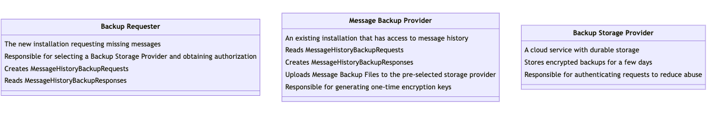
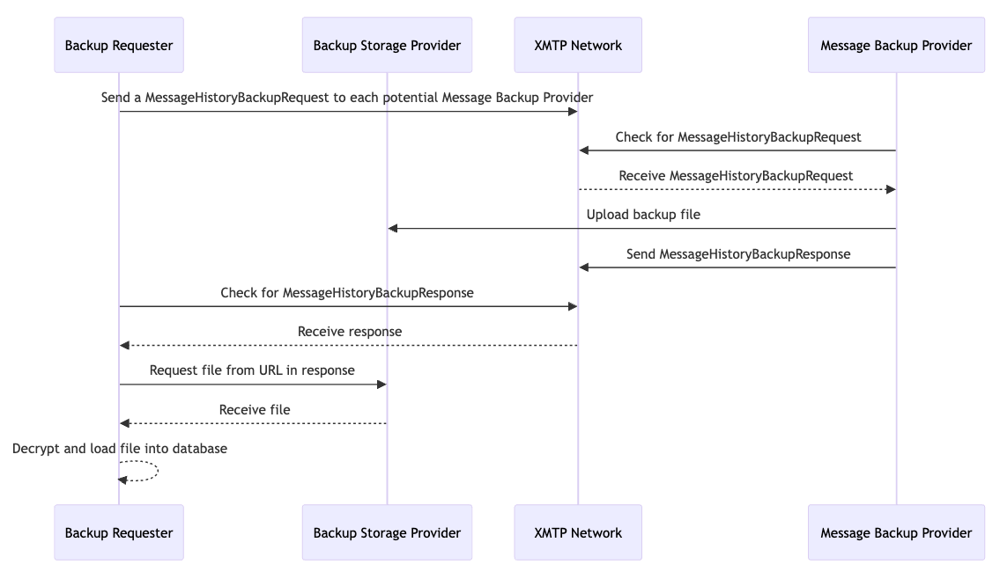

## Abstract

This XIP proposes a system for transferring message history between app installations as part of XMTP V3.

## Motivation

The [XMTP V3 Protocol Specification](https://github.com/xmtp/libxmtp/blob/main/TECHNICAL_OVERVIEW.md) creates a new XMTP identity for each installation associated with a blockchain account instead of sharing a single set of keys across all installations like V1/V2. New installations will receive all messages sent to a blockchain account after they are created, but V3 does _not_ specify how to receive messages sent before installation creation. Having conversation history sync between devices is a popular feature of V1 and V2 of the XMTP protocol and there is clear demand from developers for this to be possible as part of V3.

There are a number of cases where message history synchronization is desirable:

- User installs App A and starts engaging in conversations. Later, they install App B on the same device and want access to their existing conversations and messages.
- User installs App A and starts engaging in conversations. Later, they install App B (or another copy of App A) on a second device and desire access to their existing conversations and messages.
- User installs App A and starts engaging in conversations. They lose access to the device App A was installed on and purchase a new device. They then need to restore their previous conversations and messages to the new device.
- User installs App A and starts engaging in conversations. App A is later compromised, and they need to migrate their messages and conversations to a different app.

It's also worth noting that there are many use cases for XMTP where message history synchronization is not necessary or desirable.

- A bot that replies to messages from users. Many bots don't care about messages sent before they were created.
- A service that sends notifications to a list of subscribers via XMTP.
- An app that allows users to talk to customer support needs access to only the newly created conversation with the support agent.
- A marketplace app that wants to allow buyers and sellers to communicate about a particular item. These would only be new conversations and may not care about preexisting messages.

### Design goals

1. Message history synchronization should not compromise the Forward Secrecy or Post Compromise Security properties of XMTP V3. We expect the majority of consumer apps using XMTP to have some form of message history syncing enabled.
1. Message history synchronization should be opt-in for developers.
1. It should be simple for developers to implement message history synchronization correctly. Implementation work should be focused on app-specific UX choices, with the SDK responsible for core transport and security decisions.
1. Compatibility between apps is expected. Apps should be able to share history irrespective of operating system, SDK version, or device type (web vs. mobile vs. server).
1. Even if developers of some popular apps choose to not support message history synchronization, it should be simple for users to opt-in to enable it for themselves.

## Specification

This specification offers the user two modes of message backup, which accommodate different use cases:

- Remote Message Backups  
  This is the lowest friction solution, provided the blockchain account has access to another existing installation.

- Backup Account Files  
  This is an emergency solution for cases where the user has lost access to all of their XMTP apps (for example, if they lost the only device they have used to connect to XMTP).

### Actors

There are three types of actors in this specification. The first two types of actors are XMTP Clients, and the implementation required to fulfill the responsibilities of both roles would be built into `libxmtp`.

- Backup requesters  
  These are XMTP Clients that are missing message history and would like to receive a backup.

- Message Backup Providers  
  These are XMTP Clients that have a message history and are capable of sending it to a requester.

- Backup Storage Provider  
  This is a remote service responsible for temporarily storing backup files, and is only needed for Remote Message Backups.



### Remote Message Backups

Remote message backups work by having Backup Requesters send a special message type (`MessageHistoryBackupRequest`) across the XMTP network to all other installations signed by the same blockchain account as the sender (Message Backup Providers).

Upon receipt of these messages, Message Backup Providers should display a prompt to the user asking whether they consent to share their message history with the requesting installation. The prompt should display the Verification PIN from the request, which will also be displayed in the Backup Requester's app to ensure the user approves the correct request. Some apps may choose to force the user to enter the PIN rather than display it as an additional layer of security.

Upon approval, the app will convert its local database into a standard Message History Backup File, encrypt it, and upload it to the Backup Storage Provider specified in the `MessageHistoryBackupRequest`.

For mobile apps already handling push notifications, `MessageHistoryBackupRequest`s would become a special case of push notification handling.

#### Flow for Backup Requesters

1. Get a list of all other installations associated with their blockchain account. Ignore any installations that have been revoked
2. Generate a `MessageHistoryBackupRequest` for each installation (see below for Protobuf spec) and store in the local database
3. Send the `MessageHistoryBackupRequest` messages to the normal inbound messaging topic for each installation
4. Wait for a response from any of the Message Backup Providers
5. For each `MessageHistoryBackupResponse`

   5a. Ensure there is a `MessageHistoryBackupRequest` with a matching `requestId` stored in the database. If not, ignore.

   5b. Download the file from the `backupUrl` and decrypt using the credentials provided in the `MessageHistoryBackupResponse`.

   5c. Load each message into the local database, ignoring any duplicate messages.

   5d. Delete the `MessageHistoryBackupResponse` and all associated credentials.

   5e. Set the status of the `MessageHistoryBackupRequest` to `Applied`.

#### Flow for Message Backup Providers

1. Receive a `MessageHistoryBackupRequest` as part of the normal message receiving flow.
1. Retrieve the contact for the installation that sent the message and ensure it has not been revoked. If revoked, ignore.
1. Ensure the installation that sent the message has a contact signed by the same blockchain account as the current user. If not, ignore.
1. Convert all messages in the local database into a Message Backup File
1. Generate ephemeral encryption key, salt, and nonce. Encrypt the file using these keys.
1. Upload the file to the `backupStorageProviderUploadUrl` from the request.
1. Reply to the message with a `MessageHistoryBackupResponse` containing the encryption details and the `backupUrl` provided by the Backup Storage Provider.
1. Delete the `MessageHistoryBackupRequest`, the local database dump, and all the encryption keys.

#### End-to-end flow



### Backup Account Files

Backup account files are designed as a solution for users who have lost access to all of their XMTP apps. To create a Backup Account File, an app will generate a new set of XMTP keys and register the installation on the XMTP network. The installation contact published to the network will be set with a type of `backup`, which instructs all well-behaved clients to disregard any messages from this installation other than `MessageHistoryBackupResponse`s. This means that a compromised backup installation cannot be used to send messages on the user's behalf, which makes these files a less valuable target for attack.

Once a backup account's contact has been published to the network, their installation messaging topic will receive a copy of all new messages sent to the associated blockchain account.

The newly generated XMTP keys are encrypted and downloaded to the user's device. They may be encrypted by either a passphrase or a wallet signature. Users or apps may decide to store the Backup Account File in a private cloud storage provider (iCloud, Google Drive, etc.). Or the file could simply be stored on-device with the risk of loss if the device was inaccessible.

It is recommended, but not required, that apps provide an easy method to generate a Backup Account File.

We may want to consider making a backup client's contact bundle signed by the identity key of the installation that created it instead of a wallet. This removes the need for an additional wallet signature. Ownership could still be determined by following the chain of signatures back to the original wallet. This would make revocation more complicated. We would want to revoke the backup account alongside the parent account, but it should be possible. We would have to be careful to ensure that backups could still be restored even if the main account was compromised.

#### Restoring from a Backup Account File directly

A client app can allow a user to restore from a Backup Account File directly using the following steps:

1. Load the Backup Account File from disk.
1. Create a temporary client instance with a new location for the database.
1. Call `receive` on the temporary client instance to download all messages stored on the network.
1. Convert all messages into a Message Backup File.
1. Import the Message Backup File into the main account's database.
1. Delete the database associated with the temporary client instance and the Message Backup File.

While some apps may choose to support Backup Account Files directly, we can also offer means to convert Backup Account Files into Remote Message Backups. This allows developers to support all possible backup scenarios simply by supporting the more common Remote Message Backups.

#### Converting a Backup Account File into a Remote Message Backup

Ephemera should create a simple web app to convert Backup Account Files into Remote Message Backups. In this app, a user could import their Backup Account File (with the file never leaving their machine) and create a temporary client instance with that backup file. The user would be presented with any outstanding `MessageHistoryBackupRequests` and select any backup requests they want to fulfill. The client would download all unread messages from the network and proceed with the regular Message Backup Provider flow for Remote Message Backups. All data would be cleared from the client as soon as the operation was completed.

This same web app could be used to create Backup Account Files for cases where a user's preferred XMTP app does not support creating Backup Account Files. This means every user on the XMTP network can create a Backup Account File if desired.

### Backup Storage Provider

A Backup Storage Provider is a simple HTTP service with two endpoints. Anyone can implement a Backup Storage Provider. It is up to the Backup Requester app to choose the Backup Service Provider for their app.

These are the required APIs for a minimal Backup Storage Provider:

`POST /upload`:
Request body would contain the file as multipart/form-data.

Example response:

```json
{
  "downloadUrl": "https://backupproviderdomain.com/files/some-long-unguessable-download-id"
}
```

`GET /files/$DOWNLOAD_ID`:
Returns the uploaded file matching the ID

It would be the responsibility of the Backup Storage Provider to authenticate requests to `/upload` and mitigate abuse. Uploaded files would only need to be stored for maybe 72 hours before they could be safely purged, as backups are meant to be temporary storage. We could also just delete the file after it had been downloaded once.

Ephemera would provide a reference implementation of a Backup Storage Provider.

I am also proposing that Ephemera run a Backup Storage Provider as a free public good for the next two years, at which point this functionality would become part of an ecosystem of third-party gateway service providers.

### Changes to the v3 protocol buffers

#### [Message Protos](https://github.com/xmtp/proto/blob/xmtpv3/proto/v3/message_contents/message.proto)

```proto
// Initiator or new installation id requesting a history will send a request
message MessageHistoryRequest {
  // Unique identifier for each request
  string request_id = 1;
  // Ensures a human is in the loop
  string pin_code = 2;
}

// Pre-existing installation id capable of supplying a history sends this reply
message MessageHistoryReply {
  // Must match an existing request_id from a message history request
  string request_id = 1;
  // Where the messages can be retrieved from
  string url = 2;
  // Generated input 'secret' for the AES Key used to encrypt the message-bundle
  MessageHistoryKeyType encryption_key = 3;
}

// Key used to encrypt the message-bundle
message MessageHistoryKeyType {
  oneof key {
    bytes chacha20_poly1305 = 1;
  }
}
```

#### [Contact protos](https://github.com/xmtp/proto/blob/xmtpv3/proto/v3/message_contents/public_key.proto)

```proto

enum ContactRole {
    UNKNOWN_CONTACT_ROLE = 0;
    FULL = 1;
    BACKUP = 2;
}

message VmacInstallationPublicKeyBundleV1 {
    VmacAccountLinkedKey identity_key = 1;
    VmacInstallationLinkedKey fallback_key = 2;
    // NEW FIELD
    ContactRole contact_role = 3;
}

// A wrapper for versions of the installation contact bundle to allow
// upgradeability
message InstallationContactBundle {
    oneof version {
        VmacInstallationPublicKeyBundleV1 v1 = 1;
    }
}
```

### Changes to `libxmtp`

```rust
pub enum MessageHistoryError {
    #[error("pin not found")]
    PinNotFound,
    #[error("pin does not match the expected value")]
    PinMismatch,
    #[error("IO error: {0}")]
    IO(#[from] std::io::Error),
    #[error("Serialization/Deserialization Error {0}")]
    Serde(#[from] serde_json::Error),
    #[error("AES-GCM encryption error")]
    AesGcm(#[from] aes_gcm::Error),
    #[error("reqwest error: {0}")]
    Reqwest(#[from] reqwest::Error),
    #[error("storage error: {0}")]
    Storage(#[from] StorageError),
    #[error("type conversion error")]
    Conversion,
    #[error("utf-8 error: {0}")]
    UTF8(#[from] std::str::Utf8Error),
    #[error("client error: {0}")]
    Client(#[from] ClientError),
    #[error("group error: {0}")]
    Group(#[from] GroupError),
    #[error("request ID of reply does not match request")]
    ReplyRequestIdMismatch,
    #[error("reply already processed")]
    ReplyAlreadyProcessed,
    #[error("no pending request to reply to")]
    NoPendingRequest,
    #[error("no reply to process")]
    NoReplyToProcess,
    #[error("generic: {0}")]
    Generic(String),
    #[error("missing history sync url")]
    MissingHistorySyncUrl,
    #[error("invalid history message payload")]
    InvalidPayload,
    #[error("invalid history bundle url")]
    InvalidBundleUrl,
}

// client methods for message history
impl Client<A> {
    // Get the sync group for the client
    pub fn get_sync_group(&self) -> Result<MlsGroup, GroupError> {}

    // Enable message history sync for the client
    pub async fn enable_history_sync(&self) -> Result<(), GroupError> {}

    // Send a history request to the network
    pub async fn send_history_request(&self) -> Result<(String, String), MessageHistoryError> {}

    // Send a history reply to the network
    pub async fn send_history_reply(
        &self,
        contents: MessageHistoryReply,
    ) -> Result<(), MessageHistoryError> {}

    // Get the latest pending history request
    pub async fn get_pending_history_request(
        &self,
    ) -> Result<Option<(String, String)>, MessageHistoryError> {}

    // Reply to the latest pending history request
    pub async fn reply_to_history_request(
        &self,
    ) -> Result<MessageHistoryReply, MessageHistoryError> {}

    // Get the latest history reply
    pub async fn get_latest_history_reply(
        &self,
    ) -> Result<Option<MessageHistoryReply>, MessageHistoryError> {}

    // Process the latest history reply
    pub async fn process_history_reply(&self) -> Result<(), MessageHistoryError> {}

    // Verify a PIN for a history request
    pub fn verify_pin(
        &self,
        request_id: &str,
        pin_code: &str,
    ) -> Result<(), MessageHistoryError> {}
}

pub enum BackupRequestStatus {
    Pending,
    Expired,
    Applied,
    Failed
}
```

## Rationale

There are many other potential solutions to message portability listed below. I am proposing this particular solution because it solves the key user problems stated above with the minimal amount of developer friction. Many of the alternatives require substantial cooperation from app developers, who may care more about shipping new features than supporting competing apps. Developers have strong incentives to receive backups but limited incentives to provide them.

### Alternatives considered

#### Use the XMTP Network as a Backup Storage Provider

Instead of storing backups in a remotely hosted file and serving via HTTP, messages would be divided into chunks and stored on the XMTP network on a special topic only known to the participants in the backup message exchange.

##### XMTP Network Advantages

- No new infrastructure required. Everything stays on the XMTP network

##### XMTP Network Disadvantages

- The XMTP network was not designed for storage of large files. The network currently has a 1MB per message limit so backups would be divided across potentially hundreds of chunks.
- Costly as the network decentralizes and fees are added to the network. Given that alternative storage providers can be used in the current proposal, the benefits to decentralization are limited.

#### Use a QR code instead of an XMTP message

Following in the footsteps of Signal, message history synchronization could be achieved as a synchronous exchange of data between clients.

A QR code displayed in the Message Backup Provider could establish an encrypted channel with the Backup Requester. This model follows a flow similar to WalletConnect. Deep links would be used for app -> app transfers.

Messages would be encrypted using an [N](https://noiseexplorer.com/patterns/X/) or [X](https://noiseexplorer.com/patterns/X/) pattern Noise handshake, with the bootstrap information encoded in the QR for out-of-band transmission. This channel would be private and ephemeral, offering the best protection for backups.

##### QR Code Advantages

- Does not require any additional installations to be added to the user's account
- Ensures the Backup Requester and Message Backup Provider are in the same room (QR code) or on the same device (deep link)

##### QR Code Disadvantages

- QR codes are most appropriate for cases where there isn't an authenticated and private communication channel between parties. That isn't the problem here. We already have a solution for authenticated and secure messaging between two installations as part of V3.
- All participating apps would have to be able to handle the QR code flow. This requires more complicated front-end designs that every app needs to implement, as well as access to a camera in some cases. This could be enough to discourage developers from implementing their side of the flow.
- Would require mobile app developers to handle XMTP deep links for app -> app transfer. This gets complicated when there are multiple potential apps as backup providers. The Backup Requester would need to be aware of all possible Backup Provider apps and the user would have to select the right one.
- Would need to be rethought for webapp -> server transfer
- Would need to be rethought for webapp -> webapp transfers where QR code scanning and deep-linking are not possible. Maybe something closer to oAuth.

#### Trusted Backup Service

This approach is similar to the Backup Account File, but the backup account would be run on a server and listen for new messages continuously. Messages could be added to an archive in real-time, and backups could be served to any app that provided appropriate authentication over HTTP or XMTP protocols.

##### Trusted Service Advantages

- Continuous real-time backup of all messages after the service is created. Backups would continue even if all of a user's devices were lost or compromised.
- No need to involve any other apps in the backup process. The user would have complete control over where their backups were stored
- Users could self-host trusted services

##### Trusted Service Disadvantages

- The service provider could read all messages as they come off the network. Even if they were encrypted at rest, there is a significant risk of compromise.
- More costly to run than the Backup Account File since it requires server resources to be continuously polling/streaming from the network.
- Multi-tenant providers could be legally compelled to provide access to users' messaging history or otherwise spy on users.
- Self-hosting with a high level of security would be a high bar and might be prohibitive for all but the most committed users.
- Nothing is stopping users from doing this under any scenario. The trusted server would just be a client. If there is demand for this, someone will build it regardless.

## Backward compatibility

Given that V3 is brand new, there is no risk of backward incompatible changes with the initial release of this feature.

Caution should be taken in the design of the Message Backup File format to ensure that it is flexible and compatible with other potential changes. Any fields that may have changing data formats should be self-describing and versioned for backward/forward compatibility.

## Reference implementation

Message History Server: [https://github.com/xmtp/xmtp-message-history-server](https://github.com/xmtp/xmtp-message-history-server)

LibXMTP implementation: [https://github.com/xmtp/libxmtp/blob/main/xmtp_mls/src/groups/message_history.rs](https://github.com/xmtp/libxmtp/blob/main/xmtp_mls/src/groups/message_history.rs)

## Security considerations

### Risks and drawbacks to Remote Message Backups

- Developers of the Message Backup Provider could implement the consent flow in a way that confuses users into accepting backup requests from malicious apps. PIN verification may not be implemented across all providers
- A malicious Message Backup Provider could choose to censor messages in the backup or add spoofed messages since the messages in the backup are unauthenticated.
- Bugs in the validation of requests in Message Backup Providers would be very, very bad. This would need to be very well-tested code since a compromise here would effectively be a 0-click exploit of someone's XMTP account.

### Risks and drawbacks to Backup Account Files

- Because the account stored in a Backup Account File never sends messages, all messages sent to the account will be encrypted using a one-time prekey with no ratcheting. A single ratchet step could happen each time a backup was created since the account is briefly online, although this would require the user to replace their Backup Account File with a new one containing the current ratchet state.
- Accounts in the Backup Account File will only be online during backup restoration. This means there are few opportunities to generate new one-time prekeys. This may be mitigated by creating a very large number of one-time prekeys as part of creation.
- This approach relies on the XMTP network allowing messages to remain in pre-delivery storage indefinitely. While that works today, in future iterations of the network, this may be cost-prohibitive.
- Apps creating Backup Account Files would need to handle interacting with the device filesystem or cloud storage providers. For mobile apps, this may require extra permissions.
- If Backup Account Files were accessed and their encryption keys were compromised, the attacker would have access to all historical messages.

### Risks and drawbacks to Backup Storage Providers

- Offering free storage on the internet has the potential for abuse. Requests to this service should be rate-limited or otherwise protected against attack.

## Copyright

Copyright and related rights waived via [CC0](https://creativecommons.org/publicdomain/zero/1.0/).
