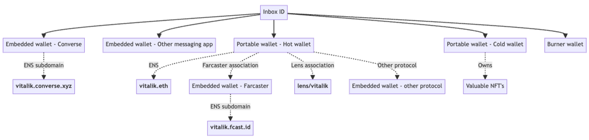

## Abstract

This XIP defines a new identity model for XMTP, where users are represented in the protocol by an Inbox ID rather than a wallet address. Additionally, it defines mechanisms for associating multiple addressable identities, including wallets, to this new identity.

## Motivation

Within the Ethereum ecosystem, security concerns have led to the widespread use of burner wallets, while UX abstractions have led to the creation of non-portable, embedded wallets inside apps. Increasingly, users are likely to possess multiple wallets and perhaps even identities outside of an EVM chain.

In this world, the user would ideally be contactable via any identity they possess and be able to authenticate to the same inbox via any of these identities to apps on the XMTP network.



To facilitate this, XMTP must establish a binding between an XMTP Inbox ID and multiple wallet addresses, with a public API for retrieving them (described in [Identity log](#inbox-log)). In the diagram above, XMTP will resolve the solid lines, whereas the dotted lines will continue to be resolved by the implementing app, outside of XMTP - for example, using services such as Airstack. All wallets sharing an Inbox ID share an inbox.

When messaging a user by name, the implementing app will resolve from name to Inbox ID, beginning from the bottom of the tree and ending at the top.

When a conversation participant is rendered in an app’s UX, resolution from Inbox ID to name will begin from the top of the tree and end at the bottom.

When multiple names are present, the implementing app must define a policy for how they will be rendered.

## Specification

### Inbox IDs

In this model, users of the protocol will be identified by Inbox IDs. An Inbox ID can be treated as an opaque string by applications but is constrained to the hash of the first associated address and a nonce.

### Key hierarchy and permissions

XMTP does not require that apps have direct access to a user’s wallet keys. In XMTP v3, each app installation generates a separate key-pair (‘installation key’) signed by the wallet, which can be used to sign operations on behalf of the user. The installation key is not expected to leave the app installation in which it was created. At the cryptographic layer, MLS messages are exchanged between installation keys rather than wallets.

This defines a hierarchy where an Inbox ID may be associated with multiple wallets. Each wallet may, in turn, grant messaging permissions to multiple installation keys, forming a parent-child relationship. Each of these is represented as a member of the Inbox ID.

```protobuf
// The identifier for a member of an Inbox
message MemberIdentifier {
  oneof kind {
    string address = 1;
    bytes installation_public_key = 2;
  }
}
```

The user may perform identity updates, such as adding or removing wallets and installations to an Inbox ID, which are signed by these keys. When a member is associated with an Inbox ID, it is assigned a role. The permissions granted to each role are defined as follows.

| Permission | Associated address | Installation key | Recovery address |
| --- | --- | --- | --- |
| Is typically a wallet | Yes | No | Yes |
| Addressable for incoming messages | Yes | No | No |
| Can be used to authenticate on new apps | Yes | No | No |
| Used by the app to sign messages | No | Yes | No |
| Can add more associated addresses | Yes | Yes | Yes |
| Can add more installation keys | Yes | No | Yes |
| Can revoke other associated addresses and installation keys | No | No | Yes |
| Can revoke self | No | No | No |
| Can change the recovery address | No | No | Yes |
| Can be revoked | Yes | Yes | No |
| Is automatically revoked when its parent is revoked | No | Yes | No |

In short, all roles are able to associate additional members, which provides similar privileges to their existing privileges, but only the recovery address may remove members, which is needed to recover from compromise.

There may only be one recovery address per Inbox ID. The recovery address may choose to relinquish its role and assign it to another address. It is permissible, but not required, for a recovery address to also be an associated address.

The member list of an inbox is expected to have the following properties:

1. Every added member was bidirectionally approved by an existing member and the newly added member.
2. There is a way to recover control over the inbox if any member other than the recovery address is compromised.
3. Any client can verify that (1) is true, and all clients should see the same member list.

### Role of the recovery address

The recovery address is the only address that is allowed to revoke installations or wallets. Changing the recovery address does not require a signature from the new recovery address, allowing users to delegate recovery to a third party if desired. Recovery addresses are not used for reverse resolution (address -> inbox), so changing the recovery address of an inbox to an address that you do not control does not allow the user to impersonate any other address.

Applications building a revocation flow are encouraged to show the list of addresses and installations in a hierarchical form, and allow the user to choose to recursively revoke members that were added by the installation targeted for revocation. This protects against cases where a compromised installation or account may have added additional compromised members. This recursive revocation is not required by the protocol, with the exception of installations added directly by a revoked wallet, allowing users choice in how broadly they would like to revoke access.

### Identity updates

#### Identity actions

Changes to the associated addresses and installation keys for an Inbox ID are defined as identity actions. The proto definitions of these actions are listed below.

```protobuf
// The first entry of any InboxID log. The InboxID must be deterministically derivable
// from the address and nonce.
// The recovery address defaults to the initial associated_address unless
// there is a subsequent ChangeRecoveryAddress in the log.
message CreateInbox {
  string initial_address = 1;
  uint64 nonce = 2;
  Signature initial_address_signature = 3; // Must be an addressable member
}

// Adds a new member for an InboxID - either an addressable member such as a
// wallet, or an installation acting on behalf of an address.
// A key-pair that has been associated with one role MUST not be permitted to be
// associated with a different role.
message AddAssociation {
  MemberIdentifier new_member_identifier = 1;
  Signature existing_member_signature = 2;
  Signature new_member_signature = 3;
}

// Revokes a member from an InboxID. The recovery address must sign the revocation.
message RevokeAssociation {
  MemberIdentifier member_to_revoke = 1;
  Signature recovery_address_signature = 2;
}

// Changes the recovery address for an InboxID. The recovery address is not required
// to be a member of the InboxID. In addition to being able to add members, the
// recovery address can also revoke members.
message ChangeRecoveryAddress {
  string new_recovery_address = 1;
  Signature existing_recovery_address_signature = 2;
}

// A single identity operation
message IdentityAction {
  oneof kind {
    CreateInbox create_inbox = 1;
    AddAssociation add = 2;
    RevokeAssociation revoke = 3;
    ChangeRecoveryAddress change_recovery_address = 4;
  }
}
```

One or more identity actions may be batched and signed together to form an identity update.

```protobuf
// One or more identity actions that were signed together.
// Example: [CreateInbox, AddAssociation, ChangeRecoveryAddress]
// 1. The batched signature text is created by combining the actions together.
// 2. The user signs this concatenated result.
// 3. The resulting signature is added to each association proto where relevant.
//    The same signature may be used for multiple associations in the array.
message IdentityUpdate {
  repeated IdentityAction actions = 1;
  uint64 client_timestamp_ns = 2;
  string inbox_id = 3;
}
```

For example, on a user’s first interaction with XMTP, their app will call a method in the libxmtp SDK that builds an `IdentityUpdate` that includes a `CreateInbox` action and an `AddAssociation` action to add their first installation key.

#### Signing text

Identity updates follow a deterministic algorithm to construct a ‘signing text’. They must be constructed with the following header:

##### Header

```text
XMTP : Authenticate to inbox

Inbox ID: ${INBOX_ID}
Current time: ${YYYY-MM-DD HH:MM:SS UTC}

```

Subsequently, for each identity action, two lines are appended to the result based on the action and target role.

##### CreateInbox (Initial Address)

```text
- Create inbox
  (Owner: ${INITIAL_ADDRESS})
```

##### AddAssociation (Installation Key)

```text
- Grant messaging access to app
  (ID: ${hex(INSTALLATION_PUBLIC_KEY)})
```

##### AddAssociation (Associated Address)

```text
- Link address to inbox
  (Address: ${ASSOCIATED_ADDRESS})
```

##### RevokeAssociation (Installation Key)

```text
- Revoke messaging access from app
  (ID: ${hex(INSTALLATION_PUBLIC_KEY)})
```

##### Revoke Association (Associated Address)

```text
- Unlink address from inbox
  (Address: ${ASSOCIATED_ADDRESS})
```

##### ChangeRecoveryAddress (Recovery Address)

```text
- Change inbox recovery address
  (Address: ${NEW_RECOVERY_ADDRESS})
```

Finally, a footer is appended.

##### Footer

```text

For more info: https://xmtp.org/signatures/
```

The identity update will have one or more signers. If a signer is an installation key, this signing will be performed directly by the application within the libxmtp SDK, and the user will not see the signing text.

If a signer is a wallet that the user controls, the signing text will be visible to the user and require their explicit acceptance.

For example, an app may expose UI to associate another wallet to the existing Inbox ID (in other words, an `AddAssociation`). Once the user initiates this action, the `existing_member_signature` will typically be signed by an installation key from the app, while the `new_member_signature` will be signed by the wallet. The latter signature will require the user to explicitly confirm the operation from the new wallet.

#### Signature formats

These identity updates accept the following signature formats to facilitate signatures from EOA wallets, smart contract wallets, installation keys using the ECDSA signature format, as well as legacy XMTP V2 keys used for the migration of existing accounts.

```protobuf
// RecoverableEcdsaSignature for EIP-191 and V2 signatures
message RecoverableEcdsaSignature {
  // 65-bytes [ R || S || V ], with recovery id as the last byte
  bytes bytes = 1;
}

// EdDSA signature for 25519
message RecoverableEd25519Signature {
  bytes bytes = 1;
}

// Smart wallet signature
message Erc1271Signature {
  // CAIP-10 contract address
  // https://github.com/ChainAgnostic/CAIPs/blob/main/CAIPs/caip-10.md
  string contract_address = 1;
  // Specify the block height to verify the signature against
  int64 block_height = 2;
  // The actual signature bytes
  bytes signature = 3;
}

// An existing address on xmtpv2 may have already signed a legacy identity key
// of type SignedPublicKey via the 'Create Identity' signature.
// For migration to xmtpv3, the legacy key is permitted to sign on behalf of the 
// address to create a matching xmtpv3 installation key.
// This signature type can ONLY be used for CreateInbox and AddAssociation
// payloads, and can only be used once in xmtpv3.
message LegacyDelegatedSignature {
  xmtp.message_contents.SignedPublicKey delegated_key = 1;
  RecoverableEcdsaSignature signature = 2;
}

// A wrapper for all possible signature types
message Signature {
  // Must have two properties:
  // 1. An identifier (address or public key) for the signer must either be
  //    recoverable, or specified as a field.
  // 2. The signer certifies that the signing payload is correct. The payload
  //    must be inferred from the context in which the signature is provided.
  oneof signature {
    RecoverableEcdsaSignature erc_191 = 1;
    Erc1271Signature erc_1271 = 2;
    RecoverableEd25519Signature installation_key = 3;
    LegacyDelegatedSignature delegated_erc_191 = 4;
  }
}
```

For each `IdentityAction`, signature validation must be performed by constructing the relevant signing text, recovering the signing address(es) via the signature(s), and validating the addresses via the [Identity action processing rules](#identity-action-processing-rules).

For more information about `Erc1271Signature`, see **[XIP-44: Smart Contract Wallet Support](https://community.xmtp.org/t/xip-44-smart-contract-wallet-support/627).**

For more information about `LegacyDelegatedSignature`, see [Backward Compatibility](#backward-compatibility).

### Identity log

Identity updates are expected to be published to and retrieved from XMTP nodes. For performance purposes, XMTP nodes must validate identity updates before committing them. Once committed, XMTP nodes must guarantee the following properties by consensus:

- Identity updates for a given Inbox ID or wallet address are ordered consistently across all nodes (sequential consistency)
- Identity updates cannot be omitted, and must be retrievable by all clients within a bounded time frame after commit

The server maintains two logs - an inbox log of updates affecting inboxes and an address log of updates affecting addresses. All updates will be published to the relevant inbox log and then to the address log, provided they are valid.

#### Inbox log

We model the server-side storage of identity updates on an inbox as an append-only, strictly ordered log, described by the following operations. The server is expected to validate log entries before appending them to the inbox log, and the client is expected to validate the inbox log on retrieval.

```protobuf
// Publishes an identity update to the network
message PublishIdentityUpdateRequest {
  xmtp.identity.associations.IdentityUpdate identity_update = 1;
}

// The response when an identity update is published
message PublishIdentityUpdateResponse {}

// Get all updates for an identity since the specified time
message GetIdentityUpdatesRequest {
  // Points to the last entry the client has received. The sequence_id should be
  // set to 0 if the client has not received anything.
  message Request {
    string inbox_id = 1;
    uint64 sequence_id = 2;
  }

  repeated Request requests = 1;
}

// Returns all log entries for the requested identities
message GetIdentityUpdatesResponse {
  // A single entry in the Inbox log on the server.
  message IdentityUpdateLog {
    uint64 sequence_id = 1;
    uint64 server_timestamp_ns = 2;
    xmtp.identity.associations.IdentityUpdate update = 3;
  }

  // The update log for a single identity, starting after the last cursor
  message Response {
    string inbox_id = 1;
    repeated IdentityUpdateLog updates = 2;
  }

  repeated Response responses = 1;
}
```

#### Address log

The address log is also an append-only, strictly-ordered log. The server is expected to append to the address log only if validation succeeded on the affected inbox log.

However, clients only ever need to know the latest Inbox ID that an address was associated with (modeled in the API description below). Clients do not need to validate the address log other than validating the inbox log of the latest inbox ID that the address points to.

```protobuf
// Request to retrieve the InboxIDs for the given addresses
message GetInboxIdsRequest {
  // A single request for a given address
  message Request {
    string address = 1;
  }

  repeated Request requests = 1;
}

// Response with the InboxIDs for the requested addresses
message GetInboxIdsResponse {
  // A single response for a given address
  message Response {
    string address = 1;
    optional string inbox_id = 2;
  }

  repeated Response responses = 1;
}
```

#### Inbox log validation algorithm

Log validation must be performed by nodes when:

- Committing an identity update

Log validation must be performed by clients when:

- Receiving a `GetIdentityUpdatesResponse`

Both nodes and clients must apply the following algorithm during validation:

1. For each Identity Update process, all Identity Actions contained in that update sequentially, according to the **Identity Action Processing Rules** described below.
2. Each Identity Action is applied with the Association State from the previous Identity Action (or the previous Identity Update if it is the first action in an Identity Update) as an input. It must provide an updated Association State as an output.
3. If any Identity Action in an Identity Update fails, the entire Identity Update must fail, and the Association State must be reverted to the state resulting from the previous Identity Update.
4. If all Identity Actions in the Identity Update have been applied successfully, gather all the signatures used in all Identity Actions in that Identity Update and add them to the `seen_signatures` HashSet contained in the Association State. This is to protect against replays of signatures used in previous Identity Updates

#### Identity action processing rules

##### CreateInbox

- CreateInbox actions must be the first Identity Action in the first Identity Update for an Inbox ID
- The `inbox_id` is derived via `SHA256(CONCAT($account_address, $nonce))`
- The `initial_address_signature` must be from a wallet (Smart Wallet, EOA, or Legacy Delegated Account)
- The `initial_address_signature` must be recoverable to the `account_address`
- If the `initial_address_signature` comes from a Legacy Delegated Account, the Inbox must have been created with nonce `0`
- The `account_address` will become the first member of the Inbox and will be set as the `recovery_address` for the inbox
- The `account_address` must not already have an Address log pointing to a different `inbox_id`

##### AddAssociation

- A CreateInbox action must have been applied before any AddAssociation actions may be applied
- Both the `new_member_signature` and the `existing_member_signature` must not be present in the Association State’s `seen_signatures` HashSet
- The `new_member_signature` must be valid and recoverable to the same identifier as specified in the `new_member_identifier`
- The `existing_member_signature` must be valid and recoverable to the identity of a current member of the Inbox OR to the recovery address
- If the `existing_member_signature` is recoverable only to the recovery address and not to any current members, the signature may not be a Legacy Delegated signature
- If either the `existing_member_signature` or the `new_member_signature` is a Legacy Delegated signature, the Inbox must have been created with nonce 0.
- The existing member type must be allowed to add the new member type, according to the **Allowed Associations Table** below
- Add the member to the Inbox, with its `added_by_member` field set to the `existing_member_identifier`

##### RevokeAssociation

- A CreateInbox action must have been applied before any RevokeAssociation actions may be applied
- The `recovery_address_signature` must not be present in the Association State’s `seen_signatures` HashSet
- The `recovery_address_signature` must be valid and recoverable to the current `recovery_address` set in the Association State
- The `recovery_address_signature` must not be a Legacy Delegated signature
- The `revoked_member` must be present in the Association State member list
- Remove the `revoked_member` from the Association State’s member list
- Remove any members in the Association State’s member list that are both of type installation AND have their `added_by_member` field set to the `revoked_member`

##### ChangeRecoveryAddress

- A CreateInbox action must have been applied before any ChangeRecoveryAddress actions may be applied
- The `existing_recovery_address_signature` must not be present in the Association State’s `seen_signatures` HashSet
- The `existing_recovery_address_signature` must be valid and be recoverable to the current `recovery_address` in the Association State
- The `existing_recovery_address_signature` must not be a Legacy Delegated signature
- Replace the `recovery_address` in the Association State with the address specified in `new_recovery_address`

#### Allowed Associations

| Existing Member Type | New Member Type |
| --- | --- |
| Wallet | Installation OR Wallet |
| Installation | Wallet |

#### Synchronizing MLS State With Inbox State

Clients in an MLS group must perform a `GetIdentityUpdatesRequest` :

- Periodically, when sending messages
- Periodically, when fetching messages

When the list of members in the conversation has changed, clients must publish a commit to add or remove the corresponding members.

#### MLS Commit Validation

Each MLS group must maintain a mapping from `inbox_id` → `last_sequence_id` for all Inboxes present in the group. This mapping will be stored as a Group Context Extension in the MLS state, and is available to all members of the group.

The `last_sequence_id` is the highest Identity Update sequence ID that has been applied to the group for the given `inbox_id`.

The mapping will be structured as:

```protobuf
message GroupMembership {
  // A mapping from inbox_id to sequence_id
  Map<String, uint64> inboxes = 1;
}
```

This mapping stores the highest known `sequence_id` for each inbox present in the group.

Today, commits adding or removing members contain a single Proposal (the actual add or remove). To facilitate Inbox IDs, we will allow for commits that contain two proposals.

1. An `UpdateGroupMembership` Group Context Extensions proposal to update the `GroupMembership` mapping.
2. The standard MLS proposal to add/remove members

##### Validating an `UpdateGroupMembership` proposal

The `UpdateGroupMembership` proposal contains a new `GroupMembership` object. To evaluate these proposals, the new `GroupMembership` object must be compared with the current `GroupMembership` value.

For each item in the new mapping:

1. Check to see if the `inbox_id` is already present in the current mapping
    1. If present, the new `sequence_id` must be greater than or equal to the current value
    2. If not present, the creator of the commit must have permission to add new members to the group
2. If the `sequence_id` is higher than the newest record in the client’s local cache of Identity Updates for that `inbox_id`, go to the network and request all updates newer than the newest record
    1. If a record matching the `sequence_id` is not found, retry for up to 1 minute until a matching record is found
    2. If no matching record is found after 1 minute, the commit has failed validation and must be aborted

For each item in the current mapping:

1. If the member is not present in the new mapping, the creator of the commit MUST have permission to remove members from the group. If not, fail validation and abort the commit

The output of this validation process is two lists:

- `inbox_id`s that have been added or modified, with their previous and current `sequence_id`
- `inbox_id`s that have been removed

##### Validating the other proposals in the commit

To validate the commit, each member must take the list of added and removed `inbox_id`s from the `UpdateGroupMembership` proposal.

For each inbox that has been added or modified:

1. Generate the Association State for the inbox ID at its previous state by replaying all updates up to the old `sequence_id`. This may be cached by the client.
    1. If the previous `sequence_id` is 0, because the Inbox is newly added, skip this step
2. Process all Identity Updates between the old `sequence_id` and the new `sequence_id` and compute the final Association State, computing a list of installations that were added and removed between the two states
3. Verify that the list of proposals matches the expected output from step 2. If any additions or removals are missing, or if there are any additional members added, the commit must fail validation and be aborted

For each inbox that has been removed from the `GroupMembership`:

1. Go through the current group membership and make a list of all installations that have credentials referencing that `inbox_id`
2. Verify that the list of proposals removes all members in that list

## Threat Model

While not exhaustive, these are some of the most important potential attacks this system must mitigate:

1. A malicious app takes control of a user’s installation key. The app developer then attempts to take over the user’s account and prevent the user from regaining control.
2. A malicious server or client fabricates an identity update and adds an unauthorized installation key to a user’s inbox.
3. A malicious server or client replays a previously valid signature and uses it in a different Identity Update for a different purpose than it was originally intended.
4. A malicious user adds someone else’s address to their inbox. Messages directed to the other person’s inbox land in the malicious user’s inbox.
5. A malicious user adds their own wallet address to someone else’s inbox. They can then authenticate on any app as the other person.

## Backward Compatibility

Multi-wallet identity could be shipped alongside XMTP v3 on MLS. However, in order to prevent fragmentation, it should only be enabled once both 1:1 and group chats have migrated to XMTP v3 for a significant portion of the network.

An important part of the experience is the flow for users moving from v2 to v3. Ideally, no new wallet signatures are required.

In XMTP v2, users were requested for a ‘Create Identity’ wallet signature used to sign their secp256k1 XMTP identity key. Instead of requesting a new wallet signature in XMTP v3, we can perform a one-time delegation of a wallet signature to this new key to allow the migrating app to sign for the migration invisibly to the user.

```protobuf
// An existing address on xmtpv2 may have already signed a legacy identity key
// of type SignedPublicKey via the 'Create Identity' signature.
// For migration to xmtpv3, the legacy key is permitted to sign on behalf of the 
// address to create a matching xmtpv3 installation key.
// This signature type can ONLY be used for CreateInbox and AddAssociation
// payloads, and can only be used once in xmtpv3.
message LegacyDelegatedSignature {
  xmtp.message_contents.SignedPublicKey delegated_key = 1;
  RecoverableEcdsaSignature signature = 2;
}
```

The rules for processing this signature are as follows:

1. The recovered address of the ‘Create Identity’ signature in the `delegated_key` is the address that this action is being performed on behalf of.
2. The ‘Create Identity’ signature of the `delegated_key` is implicitly treated as a `CreateInbox` action, with a nonce of 0.
    1. During server-side validation, if the address is already associated with an Inbox ID (has pre-existing [Address Log](https://www.notion.so/Multi-Wallet-Identity-XIP-ba30e6ddb30c45acb2dc4ff9eccae7ee?pvs=21) entries), the whole `IdentityUpdate` is invalid.
3. The `delegated_key` may be used to perform a single `AddAssociation` action for a new installation key.

This delegated signing action may only be performed in one `IdentityUpdate`. This is enforced via the `seen_signatures` HashSet described in previous sections.
