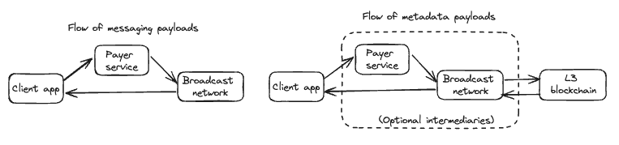
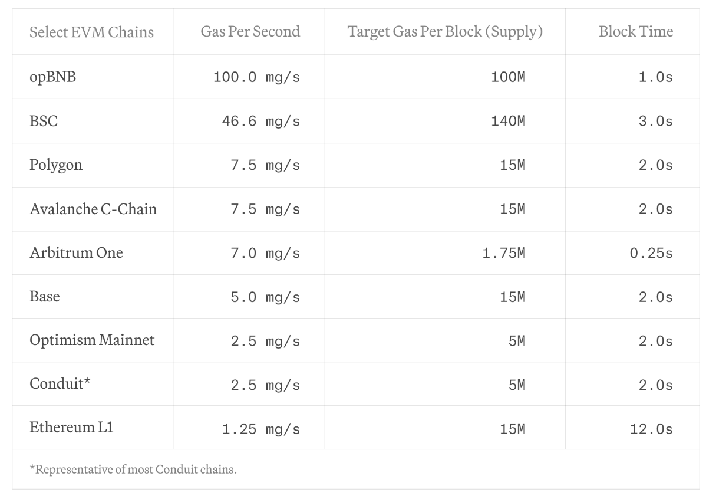
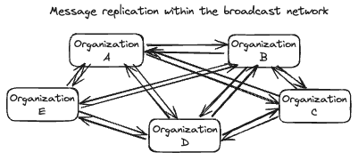

## Abstract

This XIP defines an architecture for a decentralized XMTP network.

More specifically, it defines a new [3.2. Node-to-node protocol](#32-node-to-node-protocol) and [3.3. Client-to-node protocol](#33-client-to-node-protocol). The client-to-client encryption protocol, or [XMTP’s implementation of Messaging Layer Security](https://github.com/xmtp/libxmtp/blob/main/xmtp_mls/README.md), is not modified by this XIP.

## 1. Motivation

### 1.1. Decentralization goals

#### Sustainability

The network needs to be able to outlast Ephemera the company. This project ends with Ephemera having no privileged position in the operations of the network.

Messaging fees need to be able to support the cost of operating the network. We want messaging fees to be low, which means that we need the cost of processing and storing an average message to be extremely cheap.

#### Censorship Resistance

The network must prevent any single entity or group from being able to block, alter, or remove messages sent by any other actor. If an entity attempts to withhold messages from the network or alter messages sent from clients, we must be able to generate cryptographic proof of their misbehaviour so that they can be removed from the network based on impartial evidence.

#### Low latency and high throughput

In order to compete with centralized networks we need to be able to handle hundreds of messages per second now, and scale to millions of messages per second without needing to rethink the entire architecture. This needs to happen with comparable levels of message latency to a centralized messaging app (hundreds of ms).

### 1.2 Decentralization non-goals

It’s also important to highlight some areas that we believe are non-goals for this phase of the project

#### Anyone can run nodes on the network

While this is appealing, it should not come at the expense of running a low cost/low latency network.

#### Real-time punishment for bad actors

We need accountability for bad actors, but we can tolerate their detection and removal from the system being asynchronous and having some human oversight through a security council.

### 1.3. Requirements by message type

The XMTP network handles different types of messages, which require different properties from a transport network.

| **Type** | **Description** | **Example** |
| --- | --- | --- |
| Identity updates | Modifies the metadata of an account. | Alice installs App B and grants it messaging access for her account. |
| Key packages | Publicly shares cryptographic information in order to receive Welcome messages. | Bob previously published a key package for App A, which Alice uses to encrypt a Welcome message to Bob. |
| Welcome messages | Informs a new member that they have been added to a chat. | Bob’s App A receives an invite from Alice to join the chat. |
| Application messages | Sends a message within a group chat. | Alice says "Hello world!" |
| Commit messages | Modifies the metadata of a group chat. | Alice adds Bob’s inbox ID to the chat’s member list. |

Desired properties

| **Type** | **Requires strict ordering** | **Latency sensitivity** | **Expected volume** | **Desired retention** | **Backend system** |
| --- | --- | --- | --- | --- | --- |
| Identity updates | Y | Medium | Low | Permanent | Blockchain |
| Key packages | N | Low | Medium | Until rotation | Broadcast network |
| Welcome messages | N | Medium | Medium | 6 months | Broadcast network |
| Application messages | N | High | High | 6 months | Broadcast network |
| Commit messages | Y | Medium | Medium | 6 months | Blockchain |

### 1.4. System components

In this system, there are four components involved in the delivery of messaging payloads:

1. **Client apps** will protect message confidentiality and integrity by using end-to-end encryption and signing causal ordering metadata.
2. **Payers** will fairly compensate node operators for the cost of delivering and storing messages.
3. The **broadcast network** will store and replicate payloads that do not require total ordering.
4. The **L3 blockchain** will store payloads that require total ordering.



## 2. Specification: L3 blockchain

In this XIP, the L3 blockchain is described as a high-level component, with more details to be included in a future XIP.

### 2.1. Blockchain design/selection

There are two types of data on the XMTP network today where clients require total ordering of results.

1. Identity Updates
2. MLS Commit messages

Storing this data on a blockchain allows us to get total ordering guarantees without needing to solve for total-ordering in our broadcast network. Each node in our network is responsible for reading from the chain and indexing all events in order so that results can be served to clients quickly. Clients have the ability to audit these results by checking the blockchain, but would not talk directly to the chain in normal operation.

When selecting a blockchain configuration the properties we care about most for our use-case are:

#### Time To Finality

How long from an event being published do we need to wait before it can be indexed and returned to clients? This will directly impact the latency on user actions such as creating a new identity, adding members to groups, or changing the metadata of a group.

#### Throughput

How many messages per second can we write to the chain?

#### Cost

What are the costs to store a given amount of data on chain

#### 2.1.1. Blockchain description

The XMTP appchain will be described in more detail in a further XIP, but some properties need to be defined here to understand how the appchain fits in with the offchain message processing system

#### 2.1.2. Blockchain properties

The specifics of the XMTP app chain will be described in a future XIP, but there are a few properties of all optimistic rollups that are important to keep in mind in the context of the overall system.

- Re-orgs are possible and need to be accounted for in the protocol. While the network will be designed to make a best-effort at replaying events in the original order in the event of a re-org, this is not always possible.
- We will need to rely on “soft-finality” to process messages with an acceptable latency for messaging applications (250ms-1s depending on the chain)

#### 2.1.3. Costs

Each L2 rollup has a ceiling on the amount of gas that can be used per block. Paradigm has a [helpful table](https://www.paradigm.xyz/2024/04/reth-perf) that shows the amount of gas per second that a chain can handle.



The tables below shows several variations of our smart contract, and their gas usage. All per-second values are for Arbitrum One.

|  | **Storing complete messages on chain and firing an event with the event included** | **Storing complete messages on chain and firing an event with no event** | **Storing the hashes of messages on chain. No event** | **Storing the hashes of messages on chain. Firing an event** |
| --- | --- | --- | --- | --- |
| 2kb message | 96,013 gas. 72/second on Arbitrum | 77,118 gas. 90/second | 44,946 gas. 155/second | 46735 gas. 149/second |
| 50kb message | 1,287,619 gas. 5/second | 861,246 gas. 8/second | 44,946 gas. 155/second | 46735 gas. 149/second |

### 2.2. Smart contracts

#### 2.2.1. Node registry

The list of allowed nodes can be defined in a smart contract looking something like this unaudited and incomplete prototype.

```solidity
// SPDX-License-Identifier: MIT
pragma solidity 0.8.28;

import "@openzeppelin/contracts/token/ERC721/ERC721.sol";
import "@openzeppelin/contracts/access/Ownable.sol";

/**
 * A NFT contract for XMTP Node Operators.
 *
 * The deployer of this contract is responsible for minting NFTs and assigning them to node operators.
 *
 * All nodes on the network periodically check this contract to determine which nodes they should connect to.
 */
contract Nodes is ERC721, Ownable {
    constructor() ERC721("XMTP Node Operator", "XMTP") Ownable(msg.sender) {}

    uint32 private constant NODE_INCREMENT = 100;
    // uint32 counter so that we cannot create more than max IDs
    // The ERC721 standard expects the tokenID to be uint256 for standard methods unfortunately
    uint32 private _nodeCounter = 0;

    // A node, as stored in the internal mapping
    struct Node {
        bytes signingKeyPub;
        string httpAddress;
        bool isHealthy;
    }

    struct NodeWithId {
        uint32 nodeId;
        Node node;
    }

    event NodeUpdated(uint256 nodeId, Node node);

    // Mapping of token ID to Node
    mapping(uint256 => Node) private _nodes;

    /**
     * Mint a new node NFT and store the metadata in the smart contract
     */
    function addNode(address to, bytes calldata signingKeyPub, string calldata httpAddress)
        public
        onlyOwner
        returns (uint32)
    {
        // the first node starts with 100
        _nodeCounter++;
        uint32 nodeId = _nodeCounter * NODE_INCREMENT;
        _mint(to, nodeId);
        _nodes[nodeId] = Node(signingKeyPub, httpAddress, true);
        _emitNodeUpdate(nodeId);
        return nodeId;
    }

    /**
     * Override the built in transferFrom function to block NFT owners from transferring
     * node ownership.
     *
     * NFT owners are only allowed to update their HTTP address and MTLS cert.
     */
    function transferFrom(address from, address to, uint256 tokenId) public override {
        require(_msgSender() == owner(), "Only the contract owner can transfer Node ownership");
        super.transferFrom(from, to, tokenId);
    }

    /**
     * Allow a NFT holder to update the HTTP address of their node
     */
    function updateHttpAddress(uint256 tokenId, string calldata httpAddress) public {
        require(_msgSender() == ownerOf(tokenId), "Only the owner of the Node NFT can update its http address");
        _nodes[tokenId].httpAddress = httpAddress;
        _emitNodeUpdate(tokenId);
    }

    /**
     * The contract owner may update the health status of the node.
     *
     * No one else is allowed to call this function.
     */
    function updateHealth(uint256 tokenId, bool isHealthy) public onlyOwner {
        // Make sure that the token exists
        _requireOwned(tokenId);
        _nodes[tokenId].isHealthy = isHealthy;
        _emitNodeUpdate(tokenId);
    }

    /**
     * Get a list of healthy nodes with their ID and metadata
     */
    function healthyNodes() public view returns (NodeWithId[] memory) {
        uint256 healthyCount = 0;

        // First, count the number of healthy nodes
        for (uint256 i = 0; i < _nodeCounter; i++) {
            uint256 nodeId = NODE_INCREMENT * (i + 1);
            if (_nodeExists(nodeId) && _nodes[nodeId].isHealthy) {
                healthyCount++;
            }
        }

        // Create an array to store healthy nodes
        NodeWithId[] memory healthyNodesList = new NodeWithId[](healthyCount);
        uint256 currentIndex = 0;

        // Populate the array with healthy nodes
        for (uint32 i = 0; i < _nodeCounter; i++) {
            uint32 nodeId = NODE_INCREMENT * (i + 1);
            if (_nodeExists(nodeId) && _nodes[nodeId].isHealthy) {
                healthyNodesList[currentIndex] = NodeWithId({nodeId: nodeId, node: _nodes[nodeId]});
                currentIndex++;
            }
        }

        return healthyNodesList;
    }

    /**
     * Get all nodes regardless of their health status
     */
    function allNodes() public view returns (NodeWithId[] memory) {
        NodeWithId[] memory allNodesList = new NodeWithId[](_nodeCounter);

        for (uint32 i = 0; i < _nodeCounter; i++) {
            uint32 nodeId = NODE_INCREMENT * (i + 1);
            if (_nodeExists(nodeId)) {
                allNodesList[i] = NodeWithId({nodeId: nodeId, node: _nodes[nodeId]});
            }
        }

        return allNodesList;
    }

    /**
     * Get a node's metadata by ID
     */
    function getNode(uint256 tokenId) public view returns (Node memory) {
        _requireOwned(tokenId);
        return _nodes[tokenId];
    }

    function _emitNodeUpdate(uint256 tokenId) private {
        emit NodeUpdated(tokenId, _nodes[tokenId]);
    }

    function _nodeExists(uint256 tokenId) private view returns (bool) {
        address owner = _ownerOf(tokenId);
        return owner != address(0);
    }
}

```

All nodes are expected to keep up to date with changes in this contract, and to use the registry to determine which other nodes to publish messages to and sync messages from. Requests should be authenticated using the public keys stored in the node registry (see below).

#### 2.2.2. Message storage

The following smart contract can be used to index commit messages. All nodes are expected to index the `MessageSent` event from the contract and store the events in their local database with an `originator_id` of 0.

The latest code can be found [here](https://github.com/xmtp/xmtpd/blob/main/contracts/src/GroupMessages.sol).

```solidity
interface GroupMessages {
  /**
   * Emitted when a new message is stored into the blockchain.
   * Contains all the necessary data xmtpd nodes need to index the message.
   */
  event MessageSent(bytes32 groupId, bytes message, uint64 sequenceId);

  /**
   * Emitted when an upgrade is authorized.
   */
  event UpgradeAuthorized(address upgrader, address newImplementation);

  /**
   * Stores a new group message in the blockchain.
   * @notice only callable when contract is not paused.
   */
  function addMessage(bytes32 groupId, bytes calldata message);

  /**
   * Grants a role to an specific account.
   * @notice only callable by admin.
   */
  function grantRole(bytes32 role, address account);

  /**
   * Renounce role.
   * @notice only callable by an account holding the role to be renounced.
   */
  function renounceRole(bytes32 role, address callerConfirmation);

  /**
   * Revoke a role for an specific account.
   * @notice only callable by the admin of the specified role.
   */
  function revokeRole(bytes32 role, address account);

  /**
   * Pauses the contract.
   * @notice only callable by admin.
   */
  function pause();

  /**
   * Unpauses the contract.
   * @notice only callable by admin.
   */
  function unpause();

  /**
   * Upgrades the contract to a new implementation.
   * @notice only callable by admin.
   */
  function upgradeToAndCall(address newImplementation, bytes data);

}
```

#### 2.2.3. Indexing GroupMessages

All broadcast nodes are expected to read the app chain and index log events from the `GroupMessages` smart contract. These events must be indexed in the order to which they were published to the chain, and then stored in the node’s local database on correct topic for the `groupId` alongside messages from the broadcast network.

#### 2.2.4. Identity updates

All broadcast nodes are expected to read the app chain and index log events from the `IdentityUpdates` smart contract. These events must be indexed in the order to which they were published to the chain, and then stored in the node’s local database on correct topic for the `inbox_id` alongside messages from the broadcast network.

The latest code can be found [here](https://github.com/xmtp/xmtpd/blob/main/contracts/src/IdentityUpdates.sol).

```solidity
interface IdentityUpdates {
  /**
   * Emitted when a new identity updated is stored into the blockchain.
   * Contains all the necessary data xmtpd nodes need to index the message.
   */
  event IdentityUpdateCreated(bytes32 inboxId, bytes update, uint64 sequenceId);

  /**
   * Emitted when an upgrade is authorized.
   */
  event UpgradeAuthorized(address upgrader, address newImplementation);

  /**
   * Stores a new identity update in the blockchain.
   * @notice only callable when contract is not paused.
   */
  function addIdentityUpdate(bytes32 inboxId, bytes calldata update);

  /**
   * Grants a role to an specific account.
   * @notice only callable by admin.
   */
  function grantRole(bytes32 role, address account);

  /**
   * Renounce role.
   * @notice only callable by an account holding the role to be renounced.
   */
  function renounceRole(bytes32 role, address callerConfirmation);

  /**
   * Revoke a role for an specific account.
   * @notice only callable by the admin of the specified role.
   */
  function revokeRole(bytes32 role, address account);

  /**
   * Pauses the contract.
   * @notice only callable by admin.
   */
  function pause();

  /**
   * Unpauses the contract.
   * @notice only callable by admin.
   */
  function unpause();

  /**
   * Upgrades the contract to a new implementation.
   * @notice only callable by admin.
   */
  function upgradeToAndCall(address newImplementation, bytes data);

}
```

## 3. Specification: Broadcast network

The broadcast network is designed for low latency propagation of messages to all nodes on the network. Although it is impossible to prevent individual nodes from censoring data, the network is designed to make censorship provably detectable and easily circumventable. Totally consistent message ordering is not required in the broadcast network, but should behave well in ordinary cases and be difficult for nodes to manipulate. The network should be eventually consistent: discrepancies between nodes should be resolved over time.

### 3.1. Network structure

In the initial version of the decentralized network, all nodes will hold all of the data (non-sharded). Clients may choose to publish to any node, and read from any node, making message censorship easy to detect as well as to circumvent.

Because latency is critical for a messaging protocol, we choose to adopt a small network size with a broadcast topology: all updates to a given node are immediately broadcast to all other nodes. By reducing the number of hops required for a message to proliferate we can reduce latency and complexity while increasing reliability.

With this size and topology, quality of nodes becomes important (stability, performance), as well as operational capability of node operators. In the testnet phase, we employ a node selection and removal process emphasizing high-quality, diverse, and trusted organizations, with future iterations of the selection process becoming permissionless.



The purpose of this topology is to increase decentralization and trust, not scalability. Each node represents a conceptual grouping of multiple servers run by a single organization, and may choose to scale internally using traditional infrastructure techniques such as sharding and replication across geographies, ensuring that increased demand can be met efficiently.

#### 3.1.1. Node registry

The node registry serves as the source of truth for the complete list of nodes that comprise the XMTP network. This is achieved via the NodeRegistry contract on Ethereum L1, which maintains the following information for each node:

| Field | Description | Mutable? | Unique? |
| --- | --- | --- | --- |
| **Node ID** | A strictly increasing index for the node entry. | N | Y |
| **Public key** | A secp256k1 public key controlled by the node, used for signing and identification purposes. Format: Uncompressed point with prefix (0x04) [ P \|\| X \|\| Y ], 65 bytes | N | Y |
| **HTTP Address** | The IP address or DNS information for the node’s entry-point. A node is permitted to consist of multiple servers with shared state by having the HTTP Address point to a load balancer. | N | N |
| **Status** | Either ‘enabled’ or ‘disabled’. | Y | N |

Operations to the node registry may only be performed by the contract owner during the testnet phase:

- **ModifyNodeStatus**: Used to enable or disable an existing node on the network.
- **AddNode**: Used to add additional nodes.

Key rotation, as well as modifications to routing information, can only be achieved by adding a new node with the desired data, and then disabling the existing node. A new index and public key must be used for each new entry.

#### 3.1.2. Incentives

It is important that the system as a whole protects scarce network resources such as bandwidth and storage and is resilient against DOS attack.

```protobuf
message PayerEnvelope {
  bytes unsigned_client_envelope = 1; // Protobuf serialized
  xmtp.identity.associations.RecoverableEcdsaSignature payer_signature = 2;
}
```

The server that signs the payer envelope is ultimately responsible for the cost of processing the message, and they are the first line of defense in preventing abuse. All payers are expected to handle client authentication and can decide whether to accept or reject publishing a message sent from a client.

Even if all messages are paid an attacker may concentrate a large number of messages in a short period of time to overload the network. For messages stored onchain, costs are already dynamic and adjust with supply and demand for block space. A subsequent XIP will describe the pricing model for offchain messages to deliver similar properties. If pricing is dynamic, concentrating a large number of messages over a short period of time will be cost prohibitive to all but the best-funded attackers.

### 3.2. Node-to-node protocol

#### 3.2.1. Originator node

Every `PayerEnvelope` enters the network via an ‘originator node’ of the client’s choice, before being replicated to all other nodes. Any node on the network may be selected as the originator node.

It is permissible for a client to send the same payload via multiple originators/payers, for censorship-resistance purposes. In this case, the node-to-node protocol treats each `OriginatorEnvelope` as independent, with the wrapped `ClientEnvelope` to be deduplicated on receiving clients.

When a node is the originator of a payload, it must wrap the payload into an `OriginatorEnvelope` containing a sequence ID and timestamp, and sign the result. Other nodes must later recover the `originator_public_key` for a given envelope via the recoverable signature, and MUST reject payloads for which they are unable to do so.

```protobuf
message UnsignedOriginatorEnvelope {
  uint32 originator_node_id = 1;
  uint64 originator_sequence_id = 2;
  int64 originator_ns = 3;
  PayerEnvelope payer_envelope = 4;
}

message OriginatorEnvelope {
  bytes unsigned_originator_envelope = 1; // Protobuf serialized
  oneof proof {
    xmtp.identity.associations.RecoverableEcdsaSignature originator_signature = 2;
    BlockchainProof blockchain_proof = 3;
  }
}

// An alternative to an originator signature for blockchain payloads
message BlockchainProof {
  bytes transaction_hash = 1;
  xmtp.identity.associations.RecoverableEcdsaSignature node_signature = 2;
}
```

For payloads published to the blockchain, the blockchain contract is considered the originator instead, with a `node_id` of 0 and `originator_ns` derived from the block number. These payloads are not replicated node-to-node; once published, each node independently reads the `UnsignedOriginatorEnvelope` from the smart contract and constructs an `OriginatorEnvelope` with an independent `BlockchainProof`.

#### 3.2.2. Sequence IDs and cursors

##### Sequence IDs

Each node on the network maintains an independent, strictly increasing sequence ID, beginning at 1 and incrementing by 1, for payloads originating on the node. This sequence ID is signed by the node, protecting against tampering as well as providing non-repudiation in the event of inconsistencies in the sequencing. Likewise, blockchain payloads are assigned a sequence ID by the smart contract, verifiable by any interested party via the transaction hash.

##### Cursors

Using sequence IDs, both clients and nodes are able to book-keep which payloads have already been seen for each originator. In this XIP, we will use the term ‘cursor’ to refer to a dictionary mapping from originator node ID to sequence ID. The dictionary is sparse - if a node ID is missing, it should be interpreted as included with a sequence ID of 0.

```python
message Cursor {
  map<uint32, uint64> node_id_to_sequence_id = 1;
}
```

#### 3.2.3. Node synchronization algorithm

Every replication node acts as both a client and a server. It offers a GRPC API that other nodes can connect to and subscribe for both originated and replicated messages by `originator_node_id`. It also subscribes to all other healthy nodes in the network. All connections are expected to be made via TLS.

Nodes additionally maintain a global cursor, that is updated every time a payload is originated on the node or replicated from a peer, keeping track of the maximum sequence ID seen per node ID. This cursor is attached to queries against other nodes.

```protobuf
message EnvelopesQuery {
  ...
  repeated uint32 originator_node_ids = 2;
  Cursor last_seen = 3;
}

message SubscribeEnvelopesRequest {
  EnvelopesQuery query = 1;
}

message SubscribeEnvelopesResponse {
  repeated xmtp.xmtpv4.envelopes.OriginatorEnvelope envelopes = 1;
}

service ReplicationApi {
  rpc SubscribeEnvelopes(SubscribeEnvelopesRequest) returns (stream SubscribeEnvelopesResponse) {
    option (google.api.http) = {
      post: "/mls/v2/subscribe-envelopes"
      body: "*"
    };
  }
}
```

When a node starts up, its state for each of its peers will be out of date and it will need to synchronize with other peers to catch up. The process for catching up is as follows:

1. Query the Node Registry smart contract to get a list of all currently active `originator_id`s on the network.
2. For each healthy `originator_id` connect to and subscribe to that node using the highest `sequence_id` from that originator in the node’s database as the cursor in the query.
    1. If a node is unresponsive for a period of time, follow the algorithm described in [3.2.6. Node connectivity](#326-node-connectivity).

A node may service publish requests during its catch-up period, but must reject any messages which have dependencies on `originator_sid`s ahead of its currently synced position for that originator.
The catch-up process is continuous, and automatically transitions into an ongoing synchronization protocol between nodes once caught up.

In future iterations of the protocol we may implement snapshotting to allow for faster restores when nodes are substantially behind.

#### 3.2.4. Message expiry

The following defines minimum retention periods for payloads on the network, after which they may be expired by nodes.

| **Payload type** | **Target Retention** |
| --- | --- |
| Messages | 6 months |
| Commits | 6 months |
| Welcome messages | 6 months |
| Key packages | 6 months |
| Identity updates | Forever |

When replicating payloads for a given originator, it is permissible for the first payload to have a sequence ID greater than 1, provided that the originator timestamp on the payload is older than the retention period. Future XIP’s may additionally describe schemes for explicitly publishing the high watermark for each originator.

#### 3.2.5. Node-to-node authentication

Since these nodes are accessible on the public internet, we need to authenticate requests and apply different rate limiting for requests coming from other nodes. The `NodeRegistry` smart contract gives us all the information required to construct a JWT that can authenticate these requests. When a node is acting as a client it would construct a JWT for each server (other node) it wishes to connect to, and would attach that JWT as GRPC metadata with the key of `Authorization`.

A JWT has three components: a header, a payload, and a signature.

##### Header

```solidity
{
  "alg": "ES256K", // The JWT standard name for secp256k1 signatures
  "typ": "JWT"
}
```

##### Payload

```solidity
{
  // The subject. In this case, the node ID sending the request
  "sub": "$CLIENT_NODE_ID",
  // The audience. In this case, the node ID receiving the request.
  // Nodes must verify that the audience matches their Node ID to avoid
  // tokens being re-used between nodes.
  "aud": "$SERVER_NODE_ID", 
  // Issued At Time
  "iat": 1516239022
}
```

The signature would be generated using the `signingKey` set for the client node in the `NodeRegistry` contract. Domain separation must be used to prevent replay attacks.

Server nodes would need to perform the following validations on a JWT.

- The `sub` is a node ID registered in the `NodeRegistry` contract
- The `NodeRegistry` contract has the node ID marked with a `true` value in the `isHealthy` field
- The `aud` is the server’s own node ID
- The signature is valid
- The signature can be recovered to a public key that matches the public key registered to the `sub` in the `NodeRegistry` smart contract
- The `iat` field is no less than 1 hour in the past, and no more than 1 minute in the future.

Client nodes are expected to update the JWT they use for each peer at least once per hour.

#### 3.2.6. Node connectivity

##### Unreachable nodes

In the event that a node does not respond within the time threshold defined for `MISBEHAVIOR_UNRESPONSIVE_NODE` in [3.2.7. Validation rules](#327-validation-rules), the node is considered unreachable.

Peers will:

- Submit `MisbehaviorReport`s against the unreachable node.
- Subscribe to 5 nodes at random for messages originating from the unhealthy `originator_id`.
- Periodically attempt to reconnect to the unavailable node. On a successful reconnection, the above connections will be torn down, and the node will no longer be considered unreachable.

Peers must deduplicate incoming `OriginatorEnvelope`s, which may be received from multiple sources in this event.

##### Unreachable blockchain

In the event that an originator is unable to access the latest blockchain state, for example if a gateway is unreachable, it must refuse publishes from clients with an HTTP status code 503 until it has synced to the latest state.

##### Node registry updates

In the event that a node is disabled in the registry, peers must tear down any connection with the disabled node. Whenever a node is first detected as disabled, whether that occurs as a state transition or is simply detected on startup, the peer must subscribe to 5 nodes at random for messages originating from the disabled node for 6 hours. This ensures that any historical payloads from that node are synced.

In the event that a node is added to the node registry, a new connection must be established with that node in order to sync its payloads.

#### 3.2.7. Validation rules

In this XIP, we define node misbehavior as a failure to deliver on liveness or safety properties:

- Liveness
  - Failing to respond to requests
  - Responding slowly
  - Responding with an error
- Safety
  - Omitting payloads
  - Reordering payloads
  - Allowing invalid payloads

To remediate these issues as they arise, we rely on nodes and clients to submit `MisbehaviorReports` when other actors in the system exhibit the behaviors described above. A credibly neutral security council will manually review these reports, assisting with remediation of the offending node and removing consistently misbehaving nodes from the system. Node removal may be automated in future protocol versions.

In order for these reports to be actionable, they must be trustworthy. For report types that contain cryptographic proof of the failure, a single report is sufficient for verification. For other report types, particularly liveness failures, we rely on `MisbehaviorReports` from a sufficiently large sample size of the node’s peers.

```protobuf
enum Misbehavior {
  MISBEHAVIOR_UNSPECIFIED = 0;
  MISBEHAVIOR_UNRESPONSIVE_NODE = 1;
  MISBEHAVIOR_SLOW_NODE = 2;
  MISBEHAVIOR_FAILED_REQUEST = 3;
  MISBEHAVIOR_OUT_OF_ORDER = 4;
  MISBEHAVIOR_DUPLICATE_SEQUENCE_ID = 5;
  MISBEHAVIOR_CAUSAL_ORDERING = 6;
  MISBEHAVIOR_INVALID_PAYLOAD = 7;
  MISBEHAVIOR_BLOCKCHAIN_INCONSISTENCY = 8;
}

message LivenessFailure {
  uint32 response_time_ns = 1;
  oneof request {
    xmtp.xmtpv4.message_api.SubscribeEnvelopesRequest subscribe = 2;
    xmtp.xmtpv4.message_api.QueryEnvelopesRequest query = 3;
    xmtp.xmtpv4.message_api.PublishPayerEnvelopesRequest publish = 4;
  }
}

message SafetyFailure {
  repeated xmtp.xmtpv4.envelopes.OriginatorEnvelope envelopes = 1;
}

message UnsignedMisbehaviorReport {
  uint64 reporter_time_ns = 1;
  uint32 misbehaving_node_id = 2;
  Misbehavior type = 3;
  oneof failure {
    LivenessFailure liveness = 4;
    SafetyFailure safety = 5;
  }
  // Nodes must verify this field is false for client-submitted reports
  bool submitted_by_node = 6;
}
```

##### Liveness failures

Liveness failures are heuristically detectable by a node’s peers when an API fails to receive a response within a time limit. These can be detected during the normal course of operation of the protocol (for replication API’s), or via a watchdog service run by the peer’s organization (for client API’s).

We define three misbehavior report types:

- `MISBEHAVIOR_UNRESPONSIVE_NODE` : We define this as a failure to respond after a timeout of `T`. Each retry with exponential backoff may generate a second report, with each increasing timeout duration set as the `response_time_ns`.
- `MISBEHAVIOR_SLOW_NODE`: We define this as a successful response, that arrives slower than a smaller threshold time `t`. The response time must be included in the payload.
- `MISBEHAVIOR_FAILED_REQUEST`: We define this as receiving a response with an error code.

Nodes should submit a report for every instance, attaching the request parameters that led to the failure, and may choose to batch reports for performance reasons.

##### Safety failures

The responsibility of originator nodes is to maintain an append-only log of payloads that is consistent to any party that requests them. A failure to do so can manifest in one of these ways:

- `MISBEHAVIOR_OUT_OF_ORDER`: Nodes are expected to relay payloads starting at sequence ID 1 and incrementing by 1 with each subsequent payload, with an exception described in [3.2.4. Message expiry](#324-message-expiry). Additionally, timestamps must be non-decreasing, and not future-dated by more than 5 minutes. When a received payload breaks this pattern, peers must submit a report with the current and previous payloads, but store the payload and continue as usual.
- `MISBEHAVIOR_DUPLICATE_SEQUENCE_ID`: Any sequence ID for a given originator should uniquely identify a payload. In the event that two different payloads discovered anywhere in the system share the same sequence ID and originator, any peer or client may submit the payloads as part of a report.
- `MISBEHAVIOR_CAUSAL_ORDERING`: The causal ordering mechanism described in [3.3.5. Cross-originator message ordering](#335-cross-originator-message-ordering) relies on the originator to prevent cyclical or missing dependencies as defined in [3.3.4. Validation rules](#334-validation-rules). In the event that a cycle is detected by a client, the payloads that form the cycle should be submitted as part of a report.
- `MISBEHAVIOR_INVALID_PAYLOAD`: Originator nodes are expected to validate incoming payloads as defined in [3.3.4. Validation rules](#334-validation-rules). Peers and clients may submit a misbehavior report for any received payload that does not follow these rules.
- `MISBEHAVIOR_BLOCKCHAIN_INCONSISTENCY`: In the event that a client or watchdog service receives a blockchain payload from a node that does not match the same payload fetched directly from the blockchain at the specified `transaction_hash`, the signed envelope should be submitted as part of a report.

Through this system, both message reordering and omission by an originator is detectable. For example, if the `OriginatorEnvelope` received by a client in response to a publish request to an originator does not match the `OriginatorEnvelope` for the same originator and sequence ID fetched from a peer node, the client may submit a cryptographically provable `MISBEHAVIOR_DUPLICATE_SEQUENCE_ID`. Alternatively, if a node chooses to censor a published payload by skipping over a sequence ID, it must do so with *all* peers to prevent it from being replicated, resulting in several `MISBEHAVIOR_OUT_OF_ORDER` reports. As a last line of defense, payloads observed by one client must be observable by all clients in the conversation due to causal ordering requirements ([3.3.5. Cross-originator message ordering](#335-cross-originator-message-ordering)).

In the current version of the protocol, we rely on originators to satisfy safety properties, with proof of reordering and omission by peers requiring future work. Today, clients may detect missing payloads via causal ordering metadata, fetching from multiple peers, or by fetching payloads directly from originators.

#### 3.2.8. Misbehavior API

Each node will store its own misbehavior reports locally, as well as accepting reports submitted by clients. To prevent cascading failures, misbehavior reports are not replicated, and may optionally be handled via separate infrastructure. Instead, they are available via a query API. A security council, as well as any interested party, may choose to regularly aggregate reports from all active nodes. Clients should submit misbehavior reports to multiple nodes to protect against omission.

```protobuf
message MisbehaviorReport {
  // Server time when the report was stored. Used only for querying reports.
  // This field is not signed.
  uint64 server_time_ns = 1;
  bytes unsigned_misbehavior_report = 2;
  // Signed by the node hosting the report
  xmtp.identity.associations.RecoverableEcdsaSignature signature = 3;
}

message SubmitMisbehaviorReportRequest {
  UnsignedMisbehaviorReport report = 1;
}

message SubmitMisbehaviorReportResponse {}

message QueryMisbehaviorReportsRequest {
  uint64 after_ns = 1;
}

message QueryMisbehaviorReportsResponse {
  repeated MisbehaviorReport reports = 1;
}

service MisbehaviorApi {
  rpc SubmitMisbehaviorReport(SubmitMisbehaviorReportRequest) returns (SubmitMisbehaviorReportResponse) {
    option (google.api.http) = {
      post: "/mls/v2/submit-misbehavior-report"
      body: "*"
    };
  }

  rpc QueryMisbehaviorReports(QueryMisbehaviorReportsRequest) returns (QueryMisbehaviorReportsResponse) {
    option (google.api.http) = {
      post: "/mls/v2/query-misbehavior-reports"
      body: "*"
    };
  }
}
```

### 3.3. Client-to-node protocol

#### 3.3.1. Payers

In order to publish a message to an originator it must be in the format of a signed `PayerEnvelope`, which is an attestation by the payer that it will pay for delivery of the `ClientEnvelope` wrapped inside it.

While any holder of a funded wallet *can* be a payer and produce signed `PayerEnvelope`s, in many cases applications will choose to have a dedicated Payer Service that receives `ClientEnvelopes` from clients and signs them on behalf of the user, then forwards the signed payloads to either an originator or the blockchain. This has the advantage of both hiding the client’s IP address from the node as well as subsidizing the messaging fees on behalf of the end-user.

#### 3.3.2. Envelopes

```protobuf
// Data visible to the server that has been authenticated by the client.
message AuthenticatedData {
  uint32 target_originator = 1;
  bytes target_topic = 2;
  Cursor last_seen = 3;
}

message ClientEnvelope {
  AuthenticatedData aad = 1;

  oneof payload {
    xmtp.mls.api.v1.GroupMessageInput group_message = 2;
    xmtp.mls.api.v1.WelcomeMessageInput welcome_message = 3;
    xmtp.mls.api.v1.UploadKeyPackageRequest upload_key_package = 4;
    xmtp.identity.associations.IdentityUpdate identity_update = 5;
  }
}

// Wraps client envelope with payer signature
message PayerEnvelope {
  bytes unsigned_client_envelope = 1; // Protobuf serialized
  xmtp.identity.associations.RecoverableEcdsaSignature payer_signature = 2;
}
```

When clients create `ClientEnvelope`s, they must additionally produce `AuthenticatedData`. `AuthenticatedData` is visible to the server, but for anonymity reasons are only verifiable by other clients. A hash of the `AuthenticatedData` will be embedded within each client envelope type, with more details on the authentication and verification mechanism specified in a future XIP. The data must specify the following:

1. The target originator for the payload. Payers must forward the payload to the specified originator, and all originators must validate that they are the target of a publish request.
2. The target topic for the payload, which specifies the location at which other clients may fetch it. Clients must construct topics where the first byte is a [topic kind](https://github.com/xmtp/xmtpd/blob/00a2898bf276f1502ae4204d2f70b7c468e2d7f8/pkg/topic/topic.go#L12-L14) matching the payload type, with all subsequent bytes matching the topic identifier.
3. The cursor for the payload’s topic on the client, for causal ordering purposes - in other words the highest sequence ID seen for that topic, for each originator. If no payloads from an originator have been seen on a topic, the originator may be omitted, or the sequence ID may be set to 0.

#### 3.3.3. Client API

The API exposed to clients and payers is defined by the following GRPC schema:

```protobuf
// Query for envelopes, shared by query and subscribe endpoints
// Either topics or originator_node_ids may be set, but not both
message EnvelopesQuery {
  repeated bytes topics = 1;
  repeated uint32 originator_node_ids = 2;
  Cursor last_seen = 3;
}

message SubscribeEnvelopesRequest {
  EnvelopesQuery query = 1;
}

message SubscribeEnvelopesResponse {
  repeated xmtp.xmtpv4.envelopes.OriginatorEnvelope envelopes = 1;
}

message QueryEnvelopesRequest {
  EnvelopesQuery query = 1;
  uint32 limit = 2;
}

message QueryEnvelopesResponse {
  repeated xmtp.xmtpv4.envelopes.OriginatorEnvelope envelopes = 1;
}

message PublishPayerEnvelopesRequest {
  repeated xmtp.xmtpv4.envelopes.PayerEnvelope payer_envelopes = 1;
}

message PublishPayerEnvelopesResponse {
  repeated xmtp.xmtpv4.envelopes.OriginatorEnvelope originator_envelopes = 1;
}

service ReplicationApi {
  rpc SubscribeEnvelopes(SubscribeEnvelopesRequest) returns (stream SubscribeEnvelopesResponse) {
    option (google.api.http) = {
      post: "/mls/v2/subscribe-envelopes"
      body: "*"
    };
  }

  rpc QueryEnvelopes(QueryEnvelopesRequest) returns (QueryEnvelopesResponse) {
    option (google.api.http) = {
      post: "/mls/v2/query-envelopes"
      body: "*"
    };
  }

  rpc PublishPayerEnvelopes(PublishPayerEnvelopesRequest) returns (PublishPayerEnvelopesResponse) {
    option (google.api.http) = {
      post: "/mls/v2/publish-payer-envelopes"
      body: "*"
    };
  }
}
```

##### Identity updates

Identity updates for the inbox log defined in [XIP-46: Multi-wallet identity](https://github.com/xmtp/XIPs/blob/main/XIPs/xip-46-multi-wallet-identity.md) will be stored using the publish and query endpoints above. All nodes will continue to validate identity update payloads as defined in the XIP.

In addition, the following endpoint is defined for address logs, matching the XIP. Clients MUST prevent an address from being associated with multiple inbox ID’s, by revoking them from one before associating with another. In the event that an address was not correctly revoked, nodes may return any non-revoked Inbox ID via `GetInboxIds`.

```protobuf

// Request to retrieve the XIDs for the given addresses
message GetInboxIdsRequest {
  // A single request for a given address
  message Request {
    string address = 1;
  }
  repeated Request requests = 1;
}

// Response with the XIDs for the requested addresses
message GetInboxIdsResponse {
  // A single response for a given address
  message Response {
    string address = 1;
    optional string inbox_id = 2;
  }
  repeated Response responses = 1;
}

service ReplicationApi {
  rpc GetInboxIds(GetInboxIdsRequest) returns (GetInboxIdsResponse) {
    option (google.api.http) = {
      post: "/mls/v2/get-inbox-ids"
      body: "*"
    };
  }
}
```

#### 3.3.4. Validation rules

On message publish, originators must validate the incoming `PayerEnvelope`:

1. Verify payer envelope signature
2. Verify client envelope AAD:
    1. Target originator matches self
    2. Target topic matches payload type, as defined in [3.3.2. Envelopes](#332-envelopes)
    3. The server’s cursor is greater than `last_seen`. If not, a 409 status code must be returned with the server’s current cursor.
    4. The blockchain sequence ID in the cursor is equal to the latest blockchain payload published on the topic. If not, a 409 status code must be returned with the server’s current cursor.
3. Perform payload-specific validation, as defined in previous XIP’s.
4. Publish commits or identity updates to the blockchain, else sign the payload and originate it.

On message publish, clients must validate the returned `OriginatorEnvelope`:

1. Verify that the enclosed `PayerEnvelope` matches the originally published `PayerEnvelope`.
2. Verify the `originator_signature` or `node_signature`.
3. Verify `originator_ns` is within 30 mins of the client clock.
4. (Optional) Query a peer node, with an exponential back-off, for the returned sequence ID to ensure it was replicated.

In the event that these rules are broken, clients may publish a misbehavior report and retry against another originator.

On message query, in addition to validation required by MLS, clients must:

1. Verify the `originator_sequence_id` is strictly increasing per originator.
2. Verify the `originator_signature` or `node_signature` on each payload.
3. Verify the client envelope AAD on each payload:
    1. The target originator matches the actual originator.
    2. The target topic matches the actual topic.
4. Verify the client envelope AAD was correctly authenticated ([3.3.5. Cross-originator message ordering](#335-cross-originator-message-ordering))
5. Verify that the payloads are causally consistent ([3.3.5. Cross-originator message ordering](#335-cross-originator-message-ordering)).
6. Perform payload-specific validation, as defined in previous XIP's.
7. (Optional) Query multiple nodes simultaneously to ensure no payloads were omitted.
8. (Optional) Query the blockchain directly to ensure that blockchain payloads were not doctored.

#### 3.3.5. Cross-originator message ordering

Messages from a single originator may be ordered by sequence ID, however this does not provide ordering across multiple originators. In general, clients are free to define an ordering strategy that makes an appropriate tradeoff between simplicity and trustlessness. Two such approaches are shown below.

##### Timestamp ordering

Timestamp ordering is a simple approach that sorts messages by epoch, placing commits before their dependent messages, and then tie-breaking messages within an epoch by originator timestamp.

```python
def timestamp_order(envelopes):
  envelopes.sort(key=lambda env: (env.aad.last_seen[0], # blockchain dependency
                                  is_commit(env),
                                  env.originator_ns))
```

Currently, we validate that timestamps for originated messages are strictly increasing per-originator ([**Safety failures**](#safety-failures)), but rely on trust for timestamps to not be skewed or manipulated between originators.

##### Causal ordering

For additional trustlessness, the `last_seen` cursor shared by other clients may be used to prevent causality violations, at the cost of additional complexity. Any stable topological sort such as Kahn’s algorithm may be used. One approach is shown here, in which the envelopes are pre-sorted and repeatedly applied from the front of the list as long as causal dependencies are met. This has linear performance as long as the timestamp ordering roughly matches causal ordering.

```python
def causally_order(topic_cursor, envelopes):
  timestamp_order(envelopes)
  ordered = []
  while len(envelopes) > 0:
    for i, env in enumerate(envelopes):
      if topic_cursor.gte(env.aad.last_seen):
        topic_cursor.apply(env)
        ordered.append(env)
        del envelopes[i] # Can be optimized to O(1)
        break
    else:
      resolve_missing_dependency(topic_cursor, envelopes, ordered)
  return ordered
```

In the event that a dependency is not found, clients may choose from approaches including:

- Re-sync from the originator node that validated the dependency ([3.3.4. Validation rules](#334-validation-rules)), filing a misbehavior report if the dependency is not found.
- Simply applying the next payload with the smallest timestamp before continuing, with an optional warning via telemetry or UI.

#### 3.3.6. Originator selection algorithm

The originator selection algorithm for each published payload is client-defined, with possible schemes including round-robin across all originators, preferential treatment of more trusted originators, publishing to multiple originators simultaneously, etc.

It is worth noting that if all participants within a conversation publish and read all payloads from the same originator, they may benefit from improved latency, as well as upgrading from causal ordering to total ordering. Therefore, the protocol defines a ‘preferred node’ for each conversation topic, which is derived via the following algorithm:

```python
def preferred_node(topic, excluded_nodes):
  let nodes = [n for n in get_available_nodes(registry) if n not in excluded_nodes]
  nodes.sort(key=lambda node: node.node_id)
  index = crc32(topic) % len(nodes)
  return nodes[index]
```

The ‘preferred node’ is a non-binding recommendation that should be used in the absence of any other preference by a given client. In the event that the preferred node is unreachable, it is added to the `excluded_nodes` array before the next preferred node is computed.

In addition to the other benefits listed above, following the preferred node algorithm improves the decentralization of the network by randomly allocating topics evenly across available originators.

#### 3.3.7. Scaling

##### Bootstrap commits

When an MLS group is created, the only installation in the group is the creator installation. To reduce costs, the creator should omit publishing messages and commits up to and including the first commit that adds other installations, as these are not decryptable by any other member.

### 3.4. Reference implementations

A sample node implementation, as well as definitions for the blockchain smart contracts, may be found at [https://github.com/xmtp/xmtpd](https://github.com/xmtp/xmtpd).

A sample client implementation is in development at [https://github.com/xmtp/libxmtp](https://github.com/xmtp/libxmtp).

It is possible for additional validators to permissionlessly run read-only nodes or clients, for the sake of improved censorship resistance and performance.

## 4. Security considerations and known risks

### 4.1. Broadcast network vs clients

We have 2 nodes. N and N’. We have three clients Nick, Rich, and Martin. Messages are denoted as M.

1. Nick sends 5 messages to Martin via node N denoted as N/M1 - N/M5
2. Rich sends 1 message to Martin via node N denoted as N/M6
3. N dies without any of M1-M6 ever reaching any other node
4. Rich reconnects to N’. He only has M6 stored in his cache.
5. Rich wants to send a new message to Martin, which now is N’/M1 and has a dependency on N/M6.N’ has never heard of N/M6 since that message never reached the node.
6. Rich eventually breaks the causal ordering and removes the dependency on N/M6.

#### 4.1.1. Permanently outdated clients

This scenario assumes a catastrophic failure of node N.

Since Martin can have multiple devices, each of them a separate identity, some of his devices might have received some of M1-M6, and others not. Since there is no client re-broadcast, this inconsistency never fixes itself. I might be able to see messages on one phone, but not another.

#### 4.1.2.a Inconsistent causal re-ordering

This scenario assumes a temporary failure of node N that can last between minutes and days.

Once N comes back, messages N/M1-N/M6 might get delivered to clients. These have preceded N’/M1, but since the client timed out, they are now permanently received after their dependents.

Different users (or different identities of the same user) might see messages in different order.

Some users might receive half of the conversation (M1-M6) long after they receive the second half (N’/M1).

#### 4.1.2.b. Slow nodes can delay messages from another node

This is fundamentally the same as 7.1.2(a), but it is split off so we can talk about different failure modes. (a) talks about node failure. (b) talks about unexpectedly long delays on the network, or nodes that are physically far away.

To imagine this scenario we need 3 nodes. A, B, and C. Let’s imagine that A is in LA, B is in London, and C is in Singapore. The connection between A-B and B-C is much faster than the connection between A-C.

In this scenario, A commits a new message M1. B sees the message M1 and adds a new message M2 that has a dependency on M1. M2 arrives on C before M1.

M2 can precede M1 by any time. At some point, C will need to decide not to wait for M1. This can be a configurable parameter, but fundamentally all messages from B on C can be delayed up to a threshold because of a slow network link from A.

#### 4.1.3. Normal case re-ordering

If multiple users send a message to the same conversation via different nodes, the messages are considered ‘concurrent’ and the order in which different people receive the message may be different, depending on if causal ordering or timestamp ordering is used. The same applies to different devices of the same user.

### 4.2. Broadcast network vs blockchain

Given that the shared secrets live on a different system that is only connected to the broadcast network via a slow gossip protocol, there is no guarantee that a client will ever use the new key.

Let’s imagine a scenario in which a node has a broken connection to the blockchain. This node never sees the new shared secret and neither do any of the clients connected to that node. Clients continue encrypting with the old shared secret.

#### 4.2.1 Client messages can not be read by the rest of the group

If a client is sufficiently outdated (more than 3 epochs) all of their messages will be unreadable by the rest of the group. This state persists for as long as the network connection between the node and the blockchain remains delayed.

#### 4.2.2 Client messages can be read by removed members of a group

If the network between a node and the blockchain is either severed or delayed, a client will encrypt messages using an old key. This might mean that new messages can be decrypted by a compromised malicious client until the client has been notified of the removal. Since there is no hard guarantee when a client will start using a new key, there is no way to know when a client has been successfully removed from the group for all participants. In other words, member removal may be considered ‘concurrent’ with some set of messages from other clients.

### 4.3. Side channel attacks

Since any client can subscribe to any topic without auth/autz, it means that malicious clients can get interesting information they should not have access to.

A malicious removed client knows the topic of any conversation it has seen before. It can guess some topics as well, but that information might be less useful.

The fact that messages are flowing along with their timestamps can be useful even if the content is not.

For example, the presence of notifications on a specific channel, the presence of an active conversation in a known group, etc.

### 4.4. Network fanout effect

This assumes that if the originator of a message becomes unreachable, each node subscribes to the `originator_id` from 5 other nodes. This is 5 N connections.

If the originator is separated from a subset of the nodes (worst case scenario all but 1) all of the messages from this node get rebroadcast 5 N times throughout the network.
