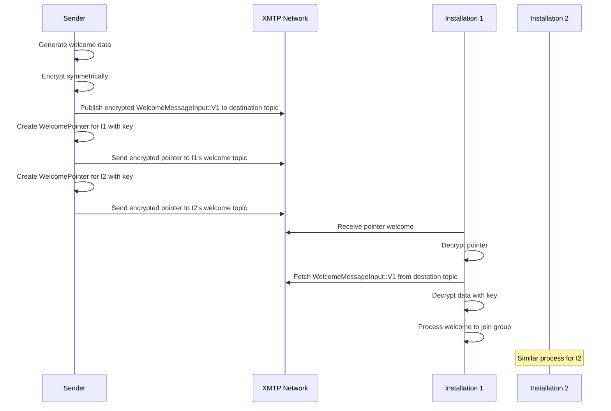
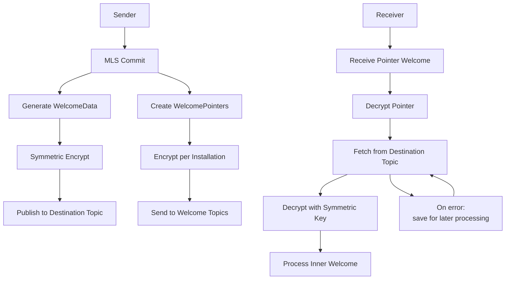

## Abstract

OpenMLS supports sending welcomes to multiple installations in a single commit. This is currently used,
but each welcome is sent individually to each installation. Some of the welcomes can be very large and
the data is essentially duplicated for every installation.

Welcome pointers introduces a new welcome message that is a pointer that only includes information about where to get the actual welcome data from. The large welcome pointer data can be sent to the server once and each installation can fetch that message. This is done by using symmetric key encryption for the welcome data while each installation receives a message that includes those keys.

## Motivation

See previous conversations at [https://github.com/xmtp/libxmtp/issues/2136](https://github.com/xmtp/libxmtp/issues/2136) and [https://github.com/xmtp/proto/pull/290](https://github.com/xmtp/proto/pull/290).

In XMTP group conversations using OpenMLS, adding multiple installations (devices) to a group requires sending welcome messages to each. These welcomes often contain large amounts of data, such as the group state, member lists, and cryptographic material. Currently, this data is duplicated for each welcome, leading to significant bandwidth usage, increased latency, and higher costs for both clients and the network.

Welcome pointers optimize this by separating the large, shared welcome data from the per-installation specifics. The shared data is encrypted symmetrically and published once to a dedicated topic. Each installation then receives a lightweight pointer message containing the location of the data and the symmetric key needed to decrypt it. This reduces redundancy, improves efficiency, and scales better for groups with many multi-device users.

Benefits include:

- Reduced network traffic: Upload the large data only once.
- Better resource utilization: Less duplication in storage and transmission.

## Specification

The keywords “MUST”, “MUST NOT”, “REQUIRED”, “SHALL”, “SHALL NOT”, “SHOULD”, “SHOULD NOT”, “RECOMMENDED”, “MAY”, and “OPTIONAL” in this document are to be interpreted as described in [RFC 2119](https://www.ietf.org/rfc/rfc2119.txt).

### Protobuf definitions

The `WelcomeMessageInput` and `WelcomeMessage` messages will be adding a new variant called `WelcomePointer`

The `WelcomePointer` variant of the `WelcomeMessageInput` will be defined as (with a matching change for `WelcomeMessage`)

```proto
  // Version 2 of the WelcomeMessageInput format which uses a WelcomePointer
  // to point to the welcome message for several installations at once
  message WelcomePointer {
    // The topic of the welcome message (generally the installation id)
    bytes destination = 1;
    // A WelcomePointer encrypted using the wrapper_algorithm
    bytes welcome_pointer = 2;
    // The public key used to encrypt the welcome pointer
    bytes hpke_public_key = 3;
    // The algorithm used to encrypt the welcome pointer
    xmtp.mls.message_contents.WelcomePointerWrapperAlgorithm wrapper_algorithm = 4;
  }
```

A new `welcome_pointer.proto` file will be added to `proto/mls/message_contents` with the following definitions

```proto
// A WelcomePointer is used to point to the welcome message for several installations at once to save overhead
message WelcomePointer {
  message V1 {
    // The topic of the welcome message. For V1, this means that it will be the first message in the topic, so no other identifier is required
    bytes destination = 1;
    // The algorithm used to encrypt the welcome pointer
    WelcomePointeeEncryptionAeadType aead_type = 2;
    // The encryption key of the welcome message. Must match key size specified by the aead_type.
    bytes encryption_key = 3;
    // Nonces used to encrypt the welcome pointer fields. Must match nonce size specified by the aead_type.
    repeated bytes nonces = 4;
  }

  oneof version {
    V1 v1 = 1;
  }
}

enum WelcomePointeeEncryptionAeadType {
  WELCOME_POINTEE_ENCRYPTION_AEAD_TYPE_UNSPECIFIED = 0;
  // Use same encoding as openmls::AeadType
  WELCOME_POINTEE_ENCRYPTION_AEAD_TYPE_CHACHA20_POLY1305 = 3;
}

// MUST match the WelcomeWrapperAlgorithm enum values without 25519 so that the i32 transformations are compatible
enum WelcomePointerWrapperAlgorithm {
  WELCOME_POINTER_WRAPPER_ALGORITHM_UNSPECIFIED = 0;
  WELCOME_POINTER_WRAPPER_ALGORITHM_XWING_MLKEM_768_DRAFT_6 = 2;
}

// Extension message that indicates the types of encryption supported by a client
message WelcomePointeeEncryptionAeadTypesExtension {
  repeated WelcomePointeeEncryptionAeadType supported_aead_types = 1;
}
```

The `WelcomePointeeEncryptionAeadTypesExtension` will be added to key packages to indicate whether welcome pointers are accepted and what type of encryption can be used (initially only ChaCha20Poly1305 is supported). The extension can add extra fields to indicate the maximum version compatible when new versions are added.

### Processing welcome pointers



#### High-level architecture for welcome processing with pointers



#### Sending

Senders of welcome pointers MUST ensure that the the target installation supports receiving welcome pointers through their key package extensions. If it is supported by more than 1 recipient then a welcome pointer message may be generated and sent to a topic that MUST be picked randomly.

#### Receiving

Clients receiving a welcome pointer MUST only use the first message from the `destination` topic to ensure that no other client can interfere with the welcome through any kind of attack (like publishing a subsequent message).

If a client cannot get the pointee from the server (either through local network or server availability issues) the client should save the welcome pointer to try re-fetching at a later point in time. This can be done on some time interval and SHOULD stop after a reasonable amount of time to avoid a malicious sender from executing a DDoS attack with welcome pointers that will never resolve.

## Rationale

- Deduplication: Publishing shared data once avoids redundancy, especially beneficial for large groups or users with many devices.
- Symmetric encryption: Allows secure sharing without per-installation asymmetric encryption of the large data.
- Pointer design: Keeps per-installation messages small, containing only essential fetch and decrypt info.
- Topic-based location: Leverages XMTP's topic system for reliable, decentralized fetching.

Alternatives considered:

- Do nothing: prevents from scaling up group sizes as one of the main bottlenecks is adding new members to large groups
- Compress data: Welcome data is already encrypted by OpenMLS, so compression is not effective
- New endpoints for welcome pointers: Requires more work in the current Go node and future decentralized nodes along with migration logic. Proposed implementation makes welcome pointers just a pointer to another message using the same APIs.

## Backward compatibility

This XIP is additive and backward compatible:

- Older clients receiving a WelcomePointer may fail to process if not updated, so senders MUST check the recipients key package to ensure that they support receiving welcome pointers.
- New clients handle both full welcomes and pointers.
- Proto changes use forward-compatible extensions (new message types).

## Test cases

- New client inviting new client via welcome pointer.
- New client inviting old client still uses direct welcomes.

## Reference implementation

- [protos](https://github.com/xmtp/proto/tree/tyler/welcome-pointer)
- [xmtp](https://github.com/xmtp/libxmtp/tree/09-15-welcome_pointer_v3_impl)

## Security considerations

- Key security: Symmetric keys are encrypted per installation in the pointer, using post quantum encryption.
- Data integrity: Use authenticated encryption (e.g., ChaCha20Poly1305) to prevent tampering.
- Replay attacks: Tie `message_id` to commit hash; clients verify against expected group state.
- Privacy: Shared data topic is ephemeral and not linkable without the pointer.
- DoS risks: Limit topic creation; clients rate-limit fetches.
- DDoS: Welcome pointers to nowhere can cause clients to execute many fetches. This is mitigated by making the cost to send a message more than the total cost of a client trying to fetch nothing and by having clients use a minimal retry duration of several minutes with a maximum retry time that quits trying to resolve the welcome pointer.
- Key generation: Use cryptographically secure random (ChaCha20) for keys and IVs.
- Timing: Only accept the first message on a topic as a pointee. Possibly add a hash of the pointee on the individual welcomes for authentication or add AAD to encryption for authentication.

### Threat model

Threats from adding welcome pointers remain the same as using regular welcomes. There is some potential for a client receiving a welcome to try to push a different welcome faster using a different node provider that could be received first on the destination topic, however, there are much more destructive actions that clients could take (like publicly publishing all messages from a group chat).

## Copyright

Copyright and related rights waived via [CC0](https://creativecommons.org/publicdomain/zero/1.0/).
