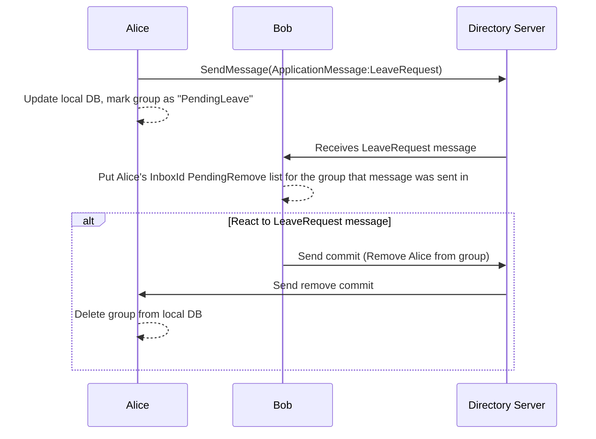
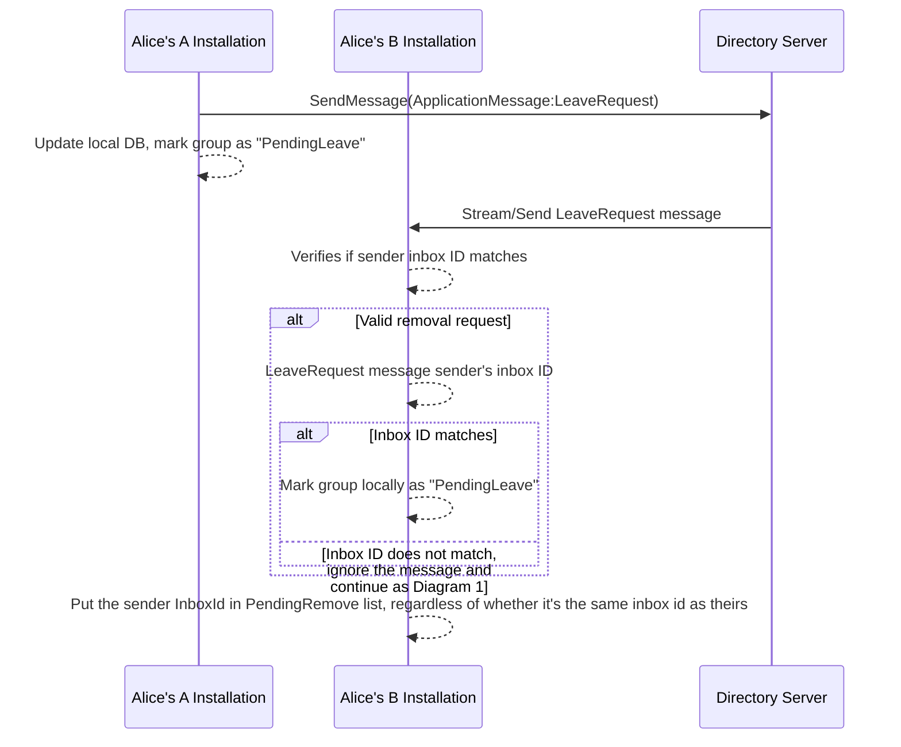
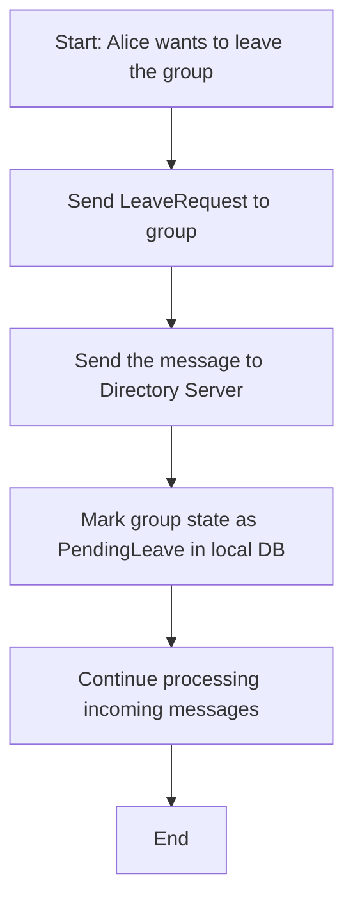
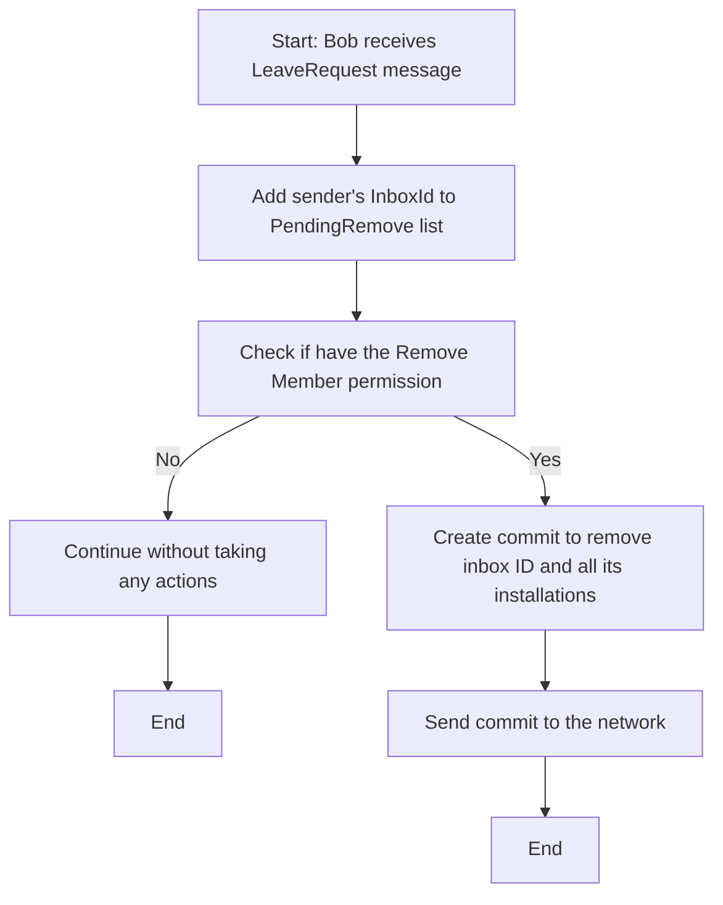
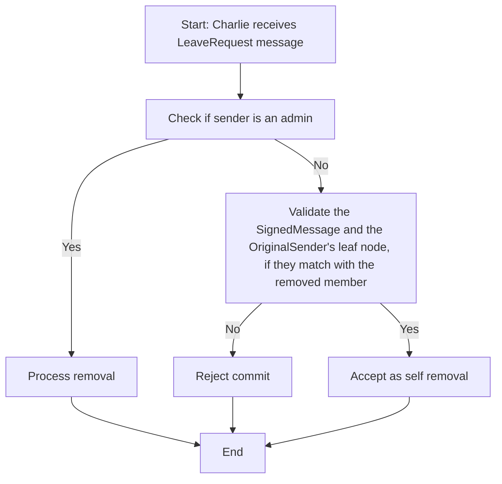
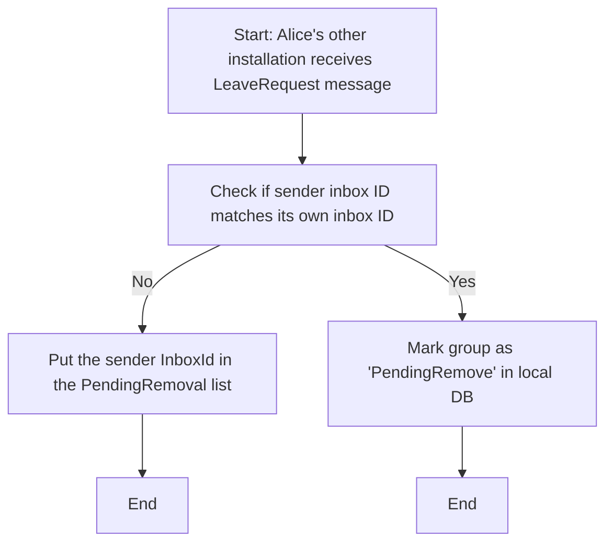

## Abstract

In the current implementation of **Messaging Layer Security (MLS) groups**, any participant can add new members to a conversation or group. However, there is no built-in mechanism to allow members to **leave a group** on their own.

The challenge stems from the **MLS group state management**—leaving a group requires modifying the group state, which generates new encryption keys. A client **cannot remove itself** by submitting a commit because the group must ensure that removed members do not gain access to updated encryption keys.

To address this, **another member must remove the departing client**. This XIP introduces three possible solutions and compares their effectiveness.

## Motivation

XMTP currently lacks a mechanism for members to manage their participation in **MLS-based** group conversations. Members **cannot remove themselves**, leading to potential issues such as:

- Receiving **unwanted messages** or notifications.

- **Privacy concerns** for users wishing to leave a group.

- **Administrative burdens** for group moderators managing member departures.

Implementing a **self-removal feature** would improve user autonomy and enhance the **overall user experience** within the XMTP ecosystem.

## Specification

### Self-removal from groups via application message/custom content types update

To facilitate self-removal, the protocol must allow a member to remove themselves using an ApplicationMessage/`ContentType` approach instead. This involves:

1. **Send an ApplicationMessage / Custom Content Type (`LeaveRequest`)**: The member sends a LeaveRequest as an application message to the group to announce the intention of leaving the group.
2. **Introduce LeaveRequest content type**: A new content type, `LeaveRequest` is introduced to show the intention of the sender.
3. **Processing LeaveRequest message**: Any installation that processes the received message should:
    - If the change applies to itself, update its local group state to `PENDING_LEAVE`.
    - If the change applies to another member:
        - V1: If they’re a super admin, or an admin with sufficient permissions, they will remove the sender’s `InboxId` from the group via a `RemoveCommit`.
        - V2 (requires breaking changes): Any member in the group can remove the sender from the group via a `RemoveCommit`.
            - This requires breaking changes to validation logic. Currently, only `SuperAdmin`s and `admin`s with sufficient permissions can remove members. With this change, any member can remove a sender who has submitted a `LeaveRequest`, even without the `Remove` permission.
4. **Ensuring consistency for 3.V2**: Since the receivers might have joined the group after the sender sent the leave request message, we need to include the `SignedMessage` that includes the sender’s `LeafNodeSignatureKey` in the remove commit. This will enable everyone to verify the `RemoveCommit`.
    - This is not a challenge for 3.V1 since only users with sufficient permissions can remove the sender from the group.

> [!NOTE]  
> We can include this data in this implementation but only removing the members by `Admin`s and `SuperAdmin`s.

### How it works

Alice and Bob are in the group, and Bob receives the leave request:



Alice’s other installations receive the leave-request:

> [!NOTE]
> We need to handle LeaveRequest state as a new ConsentState to transfer it from the older installation to the new installations.



How Alice leaves a group:



Bob receives the LeaveRequest message:



Charlie processes remove-commit from another member in the group:



Alice’s other installation receives the LeaveRequest message:



### LeaveRequest message content type

#### V1

```proto
message LeaveRequest {authenticated_note: Option<vec<u8>>}
```

#### V2 (anyone can remove anyone from the group)

```proto
message LeaveRequest {authenticated_note: Option<vec<u8>>}
```

#### V2 RemoveCommit

Needs to contain the LeaveRequest message signed by the original sender to make it verifiable by others.

### PendingRemove table on clients

We use this table on every client to make it easier to track which users want to leave the group.

```text
PendingRemove: inbox_id, group_id, message_id(reference to the user’s message in the db)
```

### Pending remove worker

Every client has a worker to react to LeaveRequests. This worker will run every 1 second and it collects all the groups that have a pending leave member. A group will be marked as such only when the user is an Admin/SuperAdmin in that specific group.

The worker will send RemoveCommit based on the recorded users in the PendingRemoval list.

After successfully removing that member, they will remove the inbox_id from the PendingRemove table and if there are no other members that want to leave the group, the client will mark the group as it has no more pending removal users.

### `Groups` table migration

We need to add a column to the Groups table if there is a pending leave request in that group and we have the right access to remove those members from the group. We can also join the Groups table with the PendingRemove table, but this requires more expensive calculation since we don’t store the Admin/SuperAdmin roles outside of the group.

> [!NOTE]
> When a user permission has changed in a group from NonAdmin to Admin or SuperAdmin, we need to check if there is a `PendingRemove` user for that group. If it does, we can then mark the group in the `Groups` table as it has a `PendingRemove` user.

### User left the group

When other users receive a message that the Admin/SuperAdmin removed a member, they can check their PendingRemove table. If that user already requested a leave request, then we put a `User Left the Group` message, otherwise we consider that remove commit as `Admin Removed X from the Group` as we are already doing it.

### Notes

1. Once a client submits the remove commit in response to a LeaveRequest message, we need to remove the member’s inbox-id from the pending removals on their local db.

## Rationale

The following alternate designs were considered:

### 1. Leave proposal

In **MLS**, modifying the group state requires submitting a **proposal**, which must then be committed. A client can **propose** to leave the group, but another client must **commit** the proposal to finalize the process.

To enable this functionality, the client wishing to leave would:

1. **Submit a leave proposal** to the group.

2. **Another client (not another installation of the same user) commits** the proposal, executing the leave process.

#### Challenges

- **XMTP’s current MLS implementation auto-commits proposals**, meaning proposals are immediately executed without a waiting period.

- To implement this solution, **the proposal mechanism must be modified** to support separate **publication and delayed commitment**.

### 2. Removal keys (Directory Server approach)

This approach assigns **removal keys** to a **Directory Server (DS)** when creating a group. These keys would allow the **DS to commit a removal proposal** initiated by a client.

#### Challenges

- This method works well in **centralized** environments where a DS has authority.

- **XMTP is decentralized**, meaning no single entity should have the power to remove members.

- **Anyone can run a node** in the network, making it infeasible to trust a single DS for member removals.

For these reasons, **this approach is not a viable solution for XMTP**.

### 3. Pending removals via metadata

In this approach, a client **updates the group metadata** by adding their **inbox ID** to a new "pending-removals" field. The client **marks the group locally** as "pending-left" or "left" to ignore messages and notifications.

The removal process follows these steps:

1. The client adds **its inbox ID** to "pending-removals" in the metadata.
2. Other **installations of the same client** receive this update and synchronize their local states.
3. Any other client processing the metadata update **commits a remove operation**, finalizing the departure.

#### Challenges and edge cases

##### Permission to remove

- Currently, **only admins** can remove members.

- This solution requires allowing **any client to remove members** whose inbox ID appears in "pending-removals".

##### Metadata update policies

- Clients must be allowed to **update group metadata** for self-removal.

- When processing a "pending-removals" update, clients must verify that **the sender’s inbox ID matches the removal request**.

- If there’s a mismatch, **other clients should reject the commit**.

### 4. Leave request via application nessage/content type

Here is a pros and cons table for self-removal solutions in MLS:

| **Solution** | **Pros** | **Cons** |
| --- | --- | --- |
| **Leave proposal** | ✅ Uses standard **MLS proposal & commit** mechanisms.<br/>✅ Maintains **cryptographic integrity** of the group state.<br/>✅ Ensures proper removal by another trusted member. | ❌ **Current XMTP MLS auto-commits proposals**, so it **requires changes** to proposal handling.<br/>❌ **Self-removal still requires another client** to commit the proposal.<br/>❌ Potential **delays** in removal if no other client commits promptly. |
| **Removal keys (Directory Server approach)** | ✅ Allows **immediate removal** of a client.<br/>✅ Works well in **centralized environments** where a DS has authority. | ❌ **Not viable in XMTP’s decentralized model**, as no single entity should hold power over removals.<br/>❌ **Trust issues**—a compromised DS could misuse removal keys.<br/>❌ Goes **against MLS principles** of distributed trust. |
| **Pending removals via metadata** | ✅ **Decentralized and user-friendly**—clients can **leave autonomously**.<br/>✅ Does not require modifying **MLS proposal-commit rules**.<br/>✅ Ensures smooth synchronization across **all installations of a client**.<br/>✅ Avoids **trusting a central authority** for removals. | ❌ **Depends on other clients to process metadata updates**, meaning **delays in finalizing removals**.<br/>❌ Requires **modifications to metadata update policies** to ensure security and **breaking** changes! |
| **Pending removals via application messages** | ✅ **Decentralized and user-friendly**—clients can **leave autonomously**.<br/>✅ Does not require modifying **MLS proposal-commit rules**.<br/>✅ Ensures smooth synchronization across **all installations of a client**.<br/>✅ Avoids **trusting a central authority** for removals.<br/>✅ Backward Compatible | ❌ **Depends on other clients to process metadata updates**, meaning **delays in finalizing removals**.<br/>❌ New Joined Client Miss the Already LeaveRequest sent by existence members |

### Best recommendation

👉 Pending removals via application messages is the best solution for XMTP because it:

- **Preserves decentralization**
- Allows **clients to self-remove**
- Does not require fundamental changes to MLS **protocol rules**

## Backward compatibility

Introducing self-removal via ApplicationMessages requires updates to the XMTP protocol and client implementations. Older clients that do not recognize the LeaveRequest messages may not process self-removal requests correctly but they also will not break.

Supporting `V2` (anyone in the group can remove anyone) requires breaking changes in the RemoveCommit validation logic.

## Test cases

TODO

## Reference implementation

TODO

## Security considerations

TODO

### Threat model

Malicious Admin/SuperAdmin client when there is only one Admin/Super Admin: With V1, since only Admin or SuperAdmins can remove another member from the group, if there is only one Admin/SuperAdmin in the group and that client is malicious, the user who wants to leave the group can be left stuck in the PendingLeave state.

## Copyright

Copyright and related rights waived via [CC0](https://creativecommons.org/publicdomain/zero/1.0/).
