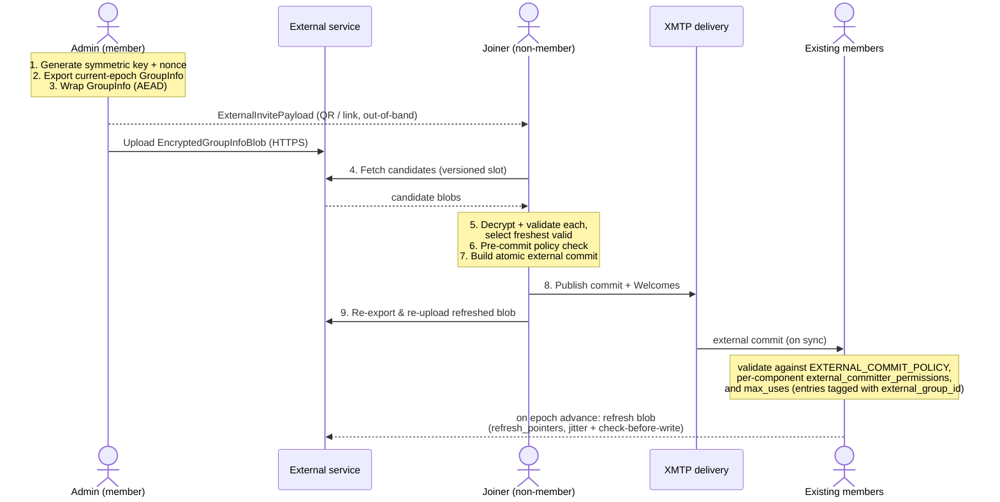

## Abstract

XMTP groups currently require an existing online member to add a new participant via a `Welcome`. This XIP introduces **External Commit Invites**: a shareable invite token (suitable for QR codes, deep links, or NFC) that allows a non-member to join a group on their own, without any existing member being online at scan time.

The mechanism uses the MLS External Commits primitive (RFC 9420 §12.4.3.2). The invite token carries a symmetric key and a pointer to an out-of-band service that hosts an encrypted `GroupInfo` for the current epoch. The joiner fetches the blob, decrypts locally, and publishes an atomic commit that adds all of the joiner's installations, registers them in the AppData group membership component, and advances the group epoch — all in a single commit that every existing member validates against an admin-controlled policy.

## Motivation

The dominant onboarding path for XMTP groups today requires an existing member to be online at the moment a new member joins, so they can construct the `Welcome` that initializes the newcomer's MLS state. This is incompatible with high-volume onboarding flows that consumer applications commonly want to ship:

- "Scan this QR code to join the community" posters at events.
- Shareable group-invite links propagated through email, SMS, or social media.
- Self-service "click to join" buttons on websites and within bots.

In each of these cases the admin issues the invite once and then expects subsequent joins to proceed without further admin involvement. Existing alternatives have material drawbacks:

- **Pre-invite manual `Welcome`**: requires an existing member to know the joiner's installations ahead of time and to be online when the joiner accepts.
- **Bot-mediated joining**: introduces a custodial intermediary that must hold group keys.
- **Out-of-protocol "invite codes" backed by a server-side roster**: moves group state outside MLS, defeating the protocol's security guarantees.

External Commits are the MLS-native solution: a non-member with the current-epoch `GroupInfo` can construct a self-contained commit that adds themselves to the group, and existing members validate that commit when they next come online. The remaining design work is to (1) get the `GroupInfo` to the joiner in a way that does not require an existing member to be online, (2) make the commit *atomic* with respect to libxmtp's cross-layer invariants (so existing members do not reject it on receipt), and (3) give the admin runtime-toggleable control over whether the group accepts external commits at all.

## Specification

The keywords "MUST", "MUST NOT", "REQUIRED", "SHALL", "SHALL NOT", "SHOULD", "SHOULD NOT", "RECOMMENDED", "MAY", and "OPTIONAL" in this document are to be interpreted as described in [RFC 2119](https://www.ietf.org/rfc/rfc2119.txt).

### Overview



### Wire format

The following protobuf messages are defined in `xmtp.mls.message_contents` (see [`external_invite.proto`](https://github.com/xmtp/proto/pull/334)). The cryptographic fields use **typed nominal newtypes** — `SymmetricKey`, `GroupStateHash`, and `ServicePointer` — rather than raw `bytes` (a review revision over the original wire format). Wrapping a `bytes` field in a submessage is a genuine wire-format change — it adds the inner field tag and length framing, so it is *not* byte-compatible with the raw layout — but the original raw-`bytes` layout never shipped (the XIP is Draft and proto#334 landed only on the unreleased `feature/external-invite` branch), so there is no wire-compatibility constraint to honor. The distinct type stops a key, nonce, hash, or pointer from being passed where another is expected, and gives length / format validation a single home. The AEAD scheme and hash function are **not** carried as in-message tags; they are fixed by the enclosing versioned envelope (and, for hashes, by the group's MLS ciphersuite). A new algorithm is a new envelope version — never an in-message tag that could disagree with the version. v1 additionally binds all of the blob's plaintext metadata into the AEAD as associated data, so a writer without the key cannot mutate any metadata field of a genuine ciphertext (see `EncryptedGroupInfoBlobV1`).

```proto
// A symmetric AEAD key. In every v1 envelope this is a 32-byte
// ChaCha20Poly1305 key. The protobuf submessage does not itself constrain
// length, so validators and setters MUST check that `material` is exactly
// 32 bytes for v1; empty or wrong-length `material` is invalid. The
// algorithm is fixed by the envelope version, not carried here.
message SymmetricKey {
  bytes material = 1;
}

// A digest of MLS group state at a single epoch. The hash function is the
// one bound to the group's MLS ciphersuite (one ciphersuite per group, so
// the algorithm is never ambiguous and is not carried on the wire). v1
// pins the preimage precisely: the TLS-serialized `GroupContext` of the
// referenced epoch — which itself binds `epoch`, `tree_hash`, and
// `confirmed_transcript_hash`. MLS is deterministic, so every member at an
// epoch derives an identical `GroupContext` and therefore an identical
// digest; equal digests ⇔ identical group state. Like SymmetricKey, the
// submessage does not constrain length: validators and setters MUST check
// that `digest` is exactly the ciphersuite's hash output length (32 bytes
// under XMTP's current ciphersuite); any other length is invalid.
message GroupStateHash {
  bytes digest = 1;
}

// Where the EncryptedGroupInfoBlob is hosted. A typed transport with a
// validated happy path plus an application-defined escape hatch. Lives
// in the invite payload (the QR) and, optionally, in
// EXTERNAL_COMMIT_POLICY.refresh_pointers so members can keep slots
// fresh (see "Keeping the blob fresh").
// Exactly one `location` variant MUST be set; a ServicePointer with no
// variant set (the empty oneof) gives the joiner no fetch target and MUST
// be treated as a parse failure (fail-closed), like an unrecognized
// version.
message ServicePointer {
  oneof location {
    // RFC 3986 https URI. libxmtp parses and syntactically validates it.
    string https_url = 1;
    // Application-defined opaque bytes for non-URL transports (NFC tags,
    // custom resolver schemes, etc.). Opaque to libxmtp.
    bytes opaque = 2;
  }
}

// v1 shape of the shareable invite blob for QR-code or link-based joining
// of an XMTP group via an MLS external commit.
message ExternalInvitePayloadV1 {
  // Typed pointer to where the encrypted blob is hosted (HTTPS URL or
  // application-defined opaque bytes). Per-QR; not stored in group state.
  //
  // MAY be ABSENT: an application whose scanner already knows how to
  // reach its service (a first-party reader with a baked-in endpoint)
  // omits the pointer entirely and resolves the service out-of-band.
  // This keeps the fetch target out of the QR — a leaked payload then
  // reveals no service location. When the field IS present, exactly one
  // `location` variant MUST be set (see ServicePointer): present-but-
  // empty is a parse failure; absent means application-resolved.
  ServicePointer service_pointer = 1;
  // Identifier for the service slot holding the encrypted blob. Format
  // is application-defined (UUID, snowflake, short slot key, etc.) and
  // opaque to libxmtp; the only constraint is that the value is unique
  // within the chosen service. Decoupled from the MLS group_id —
  // rotation may keep this stable (overwrite the same slot) or change
  // it (new slot on the service); the admin chooses per invite.
  //
  // MUST be at least 4 bytes (collision-avoidance floor for tiny
  // services). RECOMMENDED: 16 random bytes when no application-
  // specific scheme is in use. Maximum length is not capped by the
  // protocol; applications should bound it to fit their QR / link
  // transport.
  //
  // After joining, the joiner verifies this matches
  // `EXTERNAL_COMMIT_POLICY.external_group_id` in the group state as
  // defense-in-depth against a stale or swapped QR.
  bytes external_group_id = 2;
  // ChaCha20Poly1305 key (32 bytes in v1) used to wrap the GroupInfo.
  // Matches `EXTERNAL_COMMIT_POLICY.symmetric_key` in the group state.
  SymmetricKey symmetric_key = 3;
}

// Versioned envelope for the shareable invite blob. The application embeds
// the serialized bytes in whatever transport it prefers (hex, base64, raw
// QR, NFC, etc.) and stores the corresponding EncryptedGroupInfoBlob on an
// external service keyed by the v1 payload's `external_group_id`.
//
// New wire-format variants are added as new oneof entries; readers that
// don't recognize a variant treat the invite as unparseable and fail
// closed (no implicit downgrade).
message ExternalInvitePayload {
  oneof version {
    ExternalInvitePayloadV1 v1 = 1;
  }
}

// v1 shape of the encrypted-GroupInfo envelope.
//
// `epoch` and `group_state_hash` are plaintext metadata. They are NOT a
// trust anchor for the service — both are uploader-asserted, so a
// conformant service MUST NOT use them to evict entries or "pick a
// winner" (doing so turns a forged high `epoch` into a permanent slot
// wedge — see "Service contract"). Their roles are joiner-side:
//
//   * `epoch` lets the joiner sort the retained candidates and prefer the
//     freshest, and lets the joiner reject a blob whose claimed epoch
//     disagrees with the GroupInfo it decrypts.
//
//   * `group_state_hash` lets the joiner confirm, after decrypting, that
//     the blob's metadata matches the wrapped GroupInfo, and lets a
//     member recognize an idempotent re-upload.
//
// The trust anchor is the joiner's key + MLS validation, not the
// metadata: the joiner AEAD-decrypts each candidate and parses it to a
// GroupInfo whose internal epoch and `digest(GroupContext)` MUST equal
// the blob's `epoch` and `group_state_hash` before it will join. A blob
// that fails either check is discarded. See "Service contract" and
// "Join-side flow".
//
// All plaintext metadata is additionally bound into the AEAD as
// associated data. v1 AAD = `epoch` || `expires_at_ns` (each 8-byte
// big-endian) || `group_state_hash.digest`. A writer without the key
// therefore cannot mutate any metadata field of a genuine ciphertext —
// re-uploading a captured blob with, say, an extended `expires_at_ns`
// fails the unwrap. A key-holder can still re-mint a blob with arbitrary
// metadata; the post-decrypt consistency check and the validator-side
// policy bounds cover that case.
message EncryptedGroupInfoBlobV1 {
  // 12 bytes; ChaCha20Poly1305 nonce specific to this ciphertext. MUST
  // be generated uniformly at random from a cryptographically secure
  // source for every encryption; deterministic (counter-based) schemes
  // are forbidden. Many independent writers encrypt under the same
  // long-lived key (every joiner refreshes the blob), and two writers'
  // counters colliding would reuse a nonce — which in ChaCha20Poly1305
  // reuses the cipher stream and leaks the Poly1305 forgery key for
  // that nonce.
  bytes nonce = 1;
  // wrap_payload_symmetric output: AEAD ciphertext over the serialized
  // MlsMessageOut(GroupInfo).
  bytes ciphertext = 2;
  // MLS group epoch of the wrapped GroupInfo. Plaintext, uploader-
  // asserted. Used by the joiner to prefer the freshest candidate and to
  // consistency-check the decrypted GroupInfo; NOT used by the service to
  // order or evict. Joiner verifies against the decrypted GroupInfo
  // before joining.
  uint64 epoch = 3;
  // Digest of the wrapped GroupInfo's epoch state (see GroupStateHash: a
  // digest over the canonical `GroupContext` under the group's MLS
  // ciphersuite). Plaintext. The joiner verifies it equals
  // `digest(GroupContext)` of the decrypted GroupInfo; a member uses it
  // to recognize an idempotent re-upload. Not used for service ordering.
  GroupStateHash group_state_hash = 4;
  // Wall-clock expiry of this blob, in nanoseconds since UNIX epoch.
  // 0 means no expiry. The service uses this as a TTL hint and MAY
  // garbage-collect blobs past their `expires_at_ns` autonomously.
  // The joining client also enforces this — refuses to join from an
  // expired blob even if the service is still serving it.
  //
  // This is the blob's EFFECTIVE expiry, computed by the uploader as the
  // earlier of the two policy bounds that apply at wrap time (saturating;
  // a bound of 0 means "no bound" and drops out of the min):
  //
  //   min(EXTERNAL_COMMIT_POLICY.expires_at_ns,        // campaign end
  //       epoch_start_ns + EXTERNAL_COMMIT_POLICY.expire_in_ns)
  //
  // where epoch_start_ns is the delivery-service envelope timestamp of
  // the commit that began the wrapped GroupInfo's epoch (known to every
  // uploader — see "Receive-side validation" check 9). Folding the
  // staleness bound in here means the joiner's single expiry check also
  // skips candidates that validators would reject as stale — avoiding a
  // "zombie join" where the joiner publishes a commit every member
  // rejects and believes it joined a group that never accepted it — and
  // the service's TTL-based GC naturally collects staleness-dead blobs.
  // 0 only when neither policy bound is set.
  //
  // AAD-bound: a writer without the key cannot alter a genuine blob's
  // expiry (see the message comment). A key-holder can re-mint with a
  // later value, so this is a TTL / UX bound, not a security bound
  // against key-holders — the authoritative bounds are the policy
  // fields, enforced by validators against envelope timestamps.
  uint64 expires_at_ns = 5;
}

// Versioned envelope wrapping a single GroupInfo TLS-serialized bytes
// under an AEAD scheme (ChaCha20Poly1305 in v1) with a fresh random
// nonce per re-encryption and all plaintext metadata bound as
// associated data (see EncryptedGroupInfoBlobV1). Stored on the
// external service; joiners upload a refreshed blob (fresh nonce) after
// each successful join, and the slot retains the most recent uploads
// (see "Service contract").
//
// New variants represent breaking wire-format changes (different AEAD,
// different metadata layout). Readers that don't recognize a variant
// fail closed — the joiner cannot attempt MLS state transitions against
// a blob it can't validate.
message EncryptedGroupInfoBlob {
  oneof version {
    EncryptedGroupInfoBlobV1 v1 = 1;
  }
}
```

`ExternalInvitePayload` is the **capability**. It is small (well under 100 bytes), suitable for QR codes, NFC tags, and shareable URLs. It MUST be transported out-of-band; the service that hosts the encrypted blob MUST NOT see it.

`EncryptedGroupInfoBlob` is the **encrypted MLS state**. It is large (typically KB to MB, scaling with group size) and stored on the service indexed by `external_group_id`. Because it is symmetrically encrypted under the payload's `symmetric_key`, the service hosting it learns nothing about the group contents.

### Admin-controlled policy

External Commits are off by default. Each group MUST opt in via a new well-known AppData component, `EXTERNAL_COMMIT_POLICY` (ComponentId `0x800C`), defined in [`proto/mls/message_contents/external_commit_policy.proto`](https://github.com/xmtp/proto/pull/334):

```proto
// Field-coupling invariants enforced by libxmtp when applying an
// AppDataUpdate(EXTERNAL_COMMIT_POLICY) proposal:
//
//   * When `allow_external_commit` transitions to true: `symmetric_key`
//     and `external_group_id` MUST be populated (non-empty, meeting
//     their length requirements) in the same proposal. The two
//     transitions are atomic — there is no window where the bit is on
//     but the invite coordinates are unset.
//
//   * When `allow_external_commit` transitions to false (revoke):
//     every per-invite field — `symmetric_key`, `external_group_id`,
//     `expires_at_ns`, `refresh_pointers` — MUST be ABSENT from the
//     resulting policy: not serialized at all. For the proto3 scalar
//     and repeated fields this is the only cleared state there is
//     (defaults — empty bytes, 0, empty list — are never serialized;
//     "empty" and "absent" are the same wire state). The message-typed
//     `symmetric_key` is the one field with explicit presence and
//     therefore a second representable state, which is forbidden: an
//     empty SymmetricKey submessage (or empty `material`) is invalid —
//     absence is the only cleared encoding. Net effect: a revoked
//     policy serializes to nothing but the durable settings,
//     byte-identical to a policy that never had an invite. Validators
//     enforce this as a state invariant — `allow_external_commit ==
//     false` implies all four absent — so stale state cannot linger (a
//     lingering key could be revived by a careless re-enable; lingering
//     pointers re-adopted; a lingering absolute `expires_at_ns` would
//     silently mis-bound the next campaign) and a re-enable mints
//     everything fresh. The durable settings survive a revoke:
//     `expire_in_ns` and `max_uses` describe the group's posture toward
//     ANY invite, not the current one.
//
//   * On re-enable (false → true after a prior revoke): the new
//     `symmetric_key` MUST be freshly generated from a cryptographically
//     secure random source. Uniform 256-bit randomness guarantees — up
//     to negligible probability — that it differs from every
//     previously-used key, with no key-history tracking; validators do
//     not (and cannot) audit this rule, so it binds the setter. Reusing
//     a revoked key would re-validate every QR ever printed under that
//     key, defeating the revocation. The new `external_group_id` SHOULD
//     also differ.
//
//   * Whenever `allow_external_commit` is true, the GROUP_MEMBERSHIP
//     component's `ComponentMetadata.external_committer_permissions`
//     MUST admit a joiner writing its own entry. Every conforming
//     external commit is structurally required to write that entry, so
//     without the grant the switch is on but every join dead-ends at
//     validation. The enabling commit MUST establish the grant (in the
//     same commit) when it is absent. It is an ordinary permissions
//     block — not a protocol-baked default — so applications can evolve
//     it later like any other permissions surface.
message ExternalCommitPolicyV1 {
  // Master switch for MLS External Commits adding new members.
  // Required for the QR-invite flow. Defaults to false; admins
  // (super-admin by default) opt in via
  // AppDataUpdate(EXTERNAL_COMMIT_POLICY).
  //
  // See the field-coupling invariants in the message-level comment
  // above: enabling MUST populate symmetric_key + external_group_id;
  // revoking (true → false) MUST leave every per-invite field absent.
  bool allow_external_commit = 1;
  // Wall-clock auto-disable timestamp (ns since UNIX epoch).
  // 0 = no automatic expiry. After this timestamp the validator
  // rejects all external commits regardless of `allow_external_commit`.
  // Lets admins issue time-bounded invite campaigns without having to
  // come back and flip the bit manually.
  //
  // Per-invite, not a durable setting: revoking clears it to 0 — i.e.
  // absent on the wire; proto3 never serializes defaults (see the
  // field-coupling invariants — an absolute campaign end left behind
  // would silently mis-bound the next campaign). While enabled, 0
  // remains a legal value (no automatic expiry).
  uint64 expires_at_ns = 2;
  // Maximum staleness of the GroupInfo referenced by an external
  // commit, in nanoseconds since GroupInfo export. 0 = no staleness
  // limit. External commits whose referenced GroupInfo was exported
  // more than `expire_in_ns` ago are rejected. Narrows the replay
  // window for stolen-blob attacks and forces re-export frequency.
  // Durable setting: survives a revoke (it describes the group's
  // staleness posture for any invite, not the current campaign).
  uint64 expire_in_ns = 3;
  // ChaCha20Poly1305 key (32 bytes in v1) used to wrap the
  // EncryptedGroupInfoBlob for the currently-active invite. Carried in
  // the group state so any member (especially a just-joined external
  // committer) can re-export GroupInfo and re-upload a refreshed blob
  // under the same key after a join — without this, a printed QR / link
  // would die the moment the issuing admin went offline.
  //
  // The QR carries the same key. Rotation = admin sets a new value here
  // in a single AppDataUpdate(EXTERNAL_COMMIT_POLICY) proposal AND issues
  // a new QR carrying the matching key; old QR holders' keys no longer
  // decrypt blobs the service serves under the rotated slot.
  //
  // `material` MUST be exactly 32 bytes when populated (v1); the
  // SymmetricKey submessage does not enforce this, so validators/setters
  // MUST check it. The field being ABSENT is the canonical "no active
  // invite" encoding (an empty submessage or empty `material` is invalid) —
  // and MUST coincide with
  // `allow_external_commit == false` (see the field-coupling invariants
  // at the top of this message). Revoking the invite MUST clear this
  // field; re-enabling MUST populate it with a value freshly generated
  // from a cryptographically secure random source — uniform randomness
  // guarantees distinctness from every prior key without any
  // key-history tracking.
  //
  // Note: the per-QR service_pointer is application-defined and travels
  // in the QR — joiners use the pointer from the QR they scanned (a
  // scanner cannot read group state before decrypting the blob). Members
  // keep slots fresh via the optional `refresh_pointers` list below.
  SymmetricKey symmetric_key = 4;
  // Identifier for the service slot holding the active invite's
  // encrypted blob. Application-defined opaque bytes (UUID, snowflake,
  // short slot key, etc.); decoupled from the MLS group_id. Admins
  // MAY rotate the symmetric_key while keeping this stable (overwrite
  // the same slot on the service) or change both together (new slot,
  // leaves the old slot orphaned for application-side GC).
  //
  // The QR carries the same value. The joiner verifies that the QR's
  // `external_group_id` equals this field after joining, as
  // defense-in-depth against a stale or swapped QR. Mismatch indicates
  // the admin rotated to a new slot after the QR was minted; the
  // joining client SHOULD treat the just-published commit as orphaned
  // (it validates fine, but the refreshed blob the joiner would upload
  // to the old slot will not be reachable by holders of the new QR).
  //
  // MUST be at least 4 bytes when populated (collision-avoidance floor
  // for tiny services). RECOMMENDED: 16 random bytes when no
  // application-specific scheme is in use. Absent means no active
  // invite (proto3 bytes: an empty value is never serialized, so
  // "empty" and "absent" are the same wire state) — and MUST coincide
  // with `allow_external_commit == false` (see the field-coupling
  // invariants at the top of this message). Revoking the invite MUST
  // clear this field; re-enabling SHOULD use a freshly-generated value
  // (reusing a prior `external_group_id` is permitted only when the
  // admin intends to overwrite the old service slot — typically the
  // admin generates a new value to leave the prior slot orphaned).
  bytes external_group_id = 5;
  // Maximum number of members concurrently admitted to the group via the
  // currently-active invite. 0 = unlimited; 1 = a single active invited
  // member at a time.
  //
  // Enforced by every validating member, NOT by the service. Each
  // external committer tags its own GROUP_MEMBERSHIP entry with the
  // `external_group_id` it joined under (see "Atomic external commit
  // shape"); the live use-count is the number of current GROUP_MEMBERSHIP
  // entries carrying the active `external_group_id`. A member rejects an
  // external commit when that count is already >= max_uses. Because the
  // count is read from GROUP_MEMBERSHIP in the shared group state — not
  // replayed from commit history — every member, INCLUDING one that
  // joined after the invite was issued, computes the same value and
  // converges. No change to the atomic external-commit shape: the joiner
  // writes only its own GROUP_MEMBERSHIP entry.
  //
  // Semantics are CONCURRENT, not total-ever: removing an invited member
  // drops its entry and frees a slot. The count is scoped to
  // `external_group_id`, so rotating to a new slot id starts a fresh
  // budget (entries under the old id no longer count); a same-slot
  // `symmetric_key`-only rotation does NOT reset it. To make an invite
  // truly one-shot, revoke it (allow_external_commit = false) or rotate
  // the `external_group_id` after the join.
  //
  // max_uses is intentionally scoped per-invite (per-`external_group_id`):
  // it throttles a single invite/slot, by design — rotating
  // `external_group_id` opens a fresh budget. It is NOT a cap on the total
  // inboxes in the group; a cap on how many inboxes may join a group is a
  // SEPARATE setting, not max_uses. Durable setting: survives a revoke.
  uint32 max_uses = 6;
  // Service locations members use to keep the active invite's blob
  // fresh. Optional. When populated, every member re-wraps and
  // re-uploads the blob after epoch advances (see "Keeping the blob
  // fresh") — the poster on the wall stays joinable while any one
  // member is online. When empty, only the issuing admin and past
  // scanners (who know a pointer from their own QR) can refresh, or the
  // application drives refresh itself against application-resolved
  // pointers; that mode preserves pointer secrecy from group state at a
  // liveness cost.
  //
  // Listing pointers here places fetch locations in group state: every
  // member — including every future removed member — learns them. See
  // "Leakage analysis" and "Removed members and invite capability". The
  // per-QR `service_pointer` is unaffected: scanners cannot read group
  // state before decrypting the blob, so the QR (or the app's own
  // knowledge) always carries the fetch target for joining.
  //
  // Per-invite, not a durable setting: revoking clears the list — i.e.
  // absent on the wire; repeated fields have no separate presence, an
  // empty list is simply not serialized (see the field-coupling
  // invariants). Re-enabling SHOULD populate fresh locations. While
  // enabled, an empty list remains the legal opt-out of member-driven
  // refresh.
  repeated ServicePointer refresh_pointers = 7;
}

// Versioned envelope. New variants are added as new oneof variants;
// readers that don't recognize a variant treat the policy as default
// (all fields zero) per the standard unknown-variant tolerance rules.
message ExternalCommitPolicyEntry {
  oneof version {
    ExternalCommitPolicyV1 v1 = 1;
  }
}
```

Toggling the master switch is performed via an `AppDataUpdate(EXTERNAL_COMMIT_POLICY)` proposal. The component's update authorization is governed by its own `ComponentMetadata.permissions` block — by default, super-admin-only.

### Why the symmetric key is stored in the group

The QR / link must remain valid across epochs — a printed poster cannot rotate its key every time a new member joins. This means every successful join MUST re-upload a refreshed `EncryptedGroupInfoBlob` under the **same** symmetric key, even when the admin who issued the invite is offline.

The natural party to do this is the just-joined external committer: they have the new-epoch `GroupInfo` (they just produced the commit) and they have the AppData (the `AppDataDictionary` rides on the `GroupInfo` as a group-context extension, so the joiner reads `EXTERNAL_COMMIT_POLICY` the moment they decrypt the blob). They therefore have everything required to re-export and re-upload.

Storing `symmetric_key` and `external_group_id` in `ExternalCommitPolicyV1` rather than relying on the QR alone gives:

- **Group-wide agreement on the active invite coordinates**. All members see the same key + slot id via normal group sync; no key-distribution side channel.
- **Atomic invite issuance**. The admin opens an invite by setting `allow_external_commit = true`, `symmetric_key`, and `external_group_id` in a single `AppDataUpdate(EXTERNAL_COMMIT_POLICY)` proposal. The fields are coupled by MLS atomicity guarantees — there is no window where the switch is on but the key or slot id is unset.
- **Rotation = single AppData update**. Admin issues a new QR with a fresh key (and optionally a fresh `external_group_id`) and submits an `AppDataUpdate` carrying the matching values. Two rotation flavors:
  - Same `external_group_id`, new `symmetric_key`: re-uploads land on the *same* service slot; old QR holders fail AEAD on every blob wrapped after the rotation. Join ability through *retained* old-key blobs ends with the rotation commit itself — rotation advances the epoch, so a commit built from any retained (pre-rotation) blob is framed at a stale epoch and rejected; only a join already sequenced before the rotation survives. Two residuals remain: retained old-key blobs stay *readable* to old-key holders (a snapshot of pre-rotation group state) until they age out of the window or are garbage-collected, and a *member* who kept the old key can re-wrap the current `GroupInfo` under it to revive stale QRs — rotation is not a boundary against member-grade adversaries (see "Invite redirection (known limitation)"). Use the master switch when the threat includes members.
  - New `external_group_id`, new `symmetric_key`: re-uploads land on a *new* service slot; the old slot is orphaned for application-side GC. Useful when the admin wants to migrate the slot for any reason (abuse mitigation, service change, etc.).
- **Revocation = one proposal**. Setting `allow_external_commit = false` — which clears every per-invite field with it (key, slot id, campaign expiry, refresh pointers; see "Lifecycle invariants") — short-circuits the validator. No blob upload or service interaction required.

The per-QR `service_pointer` is not group state: it is application-defined opaque bytes, different invites for the same group MAY point at different services (geographic distribution, application migration, etc.), and a scanner cannot read group state before decrypting the blob anyway — so the QR (or the application's own knowledge) always carries the fetch target for *joining*. What the policy MAY carry is `refresh_pointers`: the locations members use to keep blobs fresh across epoch advances (see "Keeping the blob fresh"). `symmetric_key` and `external_group_id` must be group-wide because all participants in the invite lifecycle must produce blobs decryptable under the same value and addressable at the same slot; `refresh_pointers` joins them when the group wants member-driven freshness.

#### Leakage analysis

The symmetric key is plaintext within the group context. This is intentional and bounded:

- With `refresh_pointers` empty, the key is only useful to an attacker who *also* knows where to fetch the blob (no fetch location lives in group state). With `refresh_pointers` populated, group state carries the full fetch capability — key, slot id, and location. This is accepted: members learn a pointer from any QR they scan anyway, and the join capability itself is what the policy gates. It does sharpen "Removed members and invite capability" — a removed member of a `refresh_pointers` group always knows where the slot lives — which strengthens the rotate-on-removal guidance there.
- Any current member already has full read access to all group state, including the ability to export `GroupInfo` directly. Storing the invite key in the group does not increase any current member's capabilities.
- The blob the key wraps contains an MLS `GroupInfo` for the *current* epoch only — not historical messages. A compromised key permits joining the group (which `allow_external_commit` and `external_committer_permissions` already gate), not retroactive decryption.
- The blob does, however, expose the *current* epoch's group context to anyone holding the `symmetric_key` **before** they join: the plaintext `AppDataDictionary` (content components such as `GROUP_NAME`, `GROUP_DESCRIPTION`, and profiles) and the ratchet tree (member identities). In v1 this is accepted — the invite is a capability to join, and joining already grants that visibility. Closing this *pre-join* (and *pre-approval*) content exposure is deferred to "Confidential components (future work)" in the Rationale; membership exposure is inherent to external commit and cannot be closed without breaking the primitive.

### Per-component external-committer permissions

`ComponentMetadata` (in [`proto/mls/message_contents/component_permissions.proto`](https://github.com/xmtp/proto/pull/334)) gains a new field:

```proto
message ComponentMetadata {
  ComponentType component_type = 1;
  ComponentPermissions permissions = 2;
  // NEW: Permission policies evaluated against MLS External Commits.
  // Absent / unset is equivalent to all-Deny.
  ComponentPermissions external_committer_permissions = 3;
}
```

This is the per-component declarative authorization layer. When an external committer's commit proposes to modify a component's value, the validator consults that component's `external_committer_permissions` block. If absent, the modification is denied. This is the symmetric twin of the existing `permissions` field, but evaluated against external committers (Sender = `NewMemberCommit`) rather than existing members (Sender = `Member`).

The two layers compose: `EXTERNAL_COMMIT_POLICY.allow_external_commit` is the master switch (runtime-toggleable); `external_committer_permissions` is the declarative per-component capability surface. **Both** layers MUST admit a commit for it to be accepted.

### Atomic external commit shape

An external commit accepted under this XIP MUST consist of:

1. Exactly one `ExternalInit` proposal (RFC 9420 §12.4.3.2).
2. Zero or more by-value `Add` proposals, where every added `KeyPackage` carries the same `inbox_id` as the joiner's signing key. (This enforces "the joiner can add only their own installations.")
3. Exactly one `AppDataUpdate` proposal scoped to the joiner's own entry in the `GROUP_MEMBERSHIP` component. The entry MUST record the `external_group_id` the joiner was admitted under (this is what `max_uses` accounting counts). (This keeps the tree-level MLS membership and the AppData-level membership coupled in a single atomic commit — required by libxmtp's cross-layer invariants — and still touches only the joiner's own entry, so the atomic shape is unchanged.)

The following are explicitly forbidden:

- Any by-reference proposal (RFC 9420 §12.4.3.2 already forbids these for external commits; the libxmtp validator hard-rejects).
- `Remove` proposals (no "resync" flavor in v1).
- PSK proposals — a non-member has no pre-shared key it can legitimately reference with the group, so admitting them is gratuitous attack surface in v1 (a future resync flavor may revisit).
- `GroupContextExtensions` proposals (the AppData migration eliminates the legacy mutable-metadata use case).
- `AppDataUpdate` proposals touching any inbox's entry other than the joiner's own, or any component other than `GROUP_MEMBERSHIP`.
- Multiple `ExternalInit` proposals.

The joiner publishes the commit to the group's XMTP delivery topic, HPKE-wraps `Welcome` messages for the joiner's non-primary installations, then re-exports a `GroupInfo` at the new epoch, wraps it under the same `symmetric_key` with a **fresh** ChaCha20Poly1305 nonce, and uploads the refreshed blob to the service.

**`GROUP_MEMBERSHIP` entry field (for `max_uses`).** `GROUP_MEMBERSHIP` is a `TlsMap<InboxId, Bytes>` whose per-member value is itself a protobuf message, so recording which invite admitted a member is a routine additive field — not a structural change to the map. This XIP adds an optional `admitted_via_external_group_id` to that per-member message: an external committer sets it (to the `external_group_id` it joined under) **in the same entry it already writes** — so the atomic shape above is unchanged — and it is absent for members added by `Welcome`. The live use-count is the number of entries whose `admitted_via_external_group_id` equals the active `external_group_id`.

The tag is recorded on **every** external commit — including when `max_uses` is `0` (unlimited, in which case nothing reads it) — so a later policy change to a finite `max_uses` starts from accurate data. And it is **write-once**: set exactly once by the admitting external commit and immutable for the life of the entry. Validators MUST reject a member-sender commit that sets, clears, or alters the field on any entry — its own included; otherwise an invited member could untag itself and free a `max_uses` slot at will — and any rewrite of a member's entry for unrelated reasons (an installation change, say) MUST carry the field through unchanged. The field disappears only when the entry itself does (the member is removed).

### Service contract

The service hosting `EncryptedGroupInfoBlob` is application-defined and out of scope for libxmtp. Because the service is untrusted and never holds the symmetric key, the protocol does **not** ask it to validate, order, or arbitrate blobs: the uploaded `epoch` / `group_state_hash` are uploader-asserted and MUST NOT be used as a winner-selection signal. Instead the slot is **versioned** and the joiner selects (see "Join-side flow"). The protocol asks of any conformant service:

1. **Indexed by `external_group_id`.** Each invite has its own service slot, identified by the application-defined `external_group_id` (opaque bytes, MUST be ≥4 bytes, RECOMMENDED 16 random bytes) carried in the QR. Rotating the `external_group_id` orphans the prior slot for application-side GC.
2. **Retain recent uploads (versioned slot).** A slot SHOULD retain the most recent N uploads (RECOMMENDED N ≥ 4), evicting **by arrival order (FIFO)** — never by the uploader-asserted `epoch`. Eviction by claimed `epoch` is forbidden: it lets a single forged high-`epoch` upload flush the genuine blob and permanently wedge the slot.
3. **Serve the candidate set.** A fetch returns the retained uploads (or the most recent N). The service performs no MLS validation and needs no key; the joiner validates-and-selects across the set.
4. **Optional epoch-jump sanity gate.** A service MAY reject an upload whose `epoch` exceeds the highest stored `epoch` by more than an implementation-defined K. This is a cheap hint to bound nonsense values; it is **not** a security boundary (the joiner's validate-and-select is), and it MUST NOT be implemented as epoch-based eviction.
5. **Idempotent re-upload.** **Byte-identical** uploads — equal across **all** blob fields (`epoch, group_state_hash, expires_at_ns, nonce, ciphertext`) — MUST be coalesced to a single retained copy, so an identical-blob flood cannot consume the retention window. Coalescing MUST NOT key on the plaintext metadata alone: those fields are all attacker-copyable, so a metadata-only "latest wins" rule would let a keyless writer displace the genuine blob with one the joiner must discard (garbage ciphertext, or doctored metadata that fails the AAD) — an availability attack under the same metadata. Uploads that share metadata but differ in any field are *distinct* entries (each retained, FIFO); the joiner discards the invalid ones (the service cannot — it has no key).
6. **Expiry-based garbage collection.** The service MAY delete blobs whose `expires_at_ns` has passed.

The service MUST NOT see the symmetric key. The service MAY apply its own access controls (rate limiting, authenticated writes, abuse detection); these **compose with** — and do not replace — the versioned-slot + joiner-select robustness above. See "Slot poisoning" under Security considerations.

### Receive-side validation (existing members)

When an existing member processes an external commit, libxmtp dispatches to a new `ValidatedCommit::from_external_commit` path. The validation in addition to the standard MLS commit checks asserts:

1. The sender is `Sender::NewMemberCommit`.
2. Exactly one `ExternalInit` proposal is present.
3. All `Add` proposals share the joiner's `inbox_id` (verified against the joiner's signing key).
4. The joiner's `inbox_id` is not already in the group — no existing ratchet-tree leaf and no existing `GROUP_MEMBERSHIP` entry. (An existing member cannot re-add itself via external commit; among other things, that would let it rewrite — or re-tag — its own membership entry. Recovering a broken installation is the deferred resync flavor, not v1.)
5. Exactly one `AppDataUpdate` proposal exists, modifying only the joiner's `GROUP_MEMBERSHIP` entry.
6. No forbidden proposal types are present (see "Atomic external commit shape" above).
7. The group's `EXTERNAL_COMMIT_POLICY.allow_external_commit` is `true`.
8. The commit's **delivery-service envelope timestamp** does not exceed `EXTERNAL_COMMIT_POLICY.expires_at_ns` (if set). The bound is evaluated against the envelope timestamp — never the validator's wall clock at processing time — so a member that syncs the commit a week later reaches the same verdict as one that processed it immediately.
9. When `EXTERNAL_COMMIT_POLICY.expire_in_ns != 0`: the commit's envelope timestamp minus the current epoch's start timestamp does not exceed `expire_in_ns`. The epoch-start timestamp is the envelope timestamp of the message by which the validator entered or observed the current epoch — the epoch's commit, for members that processed it; the corresponding `Welcome` (published together with that commit), for members added at that epoch; the group-creation timestamp at the initial epoch. These differ across members only by publish latency (seconds), and not at all by *when* a validator processes the commit — so `expire_in_ns` is a coarse bound and SHOULD be set to values (minutes or more) for which that skew is immaterial.
10. The proposed `AppDataUpdate` is admitted by the `GROUP_MEMBERSHIP` component's `external_committer_permissions` block.
11. The joiner's new entry records `admitted_via_external_group_id` equal to the **active** `external_group_id` — required on every external commit, whatever `max_uses` is (see "Atomic external commit shape").
12. When `EXTERNAL_COMMIT_POLICY.max_uses != 0`: the number of current `GROUP_MEMBERSHIP` entries tagged with the active `external_group_id` is strictly less than `max_uses`. The commit that would create the (`max_uses`+1)-th concurrent invited member is rejected.

Any failure causes the commit to be rejected before merge. Existing members do not advance epoch on a rejected external commit. Convergence is a design requirement on every check: the `max_uses` count is read from `GROUP_MEMBERSHIP` in the shared group state — rather than replayed from commit history — so every member computes it identically, including one that joined after the invite was issued; the two time bounds (checks 8 and 9) are evaluated against delivery-service envelope timestamps, never a validator's own clock at processing time, so members that sync at different times still agree; and older clients reject external commits outright (fail-closed). The accept/reject decision is therefore deterministic and convergent across the membership.

### Join-side flow

A non-member with an `ExternalInvitePayload` performs the following:

1. Verify `payload.version` is recognized; otherwise fail closed (no implicit downgrade). Resolve the fetch target: if `payload.service_pointer` is absent, the application MUST already know how to reach the service for its own invites (application-resolved); if present, it MUST have a `location` variant set — a present-but-empty `ServicePointer` is a parse failure (fail closed, no fetch target).
2. Fetch the candidate set from the resolved service slot (up to N `EncryptedGroupInfoBlob`s — see "Service contract"). Clients SHOULD bound this step: cap the number of candidates processed (RECOMMENDED: at least the service's retention N, e.g. 8) and cap the per-blob size — a malicious service must not be able to stream unbounded data through the decrypt loop. See "Joiner-side resource bounds and fetch hygiene".
3. For each candidate, discard it on the first failing check:
   1. `blob.version` is recognized.
   2. Not expired: `blob.expires_at_ns == 0 || now_ns < blob.expires_at_ns`.
   3. AEAD-decrypt `blob.ciphertext` under `payload.symmetric_key.material` with `blob.nonce` and the v1 AAD (`epoch || expires_at_ns || group_state_hash.digest`, fixed-width fields big-endian). Failure — wrong key, tampered ciphertext, or tampered metadata — discards the candidate. **This is the step that eliminates poison, and metadata tampering, by anyone who does not hold the key.**
   4. Parse the plaintext as a `VerifiableGroupInfo`.
   5. Consistency: the GroupInfo's epoch equals `blob.epoch` **and** `digest(GroupContext)` equals `blob.group_state_hash.digest`. A blob whose key-holder lied about its metadata is discarded here.

   Note that check 3.2 carries the staleness bound too: `expires_at_ns` is the blob's *effective* expiry — the uploader folds the policy's `expire_in_ns` staleness window into it at wrap time (see the field comment) — so a candidate that validators would reject as stale is discarded here before any commit is built. Joining from such a blob would otherwise produce a **zombie join**: the joiner believes it is a member of a group whose every member rejected the commit, and silently receives nothing.
4. If no candidate survives, abort: the slot is empty, stale, or poisoned. This is transient — a subsequent genuine upload repopulates the slot — so the client MAY retry later.
5. Among survivors, select the **highest-epoch** candidate. If several share the highest epoch with differing `group_state_hash` (concurrent forks), order them deterministically (e.g. ascending `group_state_hash`) and attempt them in that order; on a commit rejected at validation, exclude that fork and try the next. (A deterministic *single* pick is not sufficient — it would re-select the same losing fork on every re-fetch and loop forever.) If all same-epoch forks are exhausted, abort and retry later — a newer genuine blob may appear.
6. Pre-commit policy check (SHOULD): from the selected GroupInfo's `EXTERNAL_COMMIT_POLICY`, abort **before publishing anything** when the join is predictably doomed or unwanted: `allow_external_commit == false`; `expires_at_ns` already passed; `max_uses` exhausted (count the tagged `GROUP_MEMBERSHIP` entries exactly as validators will); or the stale-QR mismatch of step 9 detected early — `external_group_id` or `symmetric_key.material` differing from the payload's means the admin rotated the invite after the QR was minted, and the joiner SHOULD abort rather than join against that expressed intent.
7. Build the atomic external commit (shape above) against the selected `GroupInfo`. The joiner's `KeyPackage`s for all installations are fetched via the standard identity-update flow.
8. Publish the commit + HPKE-wrapped `Welcome`s for the joiner's non-primary installations.
9. Verify **both** `external_group_id == payload.external_group_id` **and** `symmetric_key.material == payload.symmetric_key.material` (stale-QR / wrong-slot check; the same comparison as in step 6, re-run against the committed state). **This check does not gate joining** — once the step-8 commit lands the joiner is already a member; at this point it only governs whether to refresh the blob. On a mismatch the joiner MUST NOT upload a refreshed blob: it would land on an orphaned slot, or be encrypted under a rotated key. (A mismatch first appearing here is the race case — this join was sequenced just before a rotation commit.) Note what key-only rotation does and does not do: the rotation commit advances the epoch, so retained old-key blobs stop being *joinable* immediately — a commit built from one is framed at a stale epoch and rejected — but they remain *readable* to old-key holders until they age out, and a member who kept the old key can re-wrap the current `GroupInfo` under it to revive stale QRs (see "Invite redirection (known limitation)"). The master switch (`allow_external_commit = false`), enforced by validators *before* merge, is the revocation that holds against members too; rotating `external_group_id` additionally moves the active slot so stale QRs fetch only the orphaned one.
10. Re-export `GroupInfo` at the new epoch, wrap it under `EXTERNAL_COMMIT_POLICY.symmetric_key` with a **fresh** random nonce and the v1 AAD, set `expires_at_ns` to the effective expiry (the earlier of the policy's `expires_at_ns` and epoch-start + `expire_in_ns`; the epoch-start is the delivery-service timestamp of the joiner's own just-published commit, available once it is read back from the group's topic), and upload the refreshed `EncryptedGroupInfoBlob` to the slot resolved in step 1. The next scanner that reaches this slot gets a current-epoch blob. The joiner has also just advanced the epoch, so the member refresh algorithm (see "Keeping the blob fresh") covers any `refresh_pointers` beyond the scanned slot.

Detection timing decides the response to a stale QR. Detected at step 6 (pre-publish), the joiner SHOULD abort the join entirely — the admin has rotated the invite, and joining anyway proceeds against that expressed intent. Detected only at step 9 (post-publish), the joiner is already a member: it stays in the group but skips the refresh.

### Keeping the blob fresh (member refresh)

Every commit advances the epoch — a rename, a `Welcome`-add, a key update — and an external commit built from a stale-epoch `GroupInfo` is rejected by every member. Without a refresh path beyond join-side step 10, a printed QR dies the moment the group has any commit activity and stays dead until the issuing admin happens to come back online. Two parties keep slots alive:

- **Joiners** refresh the slot they scanned (join-side flow, step 10).
- **Any member** refreshes the slots listed in `EXTERNAL_COMMIT_POLICY.refresh_pointers`, via the algorithm below.

After merging any commit that advances the epoch of a group where `allow_external_commit == true` and `refresh_pointers` is non-empty, a member SHOULD run the following — best-effort and asynchronous, never on the commit hot path:

1. **Jitter.** Wait a uniformly random delay (RECOMMENDED 0–30 s).
2. **Re-check.** If the group's epoch advanced again during the wait, stop — the newer commit's refresh cycle supersedes this one.
3. **Check-before-write.** For each pointer in `refresh_pointers`: fetch the slot's candidates and validate them exactly as a joiner would (AEAD + consistency). If any candidate is valid at the current epoch, skip that slot — another member won the race. Otherwise wrap a fresh blob (fresh random nonce, effective `expires_at_ns`) and upload it.
4. **No retry storms.** A failed upload is abandoned; the next epoch advance re-triggers the cycle. A member MAY additionally run step 3 on a slow timer or app-foreground event — this is what repopulates a slot after a poisoning flood without waiting for the next commit.

The jitter plus check-before-write makes the scheme self-selecting: the first online member to act repopulates the slot, and everyone after it reads a fresh candidate and stands down. Duplicate uploads are bounded by the service's read-write race window — two members that pass step 3 simultaneously both upload, and the versioned slot absorbs the duplicates harmlessly (both are valid current-epoch blobs). The scheme is offline-tolerant by construction: any single online member suffices, and a group whose members are all offline is not producing the commits that stale the blob in the first place.

`refresh_pointers` SHOULD be populated when the invite is enabled and kept accurate across rotations. Leaving it empty opts out of member-driven refresh — only the issuer and past scanners can keep slots fresh, or the application drives refresh through its own callback against application-resolved pointers. That mode preserves pointer secrecy from group state at a liveness cost (see "Leakage analysis").

### Rotation and revocation

There is exactly one live invite per group at any time. To rotate, the admin issues an `AppDataUpdate(EXTERNAL_COMMIT_POLICY)` proposal with a fresh `symmetric_key` value (and optionally a fresh `external_group_id`) AND prints / distributes a new QR carrying the matching values. Holders of the prior QR retain stale values and can no longer participate in the *new* invite (their key won't decrypt fresh blobs, and they can't refresh the slot). Rotation revokes join ability as soon as the rotation commit is sequenced — it advances the epoch, staling every retained old-key blob — but it does not erase *read* access to retained pre-rotation blobs, and it does not hold against a member who kept the old key (see "Join-side flow" step 9 and "Invite redirection (known limitation)"); the master switch below holds in both respects. No explicit service-side "revoke" call is required.

The admin chooses per rotation whether to retain the `external_group_id` (overwrite the same service slot — operationally simpler) or generate a new one (new slot, leaves the old slot orphaned for application-side GC — useful when the admin wants to actively abandon a compromised slot).

The `EXTERNAL_COMMIT_POLICY.allow_external_commit` master switch provides a separate, runtime-toggleable revocation path that does not require minting a new QR: the admin flips the bit to `false`, and existing members reject any subsequent external commit regardless of whether scanners can still decrypt stale blobs. The revoke proposal clears every per-invite field with it — key, slot id, campaign expiry, refresh pointers (see "Lifecycle invariants") — so a later re-enable starts from a blank slate. This is the recommended "kill switch" for incident response.

Member removal while an invite is live SHOULD also be treated as a rotation trigger: the removed member leaves with the invite's `symmetric_key` and `external_group_id` (they are plaintext group state), so it retains both join capability — nothing prevents a removed inbox from external-committing straight back in while the invite stays live — and key-holder write capability against the slot. See "Removed members and invite capability" under Security considerations.

### Lifecycle invariants

The following rules govern every `AppDataUpdate(EXTERNAL_COMMIT_POLICY)` proposal. The first two are validator-enforced — they are checkable from the proposal plus current group state, so every member reaches the same verdict. The fresh-key rule binds the **setter only**: validators cannot audit randomness, and a late-joining validator has no key history to compare against, so making it validator-enforced would itself diverge. libxmtp's high-level setter APIs are responsible for never producing a violating proposal:

- **Enable atomicity**: When `allow_external_commit` transitions to `true`, the proposal MUST also populate `symmetric_key` (a 32-byte `SymmetricKey`) and `external_group_id` (at least 4 bytes). There is no group state in which the master switch is on but the invite coordinates are absent. The enabling commit MUST additionally leave `GROUP_MEMBERSHIP`'s `ComponentMetadata.external_committer_permissions` admitting the joiner-self-entry write — populating it in the same commit when absent. Validators reject an enable whose resulting state violates this (the check is on post-state, so it converges); without the grant the switch is on but every external commit dead-ends at validation, since the atomic shape requires that entry write. `refresh_pointers` SHOULD also be populated in the same proposal when the group wants member-driven refresh (see "Keeping the blob fresh").
- **Revoke atomicity**: When `allow_external_commit` transitions to `false`, the proposal MUST leave every per-invite field — `symmetric_key`, `external_group_id`, `expires_at_ns`, `refresh_pointers` — **absent** from the resulting policy: not serialized at all. There is exactly one cleared encoding per field. For three of the four it is the only state proto3 offers — scalar and repeated defaults (empty bytes, `0`, empty list) are never serialized, so "empty" and "absent" are the same wire state. The message-typed `symmetric_key` is the one field with explicit presence and therefore a second representable state, which is forbidden: an empty `SymmetricKey` submessage (or one with empty `material`) is invalid — absence is the only cleared encoding. A conforming revoked policy thus serializes to nothing but the durable settings, byte-identical to a policy that never had an invite. Validators enforce this as a post-state invariant: whenever `allow_external_commit` is `false`, all four are absent — so a proposal that plants, say, a `symmetric_key` while the switch is off is rejected too. Stale state left behind a revoke is a trap: a lingering key could be revived by a careless re-enable, lingering pointers re-adopted, and a lingering absolute `expires_at_ns` would silently mis-bound the next campaign. Absence forces every per-invite value to be minted fresh at the next enable. Only the durable settings (`expire_in_ns`, `max_uses`) survive — they describe the group's posture toward any invite, not the current one.
- **Fresh key on every enable**: Every `symmetric_key` populated by an enable — first or re-enable — MUST be freshly generated from a cryptographically secure random source. Uniform 256-bit randomness guarantees, up to negligible probability, that it differs from every key the group has ever used: no-key-revival without any key-history tracking. (`external_group_id` SHOULD also be fresh; reusing it is permitted when the admin intends to overwrite the prior service slot.) Setter-side only; validators do not enforce this rule.
- **Use-count scope**: The `max_uses` count is the number of live `GROUP_MEMBERSHIP` entries tagged with the active `external_group_id`, so the budget is implicitly scoped to the slot id. Rotating to a new `external_group_id` starts a fresh budget (entries under the prior id stop counting); a same-slot `symmetric_key`-only rotation does NOT reset it. No separate counter field is stored or cleared.

Together these rules ensure revocation is durable: once the admin flips the bit to `false`, no surviving QR — even one that was live moments earlier — can be used to join the group, and no subsequent enable can quietly reinstate a leaked key.

## Rationale

### Why atomic, not fast-follow

libxmtp validates every commit against a cross-layer invariant: tree-level membership (MLS leaves) and AppData-level group membership must be coupled within a single commit. A "single-leaf external commit, then a fast-follow regular commit to register installations in AppData" approach is not viable — the external commit itself would be rejected by every existing member at validation time. The atomic shape is the only design that satisfies libxmtp's existing receive-side validators.

### Why the encrypted blob lives off-protocol

The blob is large and ephemeral: it carries the full ratchet tree of the current epoch and is replaced after every join. Hosting it on the XMTP delivery layer would couple invite UX to the delivery layer's storage characteristics and would require senders to know the topic at invite-creation time. A dedicated service indexed by an opaque application-defined `external_group_id` lets the application choose its own transport, identifier format, and lifecycle policy without coupling any of those to XMTP.

### Why two layers of policy

A single boolean ("allow external commits" on the group permissions) cannot express "external committers may add themselves to `GROUP_MEMBERSHIP` but MUST NOT rename the group via `GROUP_NAME`." Per-component permissions are required, and the AppData component registry already provides the right surface — the `external_committer_permissions` block is the natural symmetric twin of the existing `permissions` block. (`ADMIN_LIST` is a degenerate case here: external committers join as ordinary members and aren't admins by default, so admin promotion is already gated by the existing super-admin requirement on that component — `GROUP_NAME` is the more illustrative example because it's the kind of content-affecting field an external committer might plausibly attempt to write.)

However, per-component permissions alone are not sufficient: a misconfigured component permissions block could accidentally enable external commits the admin never intended. The master switch (`EXTERNAL_COMMIT_POLICY.allow_external_commit`) is a defense-in-depth gate that the admin explicitly toggles. A buggy permissions migration cannot enable external commits behind the admin's back.

### Why the joiner selects the blob, not the service

The service is untrusted and keyless, so any authority it exercises over which blob "wins" is an authority an attacker can hijack. An earlier design ordered uploads by a plaintext `epoch` ("strictly newer wins"); but `epoch` is uploader-asserted, so a single forged `epoch = u64::MAX` upload — possible **without** the symmetric key — would mark every genuine upload stale and brick the slot permanently. The fix moves selection to the only party that can actually verify a blob: the joiner, who holds the key and runs MLS validation. The service's job shrinks to "retain the last N uploads, FIFO, and don't pretend to know which is real"; the joiner decrypts each candidate, checks it parses to a `GroupInfo` whose epoch and `GroupContext` digest match the blob metadata, and takes the freshest survivor. Poison from a non-key-holder fails AEAD; poison from a key-holder fails the consistency check; a permanent wedge degrades to transient unavailability (recoverable by an admin or member re-uploading — see "Slot poisoning").

### Why max_uses counts membership entries, not the commit stream

`max_uses` must converge across *all* members, including one that joined after the invite was issued — and a new member cannot replay the commit history back to issuance, so any count "derived from the commit stream" diverges (the newcomer starts at zero while older members are ahead). The count must therefore be a function of *current group state*, which every member has in full.

It is: each external committer tags its own `GROUP_MEMBERSHIP` entry with the `external_group_id` it joined under, and the use-count is the number of live entries carrying the active id. This keeps the atomic external-commit shape unchanged — the joiner still writes only its own `GROUP_MEMBERSHIP` entry — while remaining trivially convergent (it is read straight from `GROUP_MEMBERSHIP` on the `GroupInfo`). A monotonic counter on `EXTERNAL_COMMIT_POLICY` would instead give total-ever semantics, but would force the joiner to also write the policy component, widening the commit shape; entry-tagging was chosen to avoid that. The tradeoff is that the semantics are *concurrent* — removing an invited member frees a slot — and the budget resets when the `external_group_id` rotates (a new slot), not on a key-only rotation.

### Confidential components (future work)

In v1 the encrypted blob wraps the full `GroupInfo`, and the `AppDataDictionary` rides on it as a group-context extension **in plaintext**. So any holder of the `symmetric_key` — including someone who only photographed a poster and never joins — can decrypt the blob and read content components such as `GROUP_NAME`, `GROUP_DESCRIPTION`, and member profiles. v1 accepts this (the invite is a capability to join, and joining already exposes that content). There are two gaps: the content is exposed *before* the join, and a self-invited member can read it *before any existing member approves them*.

A follow-on closes both with a **content key (`CCK`) that gates a subset of the group's members from a subset of its content**, layered over MLS:

- **Encryption.** Components marked confidential (via a declarative `confidentiality` marker on `ComponentMetadata` — the same registry surface `external_committer_permissions` rides on) have their *values* encrypted under the `CCK`. The ciphertext continues to ride in the `AppDataDictionary` (and therefore in the blob), but is opaque without the `CCK`.
- **The key is held outside group state.** The `CCK` is **not** stored in the committed group state and is **not** derivable from the blob — so neither a pre-join scanner (who holds only the invite `symmetric_key`) nor a self-joined-but-unapproved member (who is in the MLS group but was never handed the key) can read confidential values.
- **Distribution is a member decision.** An existing member grants the `CCK` to a newcomer:
  - **Welcome-add → implicit grant.** The adding member includes the `CCK` in the `Welcome`. Being added by a member *is* the approval, so a Welcome-joiner reads confidential content immediately.
  - **Self-join (external commit) → explicit grant.** No member built a Welcome, so the self-joiner gets no `CCK` on join. Once a member approves the newcomer, it delivers the `CCK` **encrypted specifically to that member** — HPKE to the joiner's installation key(s), or a 1:1 channel — **never** as a group application message, which is encrypted to *all* current members and would leak the `CCK` to every other unapproved self-joiner at once. This still requires no commit / epoch bump. Until then the self-joiner messages normally but sees confidential fields blank.
- **Re-encryption only when a value changes.** Because the *key* travels to members rather than the *values* being re-keyed per member, a confidential value is re-encrypted only when the value itself changes — never on routine member-adds. (This is the property an MLS-exporter-derived key cannot provide: an epoch-bound key forces re-encrypting every confidential value on every add, just to hand the newcomer the unchanged old values under a key they can derive. The out-of-band `CCK` avoids that entirely.)

**Removal and the public blob — an optional, per-group setting.** The confidential ciphertext rides in the blob, and the blob is fetchable by anyone with the invite `symmetric_key`, which bypasses MLS delivery. So a removed member who *retained* the `CCK` and the invite key could keep reading confidential values — including ones that change later under the same `CCK` — by re-fetching the public blob. Groups that care close this with an opt-in flag (carried in the same component as the external-commit invite data, e.g. `EXTERNAL_COMMIT_POLICY`) that **rotates the `CCK` on member removal**: confidential values are re-encrypted under a fresh `CCK` the removed member never receives. This is the one re-encryption event not driven by a value change — it trades the "re-encrypt only on change" efficiency for removal-driven confidentiality, so it is a per-group choice. Groups that leave it off accept that a removed member may continue to read confidential state going forward.

One limitation is inherent, and any v2 MUST state it:

- **It hides content, not membership.** External commit requires shipping the full ratchet tree, whose leaves carry member credentials (`inbox_id`s). A pre-join scanner can still enumerate *who is in the group* regardless of component encryption; hiding membership would require withholding the tree, which breaks external commit entirely.

Open items for v2 design: which members may grant the `CCK` and who may rotate it (authorization); the recovery path for an approved member who missed the grant / rotation message; and the wire shape of the confidential-value envelope, the `confidentiality` marker, and the rotate-on-removal flag.

### Why the service holds ciphertext, not the QR

A QR code cannot fit a full MLS `GroupInfo` for any non-trivial group. The QR is the *capability* (~50 bytes); the *state* lives at a service that the application chooses. The QR-as-capability + service-as-storage split is the only design that keeps invites human-shareable.

### Invite transport encoding and cross-app routing (future work)

v1 deliberately leaves the payload's transport encoding application-defined: a first-party app encodes `ExternalInvitePayload` however it likes, and MAY omit `service_pointer` entirely, resolving its own service out-of-band. The cost is interoperability — a generic QR scanner cannot route an invite to the right application, and two applications cannot exchange invites. A future revision should define a canonical URI form: most likely an HTTPS universal link carrying the serialized payload (base64-url) in the **fragment**, so the secret is never transmitted to the link's web server (fragments stay client-side), while an unmodified phone camera still routes the link to the registered app, with a web fallback explaining what to install. That design — and whether the app-to-link registry is XMTP-level or per-application — has not been worked through; v1 ships without it.

### Alternatives considered

- **Encrypt the blob to the joiner's `KeyPackage` instead of a shared symmetric key.** Requires the admin to know the joiner ahead of time, defeating the purpose.
- **Sign the invite payload / blob, or bind it to `group_id`, to prevent redirection.** Found insufficient under the bearer-invite model: the signing capability a legitimate self-joiner needs to refresh the blob is also obtained by an attacker who joins via the same invite, and `group_id` is forgeable (a second group can carry the same id with different members/data). See "Invite redirection (known limitation)"; a protocol-level fix is deferred to future work, with application-layer post-join verification as the interim mitigation.
- **Derive the service slot key from `group_id` (e.g., as a hash) instead of an application-defined `external_group_id`.** Replaced because (a) AEAD already prevents a *keyless* service from swapping in a different group's blob — a swapped blob fails the unwrap, no extra binding needed (a swap by a *key-holder* is prevented by none of these schemes — see "Invite redirection (known limitation)"); (b) decoupling slot identity from group identity lets admins rotate the slot without rotating the group; and (c) letting the application choose the identifier length and format (tiny services can use a few bytes; larger services can use UUIDs or longer schemes) keeps QR density flexible.
- **Per-epoch key rotation.** A QR cannot rotate keys after print without a server-side derivation scheme that defeats "service holds ciphertext only." Deferred.
- **Resync flavor (`Remove` + `Add` self).** Useful for recovering installations that have been removed; deferred to a follow-on XIP. v1 rejects all `Remove` proposals in external commits.

## Backward compatibility

This XIP is additive. Behavior of existing groups is unchanged unless the admin explicitly enables external commits.

- **Older clients receiving an external commit**: existing members validate via the new `from_external_commit` path. Clients on an older libxmtp version reject the commit (fail-closed). This is the desired behavior — older clients cannot reason about the new policy fields and must not silently accept commits they can't validate.
- **Older clients in a group whose admin enabled external commits**: the policy component is opaque to them. They reject the resulting external commits (fail-closed) but otherwise function normally; they do not become forked. Once upgraded, they pick up the new validation path and the previously rejected commits can be processed.
- **Proto changes**: all additions are optional fields and new well-known component IDs. No existing wire format is altered.
- **Migration dependency**: External commits are gated on the AppData migration being complete for the target group. Pre-migration groups MUST NOT accept external commits — the `GROUP_MEMBERSHIP` component does not exist in the legacy `mutable_metadata` extension and the atomic-shape requirement cannot be satisfied.

## Test cases

The reference implementation includes the following test cases:

1. **Happy path, single-installation joiner**: admin creates invite, joiner scans + joins, all members converge on the new epoch.
2. **Multi-installation joiner**: joiner has 3 installations; primary joins via external commit (with by-value Adds for the other two), secondaries join via Welcome.
3. **Master switch off**: external commit is rejected by every existing member when `allow_external_commit == false`.
4. **Stale GroupInfo**: invite produced at epoch N, group advances to N+1, the joiner's commit attempt at the old epoch fails until a refreshed blob is fetched.
5. **Admin rotation**: admin issues a fresh invite (new symmetric key); the old key no longer decrypts the new blob.
6. **Tampered blob**: blob with mutated ciphertext fails AEAD unwrap; joiner aborts.
7. **Stale-QR rotation**: admin rotates `external_group_id` to a new slot. Holders of the old QR fetch from the old (now-orphaned or admin-deleted) slot and either get nothing or get only stale blobs — discarded at the joiner's expiry / staleness checks, or rejected at validation (the rotation advanced the epoch) — so the join aborts without landing in the group.
8. **Expired blob**: blob whose `expires_at_ns` is in the past is refused by the joiner.
9. **External committer attempts to rename the group via `GROUP_NAME`**: rejected (no `external_committer_permissions` populated on `GROUP_NAME`; defaults to all-Deny).
10. **External committer attempts to add a `KeyPackage` for a different `inbox_id`**: rejected at validator.
11. **Single active invited member (`max_uses = 1`)**: the first external-commit join is accepted by every member; a second concurrent external commit is rejected; after the first invited member is removed, a new external commit is admitted (the slot is freed — concurrent semantics).
12. **Bounded invite (`max_uses = N`)**: the commit that would create the (`N`+1)-th concurrent member tagged with the active `external_group_id` is rejected; rotating to a new `external_group_id` starts a fresh budget.
13. **Slot poisoning by a non-key-holder**: an attacker uploads a high-`epoch` garbage blob; the joiner discards it at AEAD-decrypt, selects the genuine blob, and joins successfully (slot not bricked).
14. **Versioned-slot selection**: the slot holds several valid blobs at different epochs; the joiner selects the highest-epoch one.
15. **Forged-metadata blob by a key-holder**: a blob whose plaintext `epoch` / `group_state_hash` disagree with the wrapped `GroupInfo` is discarded at the consistency check.
16. **`max_uses` convergence for a late joiner**: a member that joined *after* the invite was issued computes the same use-count from `GROUP_MEMBERSHIP` (entries tagged with the active `external_group_id`), not from replayed history, and reaches the same accept/reject decision as older members.
17. **Keyless metadata tamper**: a re-upload of a captured genuine blob with an altered `expires_at_ns` (or any other metadata field) fails the joiner's AEAD unwrap (AAD mismatch) and is discarded.
18. **Already-member external commit**: an inbox that is already a member scans the invite and attempts an external commit; every member rejects it.
19. **Tag immutability**: a member-sender commit that clears (or alters) its own `admitted_via_external_group_id` is rejected; an entry rewrite for an installation change carries the tag through unchanged.
20. **Timestamp convergence**: two members process the same external commit at different wall-clock times (one synced days later); both evaluate `expires_at_ns` / `expire_in_ns` against envelope timestamps and reach the same verdict.
21. **Zombie-join avoidance**: a candidate blob whose effective `expires_at_ns` (which folds in the policy's `expire_in_ns` staleness bound) has passed is discarded joiner-side before any commit is published.
22. **PSK proposal**: an external commit carrying a PSK proposal is rejected by every member.
23. **Member-driven refresh**: an ordinary commit (a rename) advances the epoch; a non-admin member's refresh cycle re-uploads a current blob to every `refresh_pointers` slot; the next scanner joins successfully.
24. **Check-before-write**: two members merge the same commit; the slower one finds a valid current-epoch candidate already in the slot and skips its upload.
25. **Flood recovery via refresh**: after a distinct-blob flood evicts the genuine blob, the next epoch advance (or a slow-timer pass) repopulates the slot through the member refresh algorithm.
26. **Revoke clears per-invite state**: a revoke proposal that leaves any per-invite field present (`symmetric_key`, `external_group_id`, `expires_at_ns`, `refresh_pointers`) is rejected, as is a proposal planting any of them while the switch is off; after a conforming revoke the policy is byte-identical to one that never had an invite, and re-enabling requires freshly minted values.

## Reference implementation

The PRs below predate this revision. The typed primitives (`SymmetricKey` / `GroupStateHash` / `ServicePointer`), the versioned-slot join selection, and `max_uses` enforcement are being layered onto the open PRs as review follow-ups; the proto changes land as a follow-up to `xmtp/proto#334`.

libxmtp:

- [#3664](https://github.com/xmtp/libxmtp/pull/3664) — Generic `IntentKind::AppDataUpdate`.
- [#3665](https://github.com/xmtp/libxmtp/pull/3665) — `xmtp_proto` bump.
- [#3666](https://github.com/xmtp/libxmtp/pull/3666) — `EXTERNAL_COMMIT_POLICY` well-known component.
- [#3667](https://github.com/xmtp/libxmtp/pull/3667) — `ValidatedCommit::from_external_commit`.
- [#3668](https://github.com/xmtp/libxmtp/pull/3668) — `Sender::NewMemberCommit` ingestion routing.
- [#3669](https://github.com/xmtp/libxmtp/pull/3669) — Generalized payload-encryption helpers.
- [#3670](https://github.com/xmtp/libxmtp/pull/3670) — `xmtp_mls_common::invite::payload`.
- [#3671](https://github.com/xmtp/libxmtp/pull/3671) — `xmtp_mls_common::invite::encrypted_group_info`.
- [#3672](https://github.com/xmtp/libxmtp/pull/3672) — openmls fork bump for by-value external-commit proposals.
- [#3673](https://github.com/xmtp/libxmtp/pull/3673) — `MlsGroup::create_external_invite`.
- [#3674](https://github.com/xmtp/libxmtp/pull/3674) — `Client::join_group_by_external_invite`.
- [#3675](https://github.com/xmtp/libxmtp/pull/3675), [#3676](https://github.com/xmtp/libxmtp/pull/3676) — NAPI bindings.
- [#3677](https://github.com/xmtp/libxmtp/pull/3677) — End-to-end integration test.

proto:

- [xmtp/proto#333](https://github.com/xmtp/proto/pull/333) — `AppDataUpdateData` intent.
- [xmtp/proto#334](https://github.com/xmtp/proto/pull/334) — `ExternalInvitePayload`, `EncryptedGroupInfoBlob`, `ExternalCommitPolicy`, `external_committer_permissions`.
- A follow-up to `xmtp/proto#334` adds the typed `SymmetricKey` / `GroupStateHash` / `ServicePointer` primitives, `ExternalCommitPolicyV1.max_uses` and `refresh_pointers`, the v1 AAD definition and effective-expiry semantics on `EncryptedGroupInfoBlobV1`, the optional `service_pointer`, and `GROUP_MEMBERSHIP`'s `admitted_via_external_group_id`.

openmls:

- An upstream patch is in flight to relax the `&mut MlsGroup` gate on `add_proposal` / `add_proposals` to `BorrowMut<MlsGroup>`, allowing by-value proposals on the external `CommitBuilder`. The XMTP fork carries the patch pending upstream merge.

## Security considerations

### Capability semantics

`ExternalInvitePayload` is a **shareable secret**. Anyone in possession of the payload can join the group while the master switch is on and the blob is current. Applications MUST treat the payload bytes as sensitive: do not log them, do not include them in analytics, do not transmit them over unencrypted channels. The QR / link is the only authorized transport.

### Forward secrecy

Within the lifetime of a single invite, there is no forward secrecy: any party that has ever held the `symmetric_key` can decrypt every blob the service serves under the corresponding `external_group_id` slot until rotation. This is acceptable because (a) the blob exposes only current-epoch `GroupInfo` (not historical messages), and (b) any holder of the payload is by design authorized to join the group.

Across rotations, forward secrecy is automatic: the new `symmetric_key` replaces the old at the service slot, and old key holders cannot decrypt the new ciphertext.

### Malicious service

The service is untrusted with respect to confidentiality (it never sees the symmetric key) and integrity of MLS state (AEAD prevents undetected mutation). The remaining attack surface is **availability** (deny service to scanners) and **substitution** (serve a blob from a different group). Substitution **by a party that does not hold the `symmetric_key`** is prevented by AEAD authentication — a blob wrapped under a different key fails the unwrap, since each invite generates a fresh random 256-bit key. Substitution **by a key-holder** — which, under the bearer-invite model, includes any QR-holder or member — is **not** prevented; that is the redirection risk in "Invite redirection (known limitation)" below. The post-join `external_group_id` correlation check catches an honest stale-QR / wrong-slot mismatch, but not a deliberate redirect (the attacker clones those coordinates). Availability — a service (or any third party who can write the slot) refusing to serve, or poisoning the slot with junk — is bounded by the versioned-slot design and multi-service redundancy; see "Slot poisoning" below.

This XIP intentionally does not constrain the application to a single service. The `service_pointer` is per-QR application-defined opaque bytes, and applications MAY upload the same encrypted blob to multiple services (different providers, geographic mirrors, on-prem fallbacks, etc.) — each QR variant points at a different service while sharing the `symmetric_key` and `external_group_id` from the group's `EXTERNAL_COMMIT_POLICY`. Any one service being taken offline or refusing to serve does not strand scanners holding a QR for another service. One freshness caveat: joiners re-upload only to the `service_pointer` carried by the QR they scanned (see the join-side flow), so a join refreshes exactly one service — and stales every other mirror at that moment, since the epoch is global. A stale mirror's scanners cannot join (their commit references an old epoch) and therefore cannot self-heal it. Mirrors listed in `refresh_pointers` are kept fresh by the member refresh algorithm on every epoch advance (see "Keeping the blob fresh"); a mirror *not* listed there stays stale until a party that knows its pointer re-uploads, so deployments using unlisted per-QR mirrors need their own refresh strategy. Cross-service consistency at equal epoch is guaranteed by MLS determinism (all members derive the same `group_state_hash`); each slot is independently versioned, and the joiner validates-and-selects per slot (see "Slot poisoning").

### Service-side concurrent uploads

If two members each generate a commit at epoch N concurrently and each uploads the resulting blob, they are on forked views of the group and produce blobs with the same `epoch` but different `group_state_hash`. The versioned slot retains both; the joiner picks the highest-epoch survivor and attempts to join against it. At most one fork is the commit existing members will accept, so a joiner that selected the losing fork has its external commit rejected at validation and re-fetches. No service-side arbitration is needed — and none would be trustworthy, since the service is keyless.

### Slot poisoning

The service slot is writable by anyone who can reach it; the protocol does not assume the service authenticates writers. The threat is a writer uploading content to deny joins. Three classes, in increasing capability:

- **Non-key-holder junk** (a writer who knows the slot but never held a QR): caught at AEAD-decrypt — every such candidate is discarded by the joiner. The AAD also closes the subtler keyless move: re-uploading a *genuine* captured blob with doctored metadata (an extended expiry, a forged epoch) fails the unwrap too.
- **Key-holder forged metadata** (a current or old key-holder lying about a blob's `epoch` or `group_state_hash`): caught at the joiner's consistency check — the decrypted GroupInfo's epoch / `digest(GroupContext)` won't match the blob's claimed metadata, so it is discarded.
- **Key-holder genuine-but-stale blobs** (a key-holder re-uploading real, older `GroupInfo`s): these pass *both* AEAD and the consistency check — they are real, internally-consistent blobs — so the joiner cannot distinguish them from the current blob except by `epoch` and picks the highest. The danger is purely *eviction*: enough distinct stale uploads can push the genuine current blob out of the FIFO retention window, after which every survivor is stale.

Two structural properties bound this:

- **No epoch-based eviction, no permanent wedge.** A conformant service retains the last N uploads FIFO and never evicts by the uploader-asserted `epoch`, so a forged `epoch = u64::MAX` can neither mark genuine blobs stale nor flush them out; the classic "one absurd-epoch upload bricks the slot forever" attack is structurally eliminated. Byte-identical uploads MUST be coalesced — keyed on the **whole blob**, not the plaintext `(epoch, group_state_hash)` (which an attacker can copy onto garbage ciphertext to evict the genuine blob via "latest-duplicate-wins"); see Service contract rule 5 — so an identical-blob flood cannot consume the window either.
- **Stale never validates.** A joiner that selected a stale blob produces a commit existing members reject (the validator's epoch and `expire_in_ns` checks). No bad state is ever accepted — the worst outcome is a failed join attempt.

What remains is *availability only* — no permanent wedge and no integrity loss — but it is **not** automatically self-healing. An attacker who can write fast enough to flood the window with N **distinct** blobs (genuine-stale, or junk that simply fails AEAD) evicts the genuine current blob; while the window holds no decryptable-and-current blob, **every join attempt fails, so no joiner-driven re-upload happens** to repopulate the slot. Recovery is a member re-upload, which requires no join (members already hold the group state and key). For slots listed in `refresh_pointers`, it is near-automatic: the member refresh algorithm repopulates the slot on the next epoch advance, and its slow-timer variant does so even without one (see "Keeping the blob fresh"). For unlisted slots, recovery falls back to the parties that know the pointer — the issuing admin and past scanners — as an active step. Either way, an attacker who keeps writing keeps re-evicting: refresh-versus-flood is a race, and rate-limiting writes per `external_group_id` plus a larger N are what bound the attacker's ability to sustain it. Services SHOULD therefore rate-limit writes per `external_group_id`, MAY authenticate writers (e.g. require an application credential to write a slot), and MAY choose a larger N; such write authorization composes with the protocol-level robustness but is application policy and out of scope here. One bootstrap tension to note: a write credential that excludes joiners breaks the refresh model (the just-joined member MUST be able to upload), and a credential carried in the QR is itself bearer — so write authentication screens out *non-holders* only; it cannot stop key-holder floods.

### Stolen-blob replay

A blob captured at epoch N becomes useless the moment the group advances past N, because the joiner's commit at the stale epoch fails validation. The `EXTERNAL_COMMIT_POLICY.expire_in_ns` field bounds the maximum staleness explicitly; admins SHOULD set it to a value commensurate with the campaign's expected join latency. Validators evaluate both policy time bounds against delivery-service envelope timestamps (see "Receive-side validation"), so the verdict does not depend on when a member syncs. The blob's own `expires_at_ns` is a TTL / UX bound by comparison: the AAD stops a keyless writer from extending it, but a key-holder can always re-mint — the policy fields are the security bound.

### Removed members and invite capability

Removal does not revoke the invite. `symmetric_key` and `external_group_id` are plaintext group state, so every member who is ever removed leaves with them permanently — and when `refresh_pointers` is populated, with the slot locations too. While the invite stays live, a removed member therefore retains (a) full join capability — no validation check rejects a previously-removed inbox, so it can external-commit straight back in — and (b) key-holder write capability against the slot (the genuine-but-stale flood of "Slot poisoning"). Admins SHOULD treat removal as a rotation trigger while an invite is live: rotate the invite, or flip the master switch, in the same breath as the removal — exactly parallel to the v2 `CCK` rotate-on-removal flag in "Confidential components (future work)".

An inbox-id **denylist** — a component listing inboxes that validators reject even when external commits are enabled — was considered as a stronger guarantee and deferred. It is validator-enforceable and convergent, but trivially evaded by creating a fresh inbox, so its real value reduces to identity continuity: the *known* identity cannot return, and a fresh one re-enters with none of its history or standing. It may return as a future revision if moderation needs justify the extra component.

### DoS

- **Junk uploads.** The service can rate-limit by `external_group_id` and by source IP / authenticated identity. Outside libxmtp scope.
- **Slot poisoning.** A third party (even without the `symmetric_key`) uploading junk to the slot to deny joins. Addressed by the versioned-slot design + joiner validate-and-select (see "Slot poisoning"): a permanent wedge is reduced to transient unavailability — recovered near-automatically by the member refresh algorithm for `refresh_pointers` slots, by an active pointer-holder re-upload otherwise — further bounded by per-slot rate limiting and optional write authentication.
- **Replay against the validator.** Existing members are already constrained by `expire_in_ns`; a replayed commit at a stale epoch fails MLS validation anyway.

### Cross-application invite leakage

A QR code is human-shareable by design. An attacker who photographs a poster can join the group. This is the intended threat model: the invite is the capability and protections beyond "treat it as a secret" must come from application-level mitigations (short expiry, low-value group state, post-join challenge flows, etc.).

### Joiner-side resource bounds and fetch hygiene

The QR is attacker-craftable input and the service is untrusted, so the joiner MUST treat the fetch-and-validate loop as hostile-input processing:

- **Bound the work.** Cap the number of candidates processed per fetch (RECOMMENDED: at least the service's retention N, e.g. 8) and the per-blob size (application-set; a `GroupInfo` scales with group size, so the bound should comfortably exceed the largest expected group rather than be absent). Without caps, a malicious service streams unbounded candidates of unbounded size through AEAD decryption on a phone.
- **Fetch hygiene for `https_url`.** Clients MUST require the `https` scheme, MUST NOT follow redirects to other schemes, and MUST ignore credentials embedded in the URL. Scanning a QR and fetching immediately reveals the scanner's IP address (and scan time) to whoever controls the URL — before the user has decided anything. Clients SHOULD obtain user confirmation before the first fetch for an invite, and MAY route fetches through a proxy.
- **Application-resolved pointers.** A payload with no `service_pointer` shifts service resolution to the application (see the payload comment). This removes the attacker-controlled-URL surface entirely for first-party invites and is RECOMMENDED where the application controls both the QR generator and the scanner.

### Service-visible metadata

"The service learns nothing about the group contents" is true of content, not of traffic. A slot's host observes: ciphertext sizes (which scale with group size — the blob carries the full ratchet tree), upload cadence (join and commit activity), fetch patterns (scan volume, timing, scanner IP addresses and geography), and slot identifiers. With `refresh_pointers` populated, refreshing members' addresses also touch the service on epoch advances — not only joiners' and scanners'. It never learns message content, group metadata values, or member identities — all of that is inside the AEAD. Deployments that care SHOULD pad ciphertexts to size buckets before upload, and MAY front fetches and refreshes through a proxy or CDN so client addresses terminate there; both are application policy, outside libxmtp.

### Invite redirection (known limitation)

An `ExternalInvitePayload` is a **bearer capability**: anyone holding it can both *join* the group and *write* refreshed blobs to the slot. A holder — a poster photographer, a forwarded-link recipient, or any existing member (all of whom know the `symmetric_key`) — can therefore upload a blob wrapping a *different, attacker-controlled* group's `GroupInfo` into the slot. A later scanner decrypts it (the key matches), builds an external commit against the attacker's group, and lands there believing they joined the advertised group; the attacker, controlling that group, can read the victim's messages, impersonate, or phish.

**v1 does not fully prevent this**, and the obvious mitigations do not hold under the bearer model:

- **Signing the blob / a per-invite key.** Refreshing the blob is a capability every legitimate self-joiner needs, so the signing key must reach whoever joins — and the attacker joins via the same invite, obtaining the same key. Withholding it from self-joiners instead breaks blob propagation (the QR dies once the issuing admin is offline). "Can refresh" and "can forge" are the same capability here.
- **Binding the invite to `group_id`.** `group_id` is opaque and application-set, so it is forgeable: an attacker can create a second group carrying the *same* `group_id` but different members and data, so the joiner's check passes against the attacker's group. It blocks only the trivial variant (an unrelated group's blob with a mismatched id) and at most forces the attack onto a detectable same-topic shadow fork.

The residual protections are (a) treating the payload as a secret (which limits who can attempt it) and (b) **application-layer post-join verification** — the joining client confirming the group's identity through a channel independent of the invite (a fingerprint the user cross-checks, a challenge to a known admin identity, etc.). A protocol-level fix that survives the bearer model is **left to future work**.

### Threat model

| Actor | Capability | Mitigation |
| --- | --- | --- |
| Writer **without** the `symmetric_key` (incl. malicious service) | Substitute a blob from a different group | AEAD authentication — a blob under the wrong key fails the joiner's unwrap (each invite has a fresh 256-bit key) |
| Writer **without** the `symmetric_key` | Tamper a genuine blob's plaintext metadata (e.g. extend `expires_at_ns`) | v1 AAD binds all metadata into the AEAD; any mutation fails the joiner's unwrap |
| Key-holder (QR-holder or member) | **Redirect** other joiners into an attacker-controlled group | **Not fully prevented — known limitation.** Bearer invite makes any holder a legitimate blob producer; `group_id` binding is insufficient (a second group can reuse the id). Interim mitigation is app-layer post-join verification. See "Invite redirection (known limitation)" |
| Malicious service | Refuse to serve | Protocol does not require a single service: application MAY upload the blob to multiple services (different providers, mirrors, fallbacks). Each QR's `service_pointer` selects one; one service refusing to serve does not strand QRs that point at another. Admin can additionally rotate to a new service via re-upload. |
| Member with stale invite | Decrypt blobs after rotation | Rotation generates a new symmetric key; old key fails AEAD |
| Non-member with payload | Join when master switch is off | `EXTERNAL_COMMIT_POLICY.allow_external_commit` gate; existing members reject |
| Non-member with payload | Add other inboxes' installations | Validator rejects: every `Add` must share the joiner's `inbox_id` |
| Non-member with payload | Touch components beyond `GROUP_MEMBERSHIP` | Validator rejects: `external_committer_permissions` defaults to all-Deny |
| Non-member with payload | Replay commit at stale epoch | MLS validation rejects; `expire_in_ns` provides additional bound |
| Existing member | Forge an external commit as if from a non-member | Sender is verified against the commit signature; spoofing fails standard MLS auth |
| Existing member | Re-add itself via external commit (rewrite or re-tag its own entry) | Validator rejects: the joiner's `inbox_id` must not already be in the group |
| Invited member | Free its `max_uses` slot by clearing the tag on its own entry | `admitted_via_external_group_id` is write-once; validators reject member commits that set, clear, or alter it |
| Removed member holding the invite | Re-join via external commit; flood the slot as a key-holder | Not prevented in-protocol while the invite lives: admins SHOULD rotate (or kill) the invite on removal. An inbox denylist was considered and deferred (evaded via a fresh inbox). See "Removed members and invite capability" |
| Malicious service | Resource-exhaust the scanner (unbounded candidates / blob sizes) | Client-side caps on candidate count and per-blob size; fetch hygiene rules. See "Joiner-side resource bounds and fetch hygiene" |
| Anyone who can write the slot | Poison the slot to deny joins | Versioned slot (retain last N, FIFO — never evict by claimed epoch) + joiner validate-and-select; permanent wedge degrades to transient unavailability (member refresh algorithm repopulates `refresh_pointers` slots; pointer-holder re-upload otherwise); per-slot rate limiting + optional write auth (screens non-holders only) |
| Non-member with payload | Exceed the intended number of concurrent invited members | `EXTERNAL_COMMIT_POLICY.max_uses`: every validator counts live `GROUP_MEMBERSHIP` entries tagged with the active `external_group_id` and rejects the commit that would exceed it (convergent — read from group state, not replayed history) |
| Holder of `symmetric_key` (pre-join) | Read group name / description / profiles before joining | v1: accepted (the invite is a capability to join). v2: "Confidential components" encrypts values under a member-held `CCK` not derivable from the blob. Membership (ratchet-tree leaves) remains visible — inherent to external commit |
| Self-joined member, pre-approval | Read confidential content before a member approves them | v2: confidential values gated by the member-held `CCK`, granted only on approval (Welcome = implicit, app-stream = explicit); optional rotate-on-removal revokes a removed member's continued read |

## Copyright

Copyright and related rights waived via [CC0](https://creativecommons.org/publicdomain/zero/1.0/).
