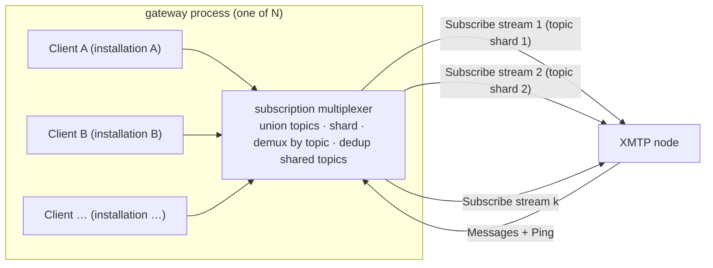
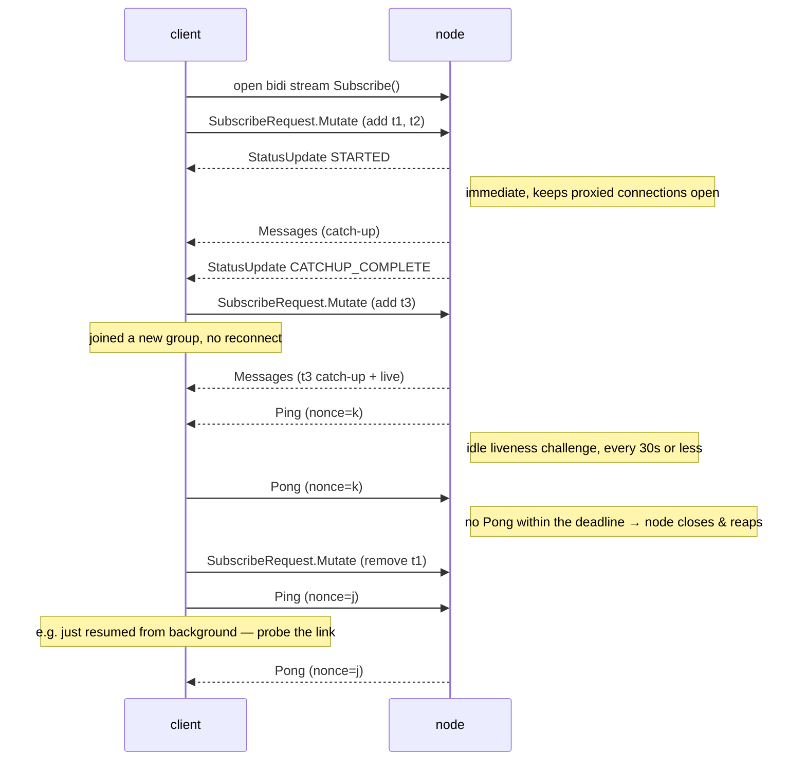
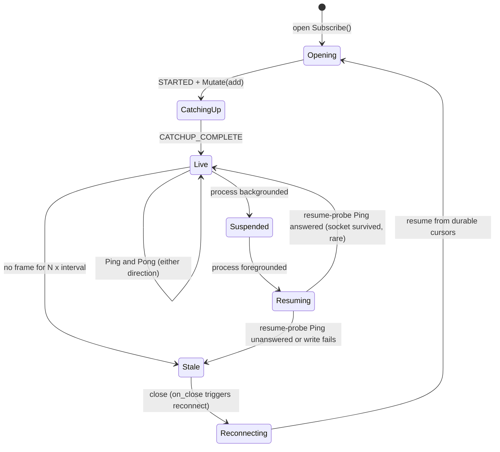

## Abstract

XMTP's message subscriptions today are unary-request, server-streaming RPCs
(`SubscribeGroupMessages`, `SubscribeWelcomeMessages`) over a **fixed** topic set, with **no
application-level liveness signal**. This forces two costly patterns: a client must **tear down and
reopen** its stream every time its topic set changes (e.g. joining a group), and it cannot
distinguish a healthy-but-idle stream from one that an intermediary has silently dropped.

This XIP defines a single **bidirectional** subscription RPC. The client opens one long-lived stream
and **mutates its subscription in place** by sending add/remove topic deltas up the request channel;
the server delivers messages down the response channel. Both sides keep the stream honest with a
**WebSocket-style liveness ping**: a nonce-matched ping/pong in which the receiver MUST answer and
the initiator closes the stream if it does not. This eliminates reconnect churn on membership
changes, lets a client detect silent stream death (a subscription an intermediary holds
open after the origin stops serving it), lets a node promptly **reap** a peer that has gone away (e.g. a mobile client the OS
suspended behind a proxy that still ACKs the transport), and lets a single connection carry the union
of many topics — the enabling primitive for multi-tenant agent gateways.

## Motivation

The current MLS subscription RPCs (`xmtp.mls.api.v1.MlsApi/SubscribeGroupMessages` and
`SubscribeWelcomeMessages`) are server-streaming over a topic set fixed at stream-open. Two
deficiencies follow directly:

### 1. Silent stream death

A subscription that goes idle (no traffic for an extended period) can have its underlying transport
held open by an intermediary — an L7 load balancer or proxy that keeps answering HTTP/2 keepalive
pings at the edge while the backend subscription is gone. The client observes neither an error nor a
stream close; its consumer simply never receives the next message. Messages are silently dropped
until the process restarts. Transport-layer keepalives are insufficient here precisely because a
terminating proxy answers them without the origin's participation; only an **application-level
payload from the origin** proves the subscription is still being served end-to-end.

### 2. Subscription churn on membership change

Because the topic set is fixed at open, a client that is added to a new group must close its stream
and open a new one covering the expanded set. For clients whose membership changes frequently, this
is an O(membership-changes) sequence of reconnects — each a fresh stream that must re-run catch-up
and is itself a new opportunity for silent death.

### Motivating deployment (non-normative): multi-tenant agent gateways

The driving use case is a service that hosts many XMTP identities (e.g. AI agents) and relays their
traffic. Without mutate-in-place and a liveness signal, such a service is forced into one stream per
identity per topic group (N×M open streams) plus bespoke silent-death band-aids. With this XIP a
gateway holds **one** long-lived stream per connection carrying the **union** of its hosted
identities' topics, adds/removes topics as identities join/leave groups, and relies on the heartbeat
to detect and recover dead connections. The gateway's internal architecture (storage, sharding,
process model) is out of scope for this XIP; only the node↔client subscription protocol is
standardized here.



*A process hosting many identities holds a handful of canonical bidirectional `Subscribe` connections — not one
per identity per topic. The multiplexer unions every client's topics, shards them across `k` streams,
routes inbound messages back to the owning client by topic, and subscribes a shared topic only once
even when several local clients want it. Because the node applies authorization per topic (not per
connection identity) and payloads are end-to-end encrypted, one connection legitimately carries many
installations' topics.*

## Specification

The keywords "MUST", "MUST NOT", "REQUIRED", "SHALL", "SHALL NOT", "SHOULD", "SHOULD NOT",
"RECOMMENDED", "MAY", and "OPTIONAL" in this document are to be interpreted as described in
[RFC 2119](https://www.ietf.org/rfc/rfc2119.txt).

### Overview



#### Stream lifecycle (client view)



*Client view of one stream. Steady state is `Live`, with `Ping`/`Pong` keeping both ends honest.
Silence past the watchdog threshold — or an unanswered resume-probe after the OS un-suspends the
process — drops to `Stale` and reconnects from durable cursors. The node independently reaps a stream
whose `Pong`s stop arriving (server requirement 4).*

### Protocol

Nodes MUST expose a bidirectional streaming RPC on the MLS API service. Each frame, in either
direction, is exactly one of: a subscription mutation, a liveness `Ping`, or a `Pong` answering a
peer's `Ping`.

```protobuf
service MlsApi {
  // ... existing RPCs unchanged ...
  rpc Subscribe(stream SubscribeRequest) returns (stream SubscribeResponse) {}
}

// client → server, sent one or more times over the life of the stream
message SubscribeRequest {
  oneof request {
    Mutate mutate = 1; // change the subscribed topic set in place
    Ping   ping   = 2; // liveness challenge (e.g. probe the link after resuming)
    Pong   pong   = 3; // answer to a server Ping
  }

  message Mutate {
    repeated TopicFilter add    = 1; // topics to begin delivering, each with a resume cursor
    repeated bytes       remove = 2; // topics to stop delivering
  }

  message TopicFilter {
    bytes  topic        = 1; // opaque topic (group-message or welcome topic)
    uint64 last_seen_id = 2; // resume cursor; 0 = from the live edge
  }
}

// server → client
message SubscribeResponse {
  oneof response {
    Messages     messages      = 1;
    StatusUpdate status_update = 2;
    Ping         ping          = 3; // idle liveness challenge; receiver MUST answer with Pong
    Pong         pong          = 4; // answer to a client Ping
  }

  message Messages {
    repeated GroupMessage   group_messages   = 1;
    repeated WelcomeMessage welcome_messages = 2;
  }

  message StatusUpdate {
    SubscriptionStatus status = 1;
    uint32 keepalive_interval_ms = 2; // advertised once with STARTED: ping cadence + reap-deadline basis
  }

  enum SubscriptionStatus {
    SUBSCRIPTION_STATUS_UNSPECIFIED      = 0;
    SUBSCRIPTION_STATUS_STARTED          = 1; // sent once, immediately on open
    SUBSCRIPTION_STATUS_CATCHUP_COMPLETE = 2; // initial catch-up for the current set is done
  }
}

// Liveness challenge/response. Either peer MAY send a Ping; the receiver MUST reply with a Pong
// echoing the nonce. The sender of a Ping closes the stream if no Pong arrives within its deadline.
message Ping { uint64 nonce = 1; }
message Pong { uint64 nonce = 1; } // echoes the nonce of the Ping it answers
```

A single stream MAY carry both group-message and welcome topics; the topic kind is encoded in the
opaque `topic` bytes, consistent with existing topic derivation.

### Server requirements

1. The node MUST send a `StatusUpdate{ STARTED }` frame immediately upon accepting the stream, before
   any catch-up, so that proxied/buffered transports keep the connection open. It SHOULD advertise its
   ping cadence in `keepalive_interval_ms` on that frame.
2. For each `TopicFilter` in a `Mutate.add`, the node MUST deliver messages with id greater than
   `last_seen_id` (or from the live edge if `last_seen_id == 0`), performing catch-up from history
   then transitioning to live delivery, and MUST NOT deliver an id at or below a cursor it has
   already advanced past for that topic on this stream (no duplicates across catch-up/live).
3. The node MUST process `Mutate` deltas that arrive **after** the initial request, mutating the live
   subscription **without** terminating or reopening the stream. Removed topics MUST stop being
   delivered; added topics MUST follow rule (2).
4. **Liveness (ping/pong).** Whenever no frame has been sent down the response channel for a bounded
   idle interval (server-controlled, RECOMMENDED **≤ 30 seconds**), the node MUST send a `Ping` with a
   fresh nonce. The idle timer MUST reset whenever any frame is delivered, so the heartbeat adds **no
   per-message overhead** and imposes **no per-topic broadcast** — it is a property of the connection,
   not of any conversation. The node MUST close the stream if the client does not return a matching
   `Pong` (or any other frame) within a bounded deadline (RECOMMENDED ≤ the ping interval), so that a
   client that has gone away — including one suspended by a mobile OS behind a proxy that still ACKs
   the transport — is reaped promptly. The node MUST also answer any client `Ping` with a `Pong`
   echoing its nonce.
5. The node MUST apply the same authorization to topics added mid-stream as it would to topics named
   in the opening request. Mutating a subscription MUST NOT be a privilege-escalation path. Any
   topic-level authorization the node enforces MUST be evaluated **per topic**, independent of the
   connection: a single `Subscribe` connection MAY carry topics belonging to **multiple identities or
   installations**, and the node MUST NOT require that all topics on one connection share a single
   identity. This is what lets one process multiplex many local clients onto a handful of upstream
   connections (the gateway use case in *Motivation*) without an intermediary.
6. The node SHOULD bound per-stream resources: a maximum number of subscribed topics per stream, a
   maximum mutation rate, and a maximum client-`Ping` rate. Requests exceeding these limits SHOULD be
   rejected with a gRPC error rather than silently truncated. Because the server-initiated heartbeat
   cadence is server-controlled, a client cannot force an expensive ping rate.

### Client requirements

1. A client MUST answer a server `Ping` with a `Pong` echoing its nonce, promptly (well within the
   advertised interval). Failing to do so will cause the node to close the stream.
2. A client SHOULD maintain a watchdog: if no frame of any kind (message, status, or `Ping`) is
   received within **N times** the heartbeat interval, it SHOULD treat the stream as dead, close it,
   and reconnect. `N` of **2–3** is RECOMMENDED. If the server advertised `keepalive_interval_ms`, the
   client SHOULD derive its threshold from that value; otherwise it MAY assume the 30-second default.
3. On reconnect, a client MUST resume each topic from its last **durably-persisted** cursor
   (`last_seen_id`) so that messages delivered into the dead window are replayed. Because an
   environment may terminate the process with no clean shutdown (see *Process suspension* below),
   cursors MUST be persisted as messages are durably processed — not only on a graceful close.
4. A client SHOULD prefer adding/removing topics via `SubscribeRequest.Mutate` deltas over opening
   additional streams.

#### Process suspension and mobile lifecycle

A long-lived stream is hostile to environments that suspend the process — notably mobile apps the OS
backgrounds, and browser tabs the engine throttles or freezes. While suspended, the client cannot run
its watchdog or answer `Ping`s, and the OS may tear down the underlying socket; on resume the client
typically holds a dead stream. Clients in such environments:

5. SHOULD treat the stream as a **foreground / online-presence** mechanism. Delivery while the process
   is suspended is out of scope for this RPC and is expected to be handled out of band (e.g. push
   notifications that wake the app for a catch-up sync); this XIP standardizes only the foreground
   subscription protocol.
6. SHOULD, on resume, **reconnect-and-resume from persisted cursors immediately** rather than waiting
   for the watchdog threshold to elapse — driven by a host-supplied lifecycle signal (e.g. an
   app-foreground or `visibilitychange` callback the SDK forwards to the client). The exact API the
   client exposes for this signal is an implementation concern and is **not** standardized here.
7. SHOULD, on resume, **actively probe** the link before trusting it: send a client `Ping` and treat a
   missing `Pong` (or a failed write) as a dead stream and reconnect. This fast path is exactly what
   the request channel makes possible; a unidirectional server-stream can only wait for missing data.
8. SHOULD debounce rapid background→foreground transitions (a brief grace period plus a minimum
   reconnect interval) to avoid connection thrash, and SHOULD measure staleness against a clock that
   advances across suspension (wall-clock), so a resumed process correctly observes the elapsed gap.

### Relationship to existing RPCs

This RPC is **additive**. `SubscribeGroupMessages` and `SubscribeWelcomeMessages` are unchanged.
Clients opt in by calling `Subscribe`. Environments without native bidirectional streaming — notably
the browser, where standard gRPC-Web over `fetch` is limited to unary and server-streaming — MAY
continue using the existing server-streaming RPCs, protected by a client-side liveness watchdog. Such
environments are **not** permanently excluded from this RPC: a full-duplex browser transport that runs
the HTTP/2 stack over a WebSocket (e.g. the `tonic-ws-transport` approach, with a wasm-compiled tonic
client) can carry `Subscribe` in the browser too. Adopting that path is non-normative and tracked
separately, because it requires a WebSocket ingress on the node (or a bridging proxy) and today relies
on experimental tooling. Standard gRPC-Web will not close this gap on its own: bidirectional streaming
over `fetch` is explicitly *not planned*, pending browser **WebTransport** support — which is the more
durable long-term primitive for in-browser full-duplex once its server/client tooling matures.

## Rationale

- **Bidirectional, not a second unary stream.** Mutating the subscription in place is the entire
  point — the client→server channel is the natural and only place to carry add/remove deltas without
  a reconnect. A unary-request stream cannot express "and now also this topic."
- **Heartbeat as an application payload, not a transport ping.** HTTP/2 PING frames are handled
  inside the transport and never surface to the application, so they cannot feed a client watchdog;
  and a terminating L7 proxy answers them at the edge, so they do not prove the origin is still
  serving the subscription. A `Ping` frame is a real, end-to-end payload that does.
- **Challenge/response (ping/pong), not a one-way heartbeat.** A one-way "still alive" frame tells
  only the *client* that the server is up. Making it a WebSocket-style ping the receiver MUST answer
  proves liveness in **both** directions from one round-trip: the `Ping`'s arrival proves the server
  to the client, and the `Pong`'s arrival proves the client to the server. This is what lets a node
  reliably reap a vanished peer — a suspended mobile client behind a proxy that still ACKs the
  transport produces no `Pong`, so the node closes the stream instead of leaking it. Because either
  side MAY initiate, a client that has just resumed can probe the link immediately instead of waiting
  for the next scheduled server ping.
- **Response shape mirrors the decentralized API.** The `oneof { Messages, StatusUpdate, ... }` and
  the `SubscriptionStatus` lifecycle deliberately mirror the decentralized backend's `SubscribeTopics`
  response (XIP-49 lineage), so a client decodes one shape regardless of backend and a future port to
  the decentralized network is mechanical.
- **Per-topic cursors mirror prior art.** The `TopicFilter`/`last_seen_id` model matches the existing
  `id_cursor` semantics and the decentralized per-topic cursor model; mutate-in-place is "stream the
  filters instead of sending them once." A bidirectional subscribe precedent also exists in the
  legacy API (`Subscribe2`).
- **Rejected alternatives:** (a) a per-message sentinel on the existing server-stream gated by a
  request header — works but is a backward-compat hack and does not fix churn; (b) resending the last
  message as a keepalive — history-dependent and stateful on the server; (c) a separate
  application-level ping RPC — proves a different connection is alive, not the subscription; (d)
  tightening transport keepalives — defeated by terminating proxies (the motivating failure); (e)
  detecting a sequence gap on the next real message — only detects loss after the next message, which
  on a dormant topic may be hours.

## Backward compatibility

This XIP introduces **no incompatibilities**. The `Subscribe` RPC is new; existing subscription RPCs
and their wire formats are untouched. There is no lockstep upgrade: a node MAY add `Subscribe`
independently, and a client MAY adopt it independently — a client that calls `Subscribe` against a
node that does not implement it receives a standard gRPC `UNIMPLEMENTED` and falls back to the
existing RPCs. Browser clients, which cannot use bidirectional gRPC over standard gRPC-Web, remain on
the existing server-streaming RPCs (with a client-side watchdog) until and unless a full-duplex
browser transport is adopted (see *Relationship to existing RPCs*); they are unaffected in the
meantime.

## Test cases

1. **Immediate STARTED.** Open `Subscribe`, send `Mutate{ add:[t1] }`. The first frame received MUST
   be `StatusUpdate{ STARTED }`, before any `Messages`.
2. **Idle ping.** With a subscription open and no new messages, the client MUST receive a `Ping`
   within the advertised interval (≤30s), and again each interval while idle.
3. **Ping resets on traffic.** Publish a message at T; the next `Ping` MUST be no earlier than
   T + interval (the idle timer reset).
4. **Server reaps a silent client.** With a subscription open, the client stops answering `Ping`s.
   The node MUST close the stream within its `Pong` deadline.
5. **Client-initiated ping.** The client sends `Ping{ nonce=k }`; the node MUST reply
   `Pong{ nonce=k }`.
6. **Mutate-add catch-up, no reconnect.** With the stream open, send
   `Mutate{ add:[t3, last_seen_id=C] }`. The client MUST receive `t3` messages with id > C, with no
   duplicates, and the stream MUST NOT be torn down.
7. **Mutate-remove.** Send `Mutate{ remove:[t1] }`; the client MUST stop receiving `t1` messages.
8. **Watchdog.** Black-hole the connection (transport pings still answered by a proxy). With no frame
   for N× interval, the client MUST close and reconnect, and on reconnect from persisted cursors MUST
   receive any message published during the dead window.
9. **Resume after suspension.** Freeze the client past the ping interval (simulating OS suspension),
   then resume. The client MUST detect the dead stream (via its resume probe or the watchdog) and
   reconnect from persisted cursors, replaying anything published during suspension; the node MUST
   have reaped the original stream.

## Reference implementation

Non-normative, and staged. The client-side liveness floor — a `WatchdogStream` combinator that turns
a stale subscription into a reconnect from the persisted cursor — is implemented in `libxmtp`
independently of this RPC and already protects the existing server-streaming subscriptions. The
protocol changes this XIP standardizes are the remaining work: a `Subscribe`-based client that decodes
the response stream (messages, status, and ping/pong), and an `xmtp-node-go` `Subscribe` handler with
a mutable per-connection topic set and a ping/pong idle ticker. Bringing the browser onto the same
`Subscribe` path — by tunnelling HTTP/2 over a WebSocket so a wasm-compiled tonic client can open a
bidirectional stream — is a separate, later track that also requires a WebSocket ingress (or bridging
proxy) in front of the node.

## Security considerations

This XIP changes only the **transport/subscription** layer. It does **not** alter MLS, message
encryption, or the node trust model. A node already sees subscription topics and ciphertext envelopes
for any stream it serves; carrying more topics on one connection does not grant a node any new
plaintext, because decryption still requires per-installation MLS state the node does not possess.

### Threat model

- **Malicious node suppresses liveness to mask censorship.** A node could keep answering pings while
  withholding real messages, making a censored stream look healthy. The ping proves *liveness*, not
  *completeness*. Mitigation: clients resume from durable per-topic cursors on every (re)connection,
  so a gap is detected when delivery resumes; completeness against a misbehaving node is addressed by
  the broader decentralized misbehavior/liveness reporting machinery (XIP-49 lineage), not by this
  RPC.
- **Malicious client exhausts node resources** via many streams, an unbounded topic set,
  high-frequency mutations, or a flood of client `Ping`s each demanding a `Pong`. Mitigation: server
  requirement (6) — nodes MUST bound topics-per-stream, mutation rate, and client-ping rate, and
  reject excess. The server-initiated heartbeat cadence is server-controlled, so a client cannot force
  an expensive ping rate.
- **Mid-stream privilege escalation.** A client might attempt to add a topic it is not entitled to
  after the stream is established. Mitigation: server requirement (5) — added topics are authorized
  identically to opening-request topics.
- **Connection concentration (gateway use case).** Concentrating many identities' subscriptions on
  one connection raises the value of compromising that connection or its operator. Because MLS is
  end-to-end encrypted, a compromised relay/gateway sees ciphertext and topic metadata only — the
  same exposure any relay already has — and cannot read messages without each identity's MLS keys.
  Operators concentrating identities SHOULD treat the per-identity key material (held outside this
  protocol) as the security boundary.

## Copyright

Copyright and related rights waived via [CC0](https://creativecommons.org/publicdomain/zero/1.0/).
