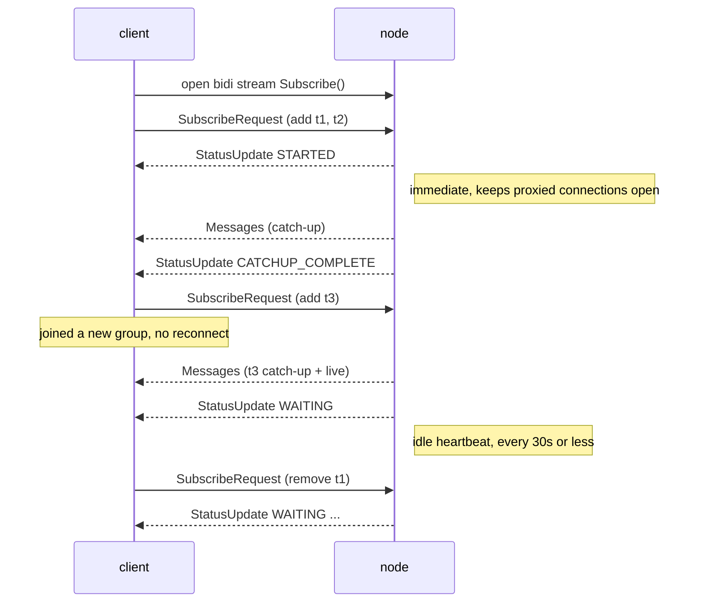

## Abstract

XMTP's message subscriptions today are unary-request, server-streaming RPCs
(`SubscribeGroupMessages`, `SubscribeWelcomeMessages`) over a **fixed** topic set, with **no
application-level liveness signal**. This forces two costly patterns: a client must **tear down and
reopen** its stream every time its topic set changes (e.g. joining a group), and it cannot
distinguish a healthy-but-idle stream from one that an intermediary has silently dropped.

This XIP defines a single **bidirectional** subscription RPC. The client opens one long-lived stream
and **mutates its subscription in place** by sending add/remove topic deltas up the request channel;
the server delivers messages **and a periodic liveness heartbeat** down the response channel. This
eliminates reconnect churn on membership changes, gives clients a reliable "last alive at" signal to
detect silent stream death, and lets a single connection carry the union of many topics — the
enabling primitive for multi-tenant agent gateways.

## Motivation

The current MLS subscription RPCs (`xmtp.mls.api.v1.MlsApi/SubscribeGroupMessages` and
`SubscribeWelcomeMessages`) are server-streaming over a topic set fixed at stream-open. Two
deficiencies follow directly:

### 1. Silent stream death

A subscription that goes idle (no traffic for an extended period) can have its underlying transport
wedged open by an intermediary — an L7 load balancer or proxy that keeps answering HTTP/2 keepalive
pings at the edge while the backend subscription is gone. The client observes neither an error nor a
stream close; its consumer simply never receives the next message. Messages are silently dropped
until the process restarts. Transport-layer keepalives are insufficient here precisely because a
terminating proxy answers them without the origin's participation; only an **application-level
payload from the origin** proves the subscription is still being served end-to-end.

### 2. Subscription churn on membership change

Because the topic set is fixed at open, a client that is added to a new group must close its stream
and open a new one covering the expanded set. For clients whose membership changes frequently, this
is an O(membership-changes) sequence of reconnects — each a fresh stream that must re-run catch-up
and is itself a new opportunity to wedge.

### Motivating deployment (non-normative): multi-tenant agent gateways

The driving use case is a service that hosts many XMTP identities (e.g. AI agents) and relays their
traffic. Without mutate-in-place and a liveness signal, such a service is forced into one stream per
identity per topic group (N×M open streams) plus bespoke silent-death band-aids. With this XIP a
gateway holds **one** long-lived stream per connection carrying the **union** of its hosted
identities' topics, adds/removes topics as identities join/leave groups, and relies on the heartbeat
to detect and recover dead connections. The gateway's internal architecture (storage, sharding,
process model) is out of scope for this XIP; only the node↔client subscription protocol is
standardized here.

## Specification

The keywords "MUST", "MUST NOT", "REQUIRED", "SHALL", "SHALL NOT", "SHOULD", "SHOULD NOT",
"RECOMMENDED", "MAY", and "OPTIONAL" in this document are to be interpreted as described in
[RFC 2119](https://www.ietf.org/rfc/rfc2119.txt).

### Overview



### Protocol

Nodes MUST expose a bidirectional streaming RPC on the MLS API service:

```protobuf
service MlsApi {
  // ... existing RPCs unchanged ...
  rpc Subscribe(stream SubscribeRequest) returns (stream SubscribeResponse) {}
}

// client → server, sent one or more times over the life of the stream
message SubscribeRequest {
  repeated TopicFilter add = 1;     // topics to begin delivering, each with a resume cursor
  repeated bytes        remove = 2; // topics to stop delivering

  message TopicFilter {
    bytes  topic        = 1;        // opaque topic (group-message or welcome topic)
    uint64 last_seen_id = 2;        // resume cursor; 0 = from the live edge
  }
}

// server → client
message SubscribeResponse {
  oneof response {
    Messages     messages      = 1;
    StatusUpdate status_update = 2;
  }

  message Messages {
    repeated GroupMessage   group_messages   = 1;
    repeated WelcomeMessage welcome_messages = 2;
  }

  message StatusUpdate {
    SubscriptionStatus status = 1;
    uint32 keepalive_interval_ms = 2; // OPTIONAL: advertise the heartbeat cadence
  }

  enum SubscriptionStatus {
    SUBSCRIPTION_STATUS_UNSPECIFIED      = 0;
    SUBSCRIPTION_STATUS_STARTED          = 1; // sent once, immediately on open
    SUBSCRIPTION_STATUS_CATCHUP_COMPLETE = 2; // initial catch-up for the current set is done
    SUBSCRIPTION_STATUS_WAITING          = 3; // idle heartbeat ("still alive, nothing new")
  }
}
```

A single stream MAY carry both group-message and welcome topics; the topic kind is encoded in the
opaque `topic` bytes, consistent with existing topic derivation.

### Server requirements

1. The node MUST send a `StatusUpdate{ STARTED }` frame immediately upon accepting the stream, before
   any catch-up, so that proxied/buffered transports keep the connection open.
2. For each `TopicFilter` in `add`, the node MUST deliver messages with id greater than
   `last_seen_id` (or from the live edge if `last_seen_id == 0`), performing catch-up from history
   then transitioning to live delivery, and MUST NOT deliver an id at or below a cursor it has
   already advanced past for that topic on this stream (no duplicates across catch-up/live).
3. The node MUST process `add`/`remove` deltas that arrive **after** the initial request, mutating
   the live subscription **without** terminating or reopening the stream. Removed topics MUST stop
   being delivered; added topics MUST follow rule (2).
4. The node MUST emit a `StatusUpdate{ WAITING }` heartbeat whenever no other frame has been sent for
   a bounded interval. The interval is server-controlled and RECOMMENDED to be **≤ 30 seconds**. The
   idle timer MUST reset whenever any `Messages` or other frame is delivered, so heartbeats add **no
   per-message overhead** and impose **no per-topic broadcast** — they are a property of the
   connection, not of any conversation.
5. The node MUST apply the same authorization to topics added mid-stream as it would to topics named
   in the opening request. Mutating a subscription MUST NOT be a privilege-escalation path.
6. The node SHOULD bound per-stream resources: a maximum number of subscribed topics per stream and a
   maximum mutation rate. Requests exceeding these limits SHOULD be rejected with a gRPC error rather
   than silently truncated.

### Client requirements

1. A client SHOULD maintain a watchdog: if no frame of any kind (message or heartbeat) is received
   within **N times** the heartbeat interval, it SHOULD treat the stream as dead, close it, and
   reconnect. `N` of **2–3** is RECOMMENDED. If the server advertised `keepalive_interval_ms`, the
   client SHOULD derive its threshold from that value; otherwise it MAY assume the 30-second default.
2. On reconnect, a client SHOULD resume each topic from its last durably-processed cursor
   (`last_seen_id`) so that messages delivered into the dead window are replayed.
3. A client SHOULD prefer adding/removing topics via `SubscribeRequest` deltas over opening
   additional streams.

### Relationship to existing RPCs

This RPC is **additive**. `SubscribeGroupMessages` and `SubscribeWelcomeMessages` are unchanged.
Clients opt in by calling `Subscribe`. Environments without bidirectional streaming support (notably
browser/WASM, which lacks bidirectional gRPC) MAY continue using the existing server-streaming RPCs.

## Rationale

- **Bidirectional, not a second unary stream.** Mutating the subscription in place is the entire
  point — the client→server channel is the natural and only place to carry add/remove deltas without
  a reconnect. A unary-request stream cannot express "and now also this topic."
- **Heartbeat as an application payload, not a transport ping.** HTTP/2 PING frames are handled
  inside the transport and never surface to the application, so they cannot feed a client watchdog;
  and a terminating L7 proxy answers them at the edge, so they do not prove the origin is still
  serving the subscription. A `WAITING` frame is a real, end-to-end payload that does both.
- **Response shape mirrors the decentralized API.** The `oneof { Messages, StatusUpdate }` and the
  `SubscriptionStatus` lifecycle deliberately mirror the decentralized backend's `SubscribeTopics`
  response (XIP-49 lineage), so a client decodes one shape regardless of backend and a future port to
  the decentralized network is mechanical.
- **Per-topic cursors mirror prior art.** The `TopicFilter`/`last_seen_id` model matches the existing
  `id_cursor` semantics and the decentralized per-topic cursor model; mutate-in-place is "stream the
  filters instead of sending them once." A bidirectional subscribe precedent also exists in the
  legacy API (`Subscribe2`).
- **Rejected alternatives:** (a) a per-message sentinel on the existing server-stream gated by a
  request header — works but is a backward-compat hack and does not fix churn; (b) resending the last
  message as a keepalive — history-dependent and stateful on the server; (c) a separate
  application-level ping RPC — proves a different connection is alive, not the subscription; (d)
  tightening transport keepalives — defeated by terminating proxies (the motivating failure); (e)
  detecting a sequence gap on the next real message — only detects loss after the next message, which
  on a dormant topic may be hours.

## Backward compatibility

This XIP introduces **no incompatibilities**. The `Subscribe` RPC is new; existing subscription RPCs
and their wire formats are untouched. There is no lockstep upgrade: a node MAY add `Subscribe`
independently, and a client MAY adopt it independently — a client that calls `Subscribe` against a
node that does not implement it receives a standard gRPC `UNIMPLEMENTED` and falls back to the
existing RPCs. WASM/browser clients, which cannot use bidirectional gRPC streams, remain on the
existing server-streaming RPCs indefinitely and are unaffected.

## Test cases

1. **Immediate STARTED.** Open `Subscribe`, send `add:[t1]`. The first frame received MUST be
   `StatusUpdate{ STARTED }`, before any `Messages`.
2. **Idle heartbeat.** With a subscription open and no new messages, the client MUST receive a
   `StatusUpdate{ WAITING }` within the advertised interval (≤30s); and again each interval while
   idle.
3. **Heartbeat resets on traffic.** Publish a message at T; the next heartbeat MUST be no earlier
   than T + interval (the idle timer reset).
4. **Mutate-add catch-up, no reconnect.** With the stream open, send `add:[t3, last_seen_id=C]`.
   The client MUST receive `t3` messages with id > C, with no duplicates, and the stream MUST NOT be
   torn down.
5. **Mutate-remove.** Send `remove:[t1]`; the client MUST stop receiving `t1` messages.
6. **Watchdog.** Black-hole the connection (transport pings still answered by a proxy). With no frame
   for N× interval, the client MUST close and reconnect, and on reconnect from persisted cursors MUST
   receive any message published during the dead window.

## Reference implementation

Non-normative, and staged. The client-side liveness floor — a `WatchdogStream` combinator that turns
a stale subscription into a reconnect from the persisted cursor — is implemented in `libxmtp`
independently of this RPC and already protects the existing server-streaming subscriptions. The
protocol changes this XIP standardizes are the remaining work: a `Subscribe`-based client that
decodes the status-aware response, and an `xmtp-node-go` `Subscribe` handler with a mutable
per-connection topic set and an idle heartbeat ticker.

## Security considerations

This XIP changes only the **transport/subscription** layer. It does **not** alter MLS, message
encryption, or the node trust model. A node already sees subscription topics and ciphertext envelopes
for any stream it serves; carrying more topics on one connection does not grant a node any new
plaintext, because decryption still requires per-installation MLS state the node does not possess.

### Threat model

- **Malicious node suppresses the heartbeat to mask censorship.** A node could deliver heartbeats
  while withholding real messages, making a censored stream look healthy. The heartbeat proves
  *liveness*, not *completeness*. Mitigation: clients resume from durable per-topic cursors on every
  (re)connection, so a gap is detected when delivery resumes; completeness against a misbehaving node
  is addressed by the broader decentralized misbehavior/liveness reporting machinery (XIP-49 lineage),
  not by this RPC.
- **Malicious client exhausts node resources** via many streams, an unbounded topic set, or
  high-frequency mutations. Mitigation: server requirement (6) — nodes MUST bound topics-per-stream
  and mutation rate and reject excess. Heartbeat cadence is server-controlled, so a client cannot
  force an expensive ping rate.
- **Mid-stream privilege escalation.** A client might attempt to add a topic it is not entitled to
  after the stream is established. Mitigation: server requirement (5) — added topics are authorized
  identically to opening-request topics.
- **Connection concentration (gateway use case).** Concentrating many identities' subscriptions on
  one connection raises the value of compromising that connection or its operator. Because MLS is
  end-to-end encrypted, a compromised relay/gateway sees ciphertext and topic metadata only — the
  same exposure any relay already has — and cannot read messages without each identity's MLS keys.
  Operators concentrating identities SHOULD treat the per-identity key material (held outside this
  protocol) as the security boundary.

## Copyright

Copyright and related rights waived via [CC0](https://creativecommons.org/publicdomain/zero/1.0/).
