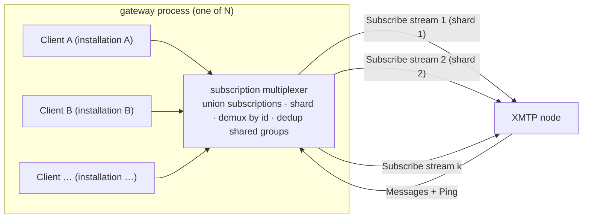
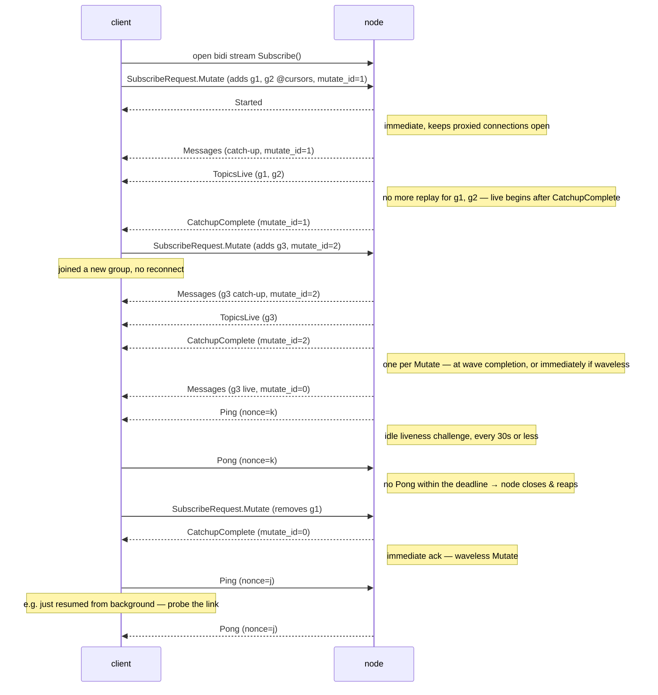
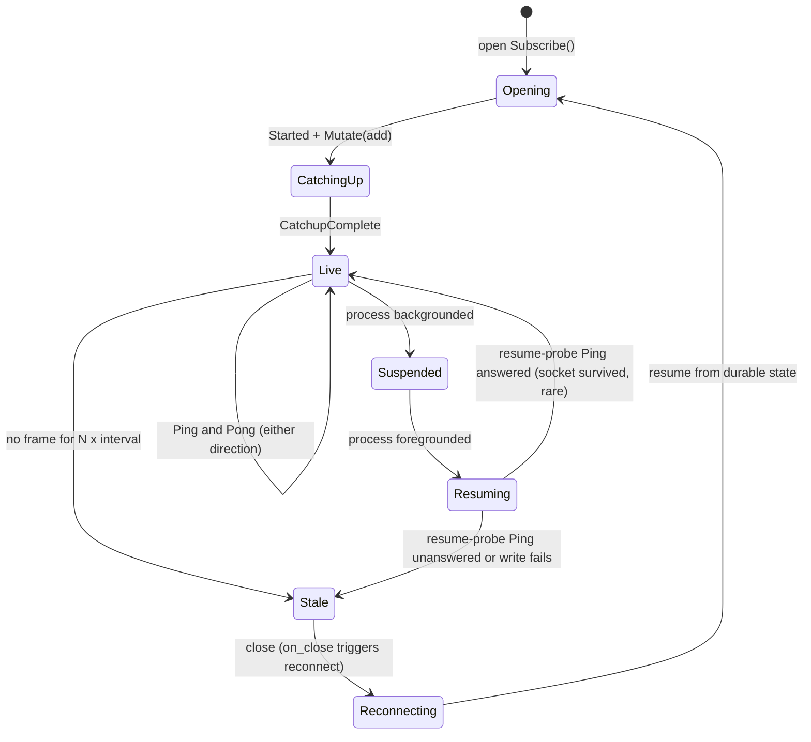

## Abstract

XMTP's message subscriptions today are unary-request, server-streaming RPCs
(`SubscribeGroupMessages`, `SubscribeWelcomeMessages`) over a **fixed** subscription set, with **no
application-level liveness signal**. This forces two costly patterns: a client must **tear down and
reopen** its stream every time its subscription set changes (e.g. joining a group), and it cannot
distinguish a healthy-but-idle stream from one that an intermediary has silently dropped.

This XIP defines a single **bidirectional** subscription RPC. The client opens one long-lived stream
and **mutates its subscription in place** by sending add/remove deltas up the request channel; the
server delivers messages down the response channel, every delivery frame tagged with the catch-up
wave that produced it (`0` = live) so replay and live tail are distinguishable on the wire. Both
sides keep the stream honest with a
**WebSocket-style liveness ping**: a nonce-matched ping/pong in which the receiver MUST answer and
the initiator closes the stream if it does not. This eliminates reconnect churn on membership
changes, lets a client detect silent stream death (a subscription an intermediary holds open after
the origin stops serving it), lets a node promptly **reap** a peer that has gone away (e.g. a mobile
client the OS suspended behind a proxy that still ACKs the transport), and lets a single connection
carry the union of many groups and welcomes — the enabling primitive for multi-tenant agent gateways.

## Motivation

The current MLS subscription RPCs (`xmtp.mls.api.v1.MlsApi/SubscribeGroupMessages` and
`SubscribeWelcomeMessages`) are server-streaming over a topic set fixed at stream-open. Two
deficiencies follow directly:

### 1. Silent stream death

A subscription that goes idle (no traffic for an extended period) can have its underlying transport
held open by an intermediary — an L7 load balancer or proxy that keeps answering HTTP/2 keepalive
pings at the edge while the backend subscription is gone. The client observes neither an error nor a
stream close; its consumer simply never receives the next message. Messages are silently dropped
until the process restarts. Transport-layer keepalives are insufficient here precisely because a
terminating proxy answers them without the origin's participation; only an **application-level
payload from the origin** proves the subscription is still being served end-to-end.

### 2. Subscription churn on membership change

Because the topic set is fixed at open, a client that is added to a new group must close its stream
and open a new one covering the expanded set. For clients whose membership changes frequently, this
is an O(membership-changes) sequence of reconnects — each a fresh stream that must re-run catch-up
and is itself a new opportunity for silent death.

### Motivating deployment (non-normative): multi-tenant agent gateways

The driving use case is a service that hosts many XMTP identities (e.g. AI agents) and relays their
traffic. Without mutate-in-place and a liveness signal, such a service is forced into one stream per
identity per topic group (N×M open streams) plus bespoke silent-death band-aids. With this XIP a
gateway holds **one** long-lived stream per connection carrying the **union** of its hosted
identities' subscriptions, adds/removes them as identities join/leave groups, and relies on the
heartbeat to detect and recover dead connections. The gateway's internal architecture (storage,
sharding, process model) is out of scope for this XIP; only the node↔client subscription protocol is
standardized here.


```mermaid
flowchart LR
    subgraph proc["gateway process (one of N)"]
        c1["Client A (installation A)"]
        c2["Client B (installation B)"]
        c3["Client … (installation …)"]
        mux["subscription multiplexer<br/>union subscriptions · shard · demux by id · dedup shared groups"]
        c1 --> mux
        c2 --> mux
        c3 --> mux
    end
    mux -->|"Subscribe stream 1 (shard 1)"| node["XMTP node"]
    mux -->|"Subscribe stream 2 (shard 2)"| node
    mux -->|"Subscribe stream k"| node
    node -->|"Messages + Ping"| mux
```

*A process hosting many identities holds a handful of canonical bidirectional `Subscribe` connections
— not one per identity per group. The multiplexer unions every client's subscriptions, shards them
across `k` streams, routes inbound messages back to the owning client by `group_id` /
`installation_key`, and subscribes a shared group only once even when several local clients want it.
Because the node applies authorization per subscription (not per connection identity) and payloads
are end-to-end encrypted, one connection legitimately carries many installations' subscriptions.*

## Specification

The keywords "MUST", "MUST NOT", "REQUIRED", "SHALL", "SHALL NOT", "SHOULD", "SHOULD NOT",
"RECOMMENDED", "MAY", and "OPTIONAL" in this document are to be interpreted as described in
[RFC 2119](https://www.ietf.org/rfc/rfc2119.txt).

XIP-83 specifies a **control protocol** with two backend bindings. The proto and requirements below
are written against the v3 `MlsApi` (`xmtp.mls.api.v1.Subscribe`); the decentralized backend carries
the identical control protocol on `xmtp.xmtpv4.message_api.QueryApi.Subscribe`, differing only in its
data model (per-originator vector cursors, envelope delivery). See [Decentralized (d14n)
binding](#decentralized-d14n-binding); all other requirements apply to both bindings unchanged.

### Overview


```mermaid
sequenceDiagram
    participant C as client
    participant N as node

    C->>N: open bidi stream Subscribe()
    C->>N: SubscribeRequest.Mutate (adds g1, g2 @cursors, mutate_id=1)
    N-->>C: Started
    Note right of N: immediate, keeps proxied connections open
    N-->>C: Messages (catch-up, mutate_id=1)
    N-->>C: TopicsLive (g1, g2)
    Note right of N: no more replay for g1, g2 — live begins after CatchupComplete
    N-->>C: CatchupComplete (mutate_id=1)
    C->>N: SubscribeRequest.Mutate (adds g3, mutate_id=2)
    Note over C: joined a new group, no reconnect
    N-->>C: Messages (g3 catch-up, mutate_id=2)
    N-->>C: TopicsLive (g3)
    N-->>C: CatchupComplete (mutate_id=2)
    Note right of N: one per Mutate — at wave completion, or immediately if waveless
    N-->>C: Messages (g3 live, mutate_id=0)
    N-->>C: Ping (nonce=k)
    Note right of N: idle liveness challenge, every 30s or less
    C->>N: Pong (nonce=k)
    Note right of N: no Pong within the deadline → node closes & reaps
    C->>N: SubscribeRequest.Mutate (removes g1)
    N-->>C: CatchupComplete (mutate_id=0)
    Note right of N: immediate ack — waveless Mutate
    C->>N: Ping (nonce=j)
    Note over C: e.g. just resumed from background — probe the link
    N-->>C: Pong (nonce=j)
```

#### Stream lifecycle (client view)


```mermaid
stateDiagram-v2
    [*] --> Opening: open Subscribe()
    Opening --> CatchingUp: Started + Mutate(add)
    CatchingUp --> Live: CatchupComplete
    Live --> Live: Messages / Mutate(add, remove)
    Live --> Live: Ping and Pong (either direction)
    Live --> Stale: no frame for N x interval
    Live --> Suspended: process backgrounded
    Suspended --> Resuming: process foregrounded
    Resuming --> Live: resume-probe Ping answered (socket survived, rare)
    Resuming --> Stale: resume-probe Ping unanswered or write fails
    Stale --> Reconnecting: close (on_close triggers reconnect)
    Reconnecting --> Opening: resume from durable state
```

*Client view of one stream. Steady state is `Live`, with `Ping`/`Pong` keeping both ends honest.
Silence past the watchdog threshold — or an unanswered resume-probe after the OS un-suspends the
process — drops to `Stale` and reconnects from the client's durable resume state (client
requirement 3). The node independently reaps a stream
whose `Pong`s stop arriving (server requirement 6).*

### Protocol

Nodes MUST expose a bidirectional streaming RPC on the MLS API service. Each frame, in either
direction, is exactly one of: a subscription mutation, a liveness `Ping`, or a `Pong` answering a
peer's `Ping`.

```protobuf
service MlsApi {
  // ... existing RPCs unchanged ...
  rpc Subscribe(stream SubscribeRequest) returns (stream SubscribeResponse) {}
}

// client → server, sent one or more times over the life of the stream.
message SubscribeRequest {
  oneof version { V1 v1 = 1; } // versioned like GroupMessage/WelcomeMessage

  message V1 {
    oneof request {
      Mutate mutate = 1;
      Ping   ping   = 2; // liveness challenge (e.g. probe the link after resuming)
      Pong   pong   = 3; // answer to a server Ping
    }

    // Add and/or remove subscriptions in place (atomic per frame). Topics use the
    // kind-prefixed binary representation shared with the decentralized backend
    // (XIP-49 §3.3.2): first byte = topic kind, remainder = identifier. This RPC
    // initially serves kind 0x00 (group messages; identifier = group_id) and kind
    // 0x01 (welcomes; identifier = installation_key); an unsupported kind fails the
    // stream with INVALID_ARGUMENT. Future kinds arrive via Started.capabilities.
    message Mutate {
      repeated Subscription adds      = 1; // begin delivering these topics
      repeated bytes        removes   = 2; // stop delivering; clears the floor so a re-add replays
      bool             history_only   = 3; // catch the adds up, but do not deliver live (see req 11)
      uint64           mutate_id      = 4; // stamps the wave's replay frames + CatchupComplete; MUST be nonzero with adds and MUST NOT match an in-flight wave; SHOULD be unique per stream

      message Subscription { bytes topic = 1; uint64 id_cursor = 2; } // cursor 0 = from the beginning
    }
  }
}

// server → client
message SubscribeResponse {
  oneof version { V1 v1 = 1; }

  message V1 {
    oneof response {
      Messages        messages         = 1;
      Started         started          = 2; // sent once, immediately on open
      Ping            ping             = 3; // idle liveness challenge; receiver MUST answer with Pong
      Pong            pong             = 4; // answer to a client Ping
      TopicsLive      topics_live      = 5; // no more replay for these topics; live begins after CatchupComplete
      CatchupComplete catchup_complete = 6; // acks a Mutate (wave completion if it started one); echoes mutate_id
    }

    message Messages {
      repeated GroupMessage   group_messages   = 1;
      repeated WelcomeMessage welcome_messages = 2;
      // The catch-up wave that produced this frame: the Mutate's mutate_id for
      // wave replay, 0 for live tail. A frame belongs to exactly one wave or to
      // live — never a mix, and never two waves (requirements 3 and 4).
      uint64                  mutate_id        = 3;
    }

    // Emitted when topics finish catch-up, AFTER their last history frame — including
    // messages that arrived mid-wave and were folded into it, which were equally historical
    // from the client's perspective — so no further replay for a listed topic follows; its live
    // (mutate_id 0) frames begin after the wave's CatchupComplete (requirement 4).
    message TopicsLive {
      repeated bytes topics = 1; // kind-prefixed topics done replaying
    }

    message Started {
      uint32 keepalive_interval_ms = 1; // ping cadence + reap-deadline basis
      repeated Capability capabilities = 2; // optional features this node speaks
    }

    // Sent once per Mutate: at wave completion (after the wave's last TopicsLive) for a
    // Mutate that started a wave, immediately for one that did not (requirement 9). Also
    // the catch-up seam: live (mutate_id 0) frames for the wave's topics begin only after
    // this frame (requirement 4).
    message CatchupComplete {
      uint64 mutate_id = 1; // echoes the Mutate; 0 only if a waveless Mutate carried 0
    }

    // Optional per-stream protocol features (none defined yet; future revisions add
    // values, e.g. fetch-over-stream lookups answered from the stream's own read view,
    // or new streamable topic kinds).
    enum Capability {
      CAPABILITY_UNSPECIFIED = 0;
    }
  }
}

// Liveness challenge/response, shared across versions. Either peer MAY send a Ping; the receiver
// MUST reply with a Pong echoing the nonce. The sender of a Ping closes the stream if no Pong
// arrives within its deadline.
message Ping { uint64 nonce = 1; }
message Pong { uint64 nonce = 1; } // echoes the nonce of the Ping it answers
```

Subscriptions are expressed as **kind-prefixed binary topics** — the representation the
decentralized backend already uses (XIP-49 §3.3.2) and that clients already build for their cursor
stores: one kind byte plus the raw identifier, with no string formatting. The node validates the
kind and stays the authority over which kinds this RPC serves; the same shape extends to future
streamable objects (key packages, identity updates) without protocol changes. A single stream MAY
carry both group and welcome subscriptions, and subscriptions belonging to many identities. `SubscribeRequest` and `SubscribeResponse` wrap their payload in `oneof version` so a
future revision can restructure them while old peers keep speaking `V1`; `Ping`/`Pong` are
version-independent. The version is **pinned per stream**: a stream whose requests are `V1` receives
only `V1` responses, so a client never has to handle a response version it did not speak first (see
server requirement 10).

### Server requirements

1. The node MUST send a `Started` frame immediately upon accepting the stream, before any catch-up,
   so that proxied/buffered transports keep the connection open. It MUST advertise its ping cadence
   in `keepalive_interval_ms` whenever it sends `Ping`s, so clients derive an accurate watchdog
   threshold, and MUST list the optional protocol features it supports in `capabilities`. Because a node silently ignores request types it does not
   understand, a client MUST NOT send an optional request type whose capability the node did not
   advertise — it would hang waiting on a response that will never come. (No capabilities are defined
   by this revision; the field is the feature-detection hook for future ones.)
2. For each `Subscription` in `adds`, the node MUST validate the kind-prefixed topic (failing the
   stream with `INVALID_ARGUMENT` for a kind this RPC does not serve), deliver messages with id
   greater than `id_cursor` (`0` meaning from the beginning, matching the existing server-streaming
   RPCs), performing catch-up from history then transitioning to live delivery, and MUST NOT deliver
   an id at or below the subscription's **current floor** (the per-registration position defined in
   requirement 5) — no duplicates across catch-up/live. A remove discards the floor, and an
   accepted lower-cursor re-add re-initializes it at the lower cursor, explicitly requesting the
   replay of ids above it (see requirement 5).
3. **Delivery tagging.** Every `Messages` frame is stamped with the wave that produced it (a
   *wave* is the catch-up a `Mutate`'s effective adds start — requirement 9): frames delivering a
   catch-up wave's replay — including messages that reached the node mid-wave and were folded into
   the wave — carry that wave's `mutate_id`, and frames delivering live tail carry `0`. A frame
   belongs to exactly one wave or to live; the node MUST NOT mix messages of distinct waves, or
   wave replay and live messages, in a single `Messages` frame. Because the tag is what makes
   replay attributable, a `Mutate` whose `adds` are non-empty MUST carry a nonzero `mutate_id`,
   and no `Mutate` may carry the `mutate_id` of a wave still in flight on the stream — the tag and
   the `CatchupComplete` echo are the only keys correlating frames to mutations, so an in-flight
   collision would make two waves' replay and completions indistinguishable; the node MUST fail
   the stream with `INVALID_ARGUMENT` in either case. Beyond that, ids SHOULD be unique for the
   stream's lifetime (reuse after a wave completes only muddies the client's own attribution). The
   tag is a REQUIRED part of this protocol, not a `Started.capabilities` feature: together with the
   order guarantees of requirement 4 it is what collapses the client's resume state to one live
   high-water mark per stream plus one transient progress mark per in-flight wave (see
   *Rationale*).
4. **Delivery order and the catch-up seam.** Delivery on a stream is ordered in two lanes, and the
   tag (requirement 3) tells the client which lane every frame is in:
   - **Live order.** Live frames (`mutate_id = 0`) MUST deliver messages in ascending id order per
     message kind, across all live topics on the stream (group-message ids and welcome ids are
     independent sequences, ordered independently). This total order is well-defined because v3
     assigns message ids from one global, monotonic sequence per kind, shared by every topic — a
     per-topic `id_cursor` selects a topic's messages out of that shared sequence — and it is what
     makes the stream-wide live high-water mark a valid resume cursor for every live topic
     (client requirement 3): when delivery reached id N, every live topic's messages at or below N
     had already been delivered.
   - **Wave order.** Within one wave, replay MUST be delivered in ascending id order per message
     kind across *all* of the wave's topics — one merged cursor-ordered pass, not per-topic bursts.
     Distinct waves are independent: frames of concurrent waves and live frames MAY interleave
     arbitrarily on the wire, and the per-frame tag resolves the interleaving.
   - **The seam.** A wave replays each topic up to a crossover — no lower than the topic's
     `id_cursor` — that chases the live edge: everything at or below the crossover is delivered as
     the wave's replay (tagged), everything above it as live (tagged `0`). Per topic, the node MUST
     NOT deliver a live frame for a wave's topic before that wave's `CatchupComplete`; live frames
     for topics of **other** subscriptions keep flowing throughout.
   - **Exactly once across the seam.** While the stream remains open and the topic's registration
     is unchanged — not removed and not moved to a later wave by a lower-cursor re-add
     (requirement 5) — and for a wave that registers live delivery (`history_only` ends delivery
     at the wave's start — requirement 11), every message for a wave's topic above that topic's
     `id_cursor` MUST be delivered exactly once on the stream — in the wave (tagged) or live after
     the wave's `CatchupComplete` (tagged `0`), never both, never neither. Together with the two
     order rules above, this pins the crossover in practice: a message that arrives mid-wave MUST
     be folded into the wave (delivered tagged) whenever holding it for live delivery would place
     it below a live id the stream has already delivered; the node MAY hold a mid-wave arrival
     for live delivery after `CatchupComplete` only while no higher live id of its kind has been
     delivered on the stream.
5. The node MUST process `Mutate` deltas that arrive **after** the initial request, mutating the live
   subscription **without** terminating or reopening the stream. Within a single `Mutate`, `removes`
   are applied before `adds`, so a topic present in both is reset — removed, then re-added with a
   fresh catch-up — and duplicate topics within `adds` are coalesced, the lowest `id_cursor` winning.
   Topics named in `removes` MUST stop being delivered promptly (for an in-flight `history_only`
   replay, see the carve-out below); messages already serialized to the
   response channel before the node processed the removal MAY still arrive, and the client discards
   them. Removing a topic clears its per-stream cursor floor (requirement 2), so a later `add` — even
   one carrying a lower `id_cursor` — starts a fresh catch-up and replays that history. Re-adding a
   topic that is still actively subscribed is a no-op **unless** its `id_cursor` is below the
   topic's current floor — per-registration state that starts at the registration's `id_cursor`
   and rises as the node delivers; a remove discards it, and an accepted lower-cursor re-add
   re-initializes it at the lower cursor. A no-op re-add joins no wave: it appears in no
   `TopicsLive`, and its `Mutate`'s ack (requirement 9) asserts nothing about delivery. A
   lower-cursor re-add restarts that topic's catch-up from the lower cursor **as part of the new
   Mutate's wave**: the topic leaves any wave it was in, the replay is tagged with the new
   `mutate_id`, and live delivery for the topic is gated on the new wave's `CatchupComplete`
   (requirement 4). A topic removed mid-wave (of a live-registering wave) likewise leaves its wave
   — no further replay frames,
   no `TopicsLive` entry — and the wave completes over its remaining topics (a wave whose topics
   have all been removed or reassigned still yields its `CatchupComplete`, which the node MAY emit
   immediately). Whether a remove cancels an in-flight `history_only` replay of the same topic is
   unspecified — such a topic is never live-registered, and a client removing it mid-replay MUST
   tolerate either outcome. Additions otherwise follow rule (2).
6. **Liveness (ping/pong).** Whenever no frame has been sent down the response channel for a bounded
   idle interval (server-controlled, RECOMMENDED **≤ 30 seconds**), the node MUST send a `Ping` with a
   fresh nonce. The idle timer MUST reset whenever any frame is delivered, so the heartbeat adds **no
   per-message overhead** and imposes **no per-topic broadcast** — it is a property of the connection,
   not of any conversation. The node MUST close the stream if the client does not return the matching
   `Pong` echoing the ping's nonce within a bounded deadline (RECOMMENDED ≤ the ping interval); other
   client frames do **not** satisfy the deadline, so a client whose receive path has died — it never
   sees the `Ping` — is reaped even while it keeps sending. This reaps a client that has gone away,
   including one suspended by a mobile OS behind a proxy that still ACKs the transport. The node MUST
   also answer any client `Ping` with a `Pong` echoing its nonce.
7. The node MUST apply the same authorization to subscriptions added mid-stream as it would to those
   in the opening request. Mutating a subscription MUST NOT be a privilege-escalation path. Any
   authorization the node enforces MUST be evaluated **per subscription**, independent of the
   connection: a single `Subscribe` connection MAY carry subscriptions belonging to **multiple
   identities or installations**, and the node MUST NOT require that all subscriptions on one
   connection share a single identity. This is what lets one process multiplex many local clients onto
   a handful of upstream connections (the gateway use case in *Motivation*) without an intermediary.
   Because each topic is itself the resource identifier — the kind-prefixed `group_id` /
   `installation_key` — per-subscription authorization keys on the topic; no separate identity field
   on `Subscription` is needed. (v3's read path is topic-keyed and enforces no per-identity read
   authorization; this requirement binds any node that does.)
8. The node SHOULD bound per-stream resources: a maximum number of subscriptions per stream, a
   maximum number of adds per `Mutate` — and, where cursors are per-originator vectors, a maximum
   total count of cursor entries across those adds, since a single add may otherwise name
   arbitrarily many originators (both bound a single wave's catch-up scan — a client with a
   larger set splits it across `Mutate`s, whose waves run concurrently), a maximum
   mutation rate, and a maximum client-`Ping` rate. Requests exceeding these limits SHOULD be rejected
   with a gRPC error rather than silently truncated. Because the server-initiated heartbeat cadence is
   server-controlled, a client cannot force an expensive ping rate. These limits are abuse guards,
   not flow control: they SHOULD be generous enough that a well-behaved client never encounters
   them, which is why the stream-fatal rejection is acceptable even on a multiplexed stream. A
   future revision MAY add a non-fatal per-request rejection frame (advertised via
   `Started.capabilities`) if operational experience shows well-behaved clients hitting limits.
9. **Live-boundary signals.** When subscriptions finish catch-up, the node MUST emit a `TopicsLive`
   frame listing their topics, **after** the last history frame for those topics — including
   messages that arrived mid-wave and were folded into it (requirement 4), which were equally
   historical from the client's perspective — so that no replay for a listed topic follows; its live tail begins
   after the wave's `CatchupComplete`. In addition, each
   `Mutate` with at least one **effective** add — one that begins or restarts a catch-up
   (requirement 5) — starts a catch-up **wave**, and once all of a wave's
   subscriptions have crossed to live (or left the wave — requirement 5) the node MUST emit
   `CatchupComplete` echoing the Mutate's `mutate_id`, after the wave's last `TopicsLive`. Every
   `Mutate` is acknowledged by exactly one `CatchupComplete`: a `Mutate` that starts no wave —
   nothing added, or every add a no-op — is acked with an immediate `CatchupComplete` echoing its
   `mutate_id` (a `Mutate` with no adds may legitimately carry `0`; one whose adds were all
   no-ops still carried a nonzero id — requirement 3 — which its ack echoes), so removes are
   confirmable and a client that subscribed nothing still learns it is live. Immediate acks are
   emitted in the order their `Mutate`s were received, so `0`-tagged acks correlate positionally
   even when pipelined; a client that wants explicit per-ack attribution supplies distinct nonzero
   ids (requirement 3 guarantees they cannot collide with an in-flight wave). An immediate ack asserts nothing
   about delivery — no-op adds stay owned by whatever wave or live registration already covers
   them. Waves from overlapping `Mutate`s MAY complete in
   any order; the echoed `mutate_id` keeps completions attributable, and `TopicsLive` provides
   per-topic attribution. These signals let a multiplexing client signal per-consumer readiness,
   and `CatchupComplete` additionally bounds the catch-up seam: it is the frame after which a
   wave's topics may speak live (requirement 4). Frame-level backfill/live attribution comes from
   the delivery tag (requirement 3), not from these markers. `TopicsLive` is **informational
   only**: delivery correctness (no duplicates, no gaps — rule 2) never depends on it, a client
   MUST NOT rely on it for duplicate suppression, and re-adding a subscription re-runs catch-up and
   re-emits it, so receivers treat it idempotently.
10. **Version pinning.** The node MUST respond on the same `version` arm the client's requests use: a
   stream whose requests are `V1` receives only `V1` responses. A future revision is adopted only by
   a client electing to speak it, never imposed mid-stream by the node. A node that receives a
   `SubscribeRequest` whose `version` arm it does not recognize MUST fail the stream with
   `INVALID_ARGUMENT` rather than silently ignore it, so a forward-version client is never wedged
   waiting on a response that will never come. The sole exception to pinning is the initial `Started`,
   which the node sends in the base version before it has read any request; a client targeting a
   future version MUST accept a base-version `Started`.
11. **Bounded catch-up and graceful shutdown.** A `Mutate` with `history_only = true` catches its adds
   up exactly as rule 2 — history, `TopicsLive` markers (which then mean "you have everything as of
   the wave's start": with no live lane there is nothing to chase, so the crossover is pinned at
   the wave's start and later messages arrive on no lane of this stream), and the wave's
   `CatchupComplete` — but the node MUST NOT register those topics for live
   delivery (removals in the same `Mutate` apply normally). The two registration styles never
   overlap on one topic: a `history_only` add naming a topic already subscribed on the stream, and
   any add naming a topic with an in-flight `history_only` catch-up, MUST fail the stream with
   `INVALID_ARGUMENT`. When the client **half-closes** its
   request stream, the node MUST stop sending `Ping`s (a half-closed peer cannot answer; the client
   suspends its watchdog for the bounded drain and relies on gRPC transport timeouts — see client
   requirement 4), MUST finish all in-flight catch-up waves (live delivery for the stream's topics
   continues while they drain), and MUST then close the stream with `OK`;
   if no waves are in flight, it closes immediately (after acking every `Mutate` it has read —
   requirement 9). Together these give the
   bounded catch-up ("sync") flow with no extra protocol: open → `Mutate{ history_only }` →
   half-close → read until the server hangs up. A client that needs to stop **immediately** cancels
   the RPC instead — no dedicated stop frame exists because HTTP/2 cancellation already propagates
   in one round trip and fails the node's pending sends.

### Client requirements

1. A client MUST answer a server `Ping` with a `Pong` echoing its nonce, promptly (well within the
   advertised interval). Failing to do so will cause the node to close the stream.
2. A client SHOULD maintain a watchdog: if no frame of any kind (message, status, or `Ping`) is
   received within **N times** the heartbeat interval, it SHOULD treat the stream as dead, close it,
   and reconnect. `N` of **2–3** is RECOMMENDED. If the server advertised `keepalive_interval_ms`, the
   client SHOULD derive its threshold from that value; otherwise it MAY assume the 30-second default.
3. On reconnect, a client MUST resume every subscription from **durably-persisted** state, so that
   messages delivered into the dead window are replayed. The tagged, ordered delivery of
   requirements 3 and 4 makes that state small: a client keeps one **live high-water mark** per
   stream (the highest live-delivered id per message kind on v3; a per-originator vector on d14n)
   plus one transient **progress mark** per in-flight wave (the same shape as the high-water
   mark: per kind on v3, a per-originator vector on d14n), and re-adds each topic with an
   `id_cursor` derived from it — the live high-water mark for topics that were live,
   `max(add cursor, wave progress)` for topics of a wave the disconnect interrupted. Because an
   environment may terminate the process with no clean shutdown (see *Process suspension* below),
   this state MUST be persisted as messages are durably processed — not only on a graceful close.
   For a newly joined group, the initial cursor SHOULD be seeded from the welcome's encrypted
   `WelcomeMetadata.message_cursor`, so a new member neither misses the gap between welcome creation
   and its first subscribe nor backfills pre-join history it cannot decrypt; `0` (from the beginning)
   remains the fallback when no seed is available, with any duplicates the coarser cursor causes
   discarded locally.
4. A client SHOULD prefer adding/removing subscriptions via `Mutate` deltas over opening additional
   streams. For scheduled background windows where a long-lived stream cannot run (e.g. Android
   WorkManager jobs or Doze maintenance windows), a client SHOULD use the bounded catch-up flow
   (server requirement 11) rather than per-topic queries: one `Mutate{ history_only }` from durable
   cursors, half-close, drain to the server's `OK`. While draining a bounded catch-up it has
   half-closed, a client MUST NOT apply its liveness watchdog (client requirement 2) to that stream:
   the node has stopped sending `Ping`s, the drain is bounded, and gRPC's transport-level timeouts
   cover a genuinely dead connection — it simply reads until the node closes with `OK`.

#### Process suspension and mobile lifecycle

A long-lived stream is hostile to environments that suspend the process — notably mobile apps the OS
backgrounds, and browser tabs the engine throttles or freezes. While suspended, the client cannot run
its watchdog or answer `Ping`s, and the OS may tear down the underlying socket; on resume the client
typically holds a dead stream. Clients in such environments:

1. SHOULD treat the stream as a **foreground / online-presence** mechanism. Delivery while the process
   is suspended is out of scope for this RPC and is expected to be handled out of band (e.g. push
   notifications that wake the app for a catch-up sync); this XIP standardizes only the foreground
   subscription protocol.
2. SHOULD, on resume, **reconnect-and-resume from persisted cursors immediately** rather than waiting
   for the watchdog threshold to elapse — driven by a host-supplied lifecycle signal (e.g. an
   app-foreground or `visibilitychange` callback the SDK forwards to the client). The exact API the
   client exposes for this signal is an implementation concern and is **not** standardized here.
3. SHOULD, on resume, **actively probe** the link before trusting it: send a client `Ping` and treat a
   missing `Pong` (or a failed write) as a dead stream and reconnect. This fast path is exactly what
   the request channel makes possible; a unidirectional server-stream can only wait for missing data.
4. SHOULD debounce rapid background→foreground transitions (a brief grace period plus a minimum
   reconnect interval) to avoid connection thrash, and SHOULD measure staleness against a clock that
   advances across suspension (wall-clock), so a resumed process correctly observes the elapsed gap.

### Relationship to existing RPCs

This RPC is **additive**. `SubscribeGroupMessages` and `SubscribeWelcomeMessages` are unchanged.
Clients opt in by calling `Subscribe`. Environments without native bidirectional streaming — notably
the browser, where standard gRPC-Web over `fetch` is limited to unary and server-streaming — MAY
continue using the existing server-streaming RPCs, protected by a client-side liveness watchdog. Such
environments are **not** permanently excluded from this RPC: a full-duplex browser transport that runs
the HTTP/2 stack over a WebSocket (e.g. the `tonic-ws-transport` approach, with a wasm-compiled tonic
client) can carry `Subscribe` in the browser too. Adopting that path is non-normative and tracked
separately, because it requires a WebSocket ingress on the node (or a bridging proxy) and today relies
on experimental tooling. Standard gRPC-Web will not close this gap on its own: bidirectional streaming
over `fetch` is explicitly *not planned*, pending browser **WebTransport** support — which is the more
durable long-term primitive for in-browser full-duplex once its server/client tooling matures.

### Decentralized (d14n) binding

The proto and requirements above are written against the v3 `MlsApi` (`xmtp.mls.api.v1`), but XIP-83 is
a **control protocol**, not a single RPC. The same protocol has a second binding on the decentralized
backend's client-facing `QueryApi` (`xmtp.xmtpv4.message_api`), added as a new bidirectional RPC
alongside the existing server-streaming `SubscribeTopics`:

```protobuf
service QueryApi {
  // ... existing QueryEnvelopes, SubscribeTopics, GetInboxIds, GetNewestEnvelope ...
  rpc Subscribe(stream SubscribeRequest) returns (stream SubscribeResponse) {}
}
```

The **control protocol is identical** — `Mutate` (adds/removes, `history_only`, `mutate_id`),
`Started`, `CatchupComplete`, `TopicsLive`, `Ping` / `Pong`, the catch-up waves, and the half-close
bounded catch-up — and every server and client requirement above applies unchanged. The two bindings
differ only where the backend's data model differs:

- **The resume cursor is a per-originator vector, not a scalar.** A v3 subscription resumes from a
  single monotonic `id_cursor`; a decentralized subscription resumes from a `Cursor`
  (`map<uint32, uint64> node_id_to_sequence_id`), because its envelopes originate from multiple nodes
  and there is no single global sequence. Each `Subscription` therefore carries `last_seen` — the same
  `Cursor` type `SubscribeTopics` already uses — in place of `id_cursor`. The no-redelivery guarantee
  (server requirement 2) is evaluated **per originator**: an envelope is delivered iff its
  `(originator_node_id, originator_sequence_id)` is beyond the subscription's recorded position for
  that originator, with originators absent from the cursor map treated as sequence `0`. "From the
  beginning" is an empty cursor rather than `0`. Because vector cursors are only partially ordered,
  "below the current floor" (requirement 5) has no direct analogue: on this binding a plain re-add
  of an actively-subscribed topic — live or still replaying — is always a no-op, even when the
  offered cursor is dominated by the current floor, and a client that wants a replay removes and
  re-adds the topic. Duplicate adds within one `Mutate` likewise coalesce with the **first**
  occurrence winning ("lowest" being equally undefined for vectors).
- **Delivery is the unified envelope stream.** Responses carry `OriginatorEnvelope`s (the decentralized
  wire type) rather than typed `GroupMessage` / `WelcomeMessage`, and the client demultiplexes by each
  envelope's target topic. `Started` / `CatchupComplete` / `TopicsLive` / `Ping` / `Pong` are
  structurally identical, re-declared in the `xmtpv4` package. The `Envelopes` delivery frame
  carries the same `mutate_id` tag as v3's `Messages` (requirement 3), with the same never-mix
  rule.
- **Order is per originator.** The order guarantees (requirement 4) are evaluated per
  `originator_node_id`, because sequence ids are per-originator and there is no global sequence:
  live frames MUST deliver each originator's envelopes in ascending `originator_sequence_id`
  across all live topics; a wave's replay MUST do the same across the wave's topics; and the
  crossover of the seam is chosen per topic per originator (a vector, like the cursor). The
  client's live high-water mark is correspondingly a per-originator vector rather than v3's
  per-kind pair, as is its per-wave progress mark.
- **Topics need no translation.** Subscriptions already use the XIP-49 kind-prefixed binary topic,
  which *is* the decentralized backend's native topic representation — the convergence this XIP relies
  on elsewhere — so a subscription crosses backends with no reformatting. A topic whose kind the node
  does not serve fails the stream with `INVALID_ARGUMENT`, as on v3.

This binding is **additive**, exactly as on v3: `SubscribeTopics` — the immutable server-streaming
ancestor whose `STARTED` / `CATCHUP_COMPLETE` lifecycle `Started` / `CatchupComplete` echo — is
unchanged, and clients opt in by calling `Subscribe`. Because bidirectional streaming requires HTTP/2,
`QueryApi.Subscribe` serves native clients (which speak HTTP/2 gRPC to the node); browser and other
gRPC-web / connect-web clients, which cannot open a bidirectional stream, remain on `SubscribeTopics`
behind a liveness watchdog — the same division as the v3 browser story above. A node MAY implement
either binding independently; a client falls back on `UNIMPLEMENTED`.

## Rationale

- **Bidirectional, not a second unary stream.** Mutating the subscription in place is the entire
  point — the client→server channel is the natural and only place to carry add/remove deltas without
  a reconnect. A unary-request stream cannot express "and now also this group."
- **Heartbeat as an application payload, not a transport ping.** HTTP/2 PING frames are handled
  inside the transport and never surface to the application, so they cannot feed a client watchdog;
  and a terminating L7 proxy answers them at the edge, so they do not prove the origin is still
  serving the subscription. A `Ping` frame is a real, end-to-end payload that does.
- **Challenge/response (ping/pong), not a one-way heartbeat.** A one-way "still alive" frame tells
  only the *client* that the server is up. Making it a WebSocket-style ping the receiver MUST answer
  proves liveness in **both** directions from one round-trip: the `Ping`'s arrival proves the server
  to the client, and the `Pong`'s arrival proves the client to the server. This is what lets a node
  reliably reap a vanished peer — a suspended mobile client behind a proxy that still ACKs the
  transport produces no `Pong`, so the node closes the stream instead of leaking it. Because either
  side MAY initiate, a client that has just resumed can probe the link immediately instead of waiting
  for the next scheduled server ping.
- **Kind-prefixed topics reuse the decentralized backend's representation.** Subscriptions carry
  the XIP-49 binary topic (one kind byte + raw identifier) with v3's single `id_cursor` — the same
  topics clients already build as cursor-store keys, so nothing new is derived client-side and the
  v3 and decentralized vocabularies converge. One repeated `{topic, id_cursor}` shape extends to
  future streamable kinds (key packages, identity updates) without protocol changes, gated by
  `Started.capabilities`; an earlier draft used per-kind typed fields, replaced during review.
  Mutate-in-place is "stream the filters instead of sending them once." A bidirectional subscribe
  precedent also exists in the legacy API (`Subscribe2`).
- **Lifecycle frames echo the decentralized API.** `Started` / `CatchupComplete` deliberately echo
  the decentralized backend's `SubscribeTopics` response lifecycle (XIP-49 lineage); they are
  dedicated response arms (not an enum with side fields) so frame metadata like
  `keepalive_interval_ms` and the echoed `mutate_id` is unambiguous by construction.
- **Server-tagged deliveries, not client-side reconstruction.** The node always knows which wave
  produced a frame; an earlier draft withheld it, and the client had to reconstruct the
  replay/live distinction with per-topic cursor floors, advancing per-subscription positions, and
  seen-sets — a residual complexity class (overlapping concurrent replays, "leapfrog" ordering
  hazards) that existed only because the wire hid information the server already had. Tagging
  every delivery frame (requirement 3) and pinning the two delivery lanes to cursor order with a
  clean seam (requirement 4) collapses that: a client keeps its routing tables, **one** live
  high-water mark per stream (a `u64` pair on v3 — group and welcome ids are independent
  sequences — a per-originator vector on d14n), and one transient progress mark per in-flight
  wave (the same shape as the high-water mark), resuming an interrupted wave from
  `max(add cursor, progress)`. The tag is required rather
  than capability-gated deliberately: `Started.capabilities` is reserved for post-GA optional
  features, and a correctness-bearing field must not fork the protocol into tagged and untagged
  dialects.
- **Versioned messages.** `SubscribeRequest` / `SubscribeResponse` wrap their payload in
  `oneof version { V1 v1 = 1; }`, matching `GroupMessage` / `WelcomeMessage`, so a future revision can
  restructure the protocol while old peers continue to speak `V1` (and a node can detect a peer's
  version by the populated arm). `Ping` / `Pong` are trivial and version-independent.
- **Rejected alternatives:** (a) unstructured opaque `topic` bytes — or legacy `g-<hex>` / `w-<hex>`
  string topics the client formats itself — that the node cannot introspect; the adopted kind-prefixed
  binary form is still a single `bytes` field, but its leading kind byte lets the node validate and
  route by kind, with no client-side string formatting;
  (b) a per-message sentinel on the existing server-stream gated by a request header — a backward-compat
  hack that does not fix churn; (c) resending the last message as a keepalive — history-dependent and
  stateful on the server; (d) a separate application-level ping RPC — proves a different connection is
  alive, not the subscription; (e) tightening transport keepalives — defeated by terminating proxies
  (the motivating failure); (f) detecting a sequence gap on the next real message — only detects loss
  after the next message, which on a dormant topic may be hours.

## Backward compatibility

This XIP introduces **no incompatibilities**. The `Subscribe` RPC is new; existing subscription RPCs
and their wire formats are untouched. There is no lockstep upgrade: a node MAY add `Subscribe`
independently, and a client MAY adopt it independently — a client that calls `Subscribe` against a
node that does not implement it receives a standard gRPC `UNIMPLEMENTED` and falls back to the
existing RPCs. Because both messages are versioned (`oneof version`), future revisions of `Subscribe`
itself are also non-breaking: a peer negotiates by the `V*` arm it populates, and a node fails the
stream on an arm it does not recognize rather than silently ignoring it (server requirement 10), so
no peer wedges silently. Browser clients, which cannot use bidirectional gRPC over standard gRPC-Web,
remain on the existing server-streaming RPCs (with a client-side watchdog) until and unless a
full-duplex browser transport is adopted (see *Relationship to existing RPCs*); they are unaffected in
the meantime.

## Test cases

Where a case shows a `Mutate` with `adds` but no explicit `mutate_id`, an arbitrary nonzero one,
distinct per `Mutate`, is implied (requirement 3).

1. **Immediate Started.** Open `Subscribe`, send `Mutate{ adds:[{ topic: g1 }] }`. The first frame
   received MUST be `Started`, before any `Messages`.
2. **Idle ping.** With a subscription open and no new messages, the client MUST receive a `Ping`
   within the advertised interval (≤30s), and again each interval while idle.
3. **Ping resets on traffic.** Publish a message at T; the next `Ping` MUST be no earlier than
   T + interval (the idle timer reset).
4. **Server reaps a silent client.** With a subscription open, the client stops answering `Ping`s.
   The node MUST close the stream within its `Pong` deadline.
5. **Client-initiated ping.** The client sends `Ping{ nonce=k }`; the node MUST reply
   `Pong{ nonce=k }`.
6. **Mutate-add catch-up, no reconnect.** With the stream open, send
   `Mutate{ adds:[{ topic: g3, id_cursor: C }] }`. The client MUST receive `g3` messages with
   id > C, with no duplicates, and the stream MUST NOT be torn down.
7. **Mutate-remove.** Send `Mutate{ removes:[g1] }`; the client MUST stop receiving `g1`
   messages, and the node acks the `Mutate` with an immediate `CatchupComplete` echoing its
   `mutate_id` (requirement 9).
8. **Watchdog.** Black-hole the connection (transport pings still answered by a proxy). With no frame
   for N× interval, the client MUST close and reconnect, and on reconnect from its durable resume
   state (client requirement 3) MUST receive any message published during the dead window.
9. **TopicsLive and per-wave CatchupComplete mark the live boundary.** Subscribe `g1` (with
   history) from cursor 0. The client MUST receive a `TopicsLive` containing `g1` after the last
   `g1` history frame and before any `g1` frame published after the marker, then that wave's
   `CatchupComplete` echoing its `mutate_id`. Then `Mutate{ adds:[g2], mutate_id: m }` (m nonzero,
   with history): the client MUST receive `g2`'s history, a `TopicsLive` containing `g2`, and a
   `CatchupComplete` echoing `m` after that marker.
10. **Bounded catch-up.** Subscribe with `Mutate{ adds:[g1@0], history_only: true }` (g1 has
    history) and immediately half-close. The client MUST receive g1's history, a `TopicsLive`
    containing `g1`, and the wave's `CatchupComplete`, after which the node MUST close the stream
    with `OK`. Messages published to `g1` after the marker MUST NOT be delivered.
11. **Resume after suspension.** Freeze the client past the ping interval (simulating OS suspension),
   then resume. The client MUST detect the dead stream (via its resume probe or the watchdog) and
   reconnect from its durable resume state (client requirement 3), replaying anything published
   during suspension; the node MUST have reaped the original stream.
12. **Replay after remove.** Subscribe `g1` from cursor 0 and catch up its history. Send
   `Mutate{ removes:[g1] }`, then `Mutate{ adds:[{ topic: g1, id_cursor: 0 }] }`. The client MUST
   receive `g1`'s history a second time — the remove cleared the cursor floor — each occurrence a
   complete catch-up ending in its wave's `CatchupComplete`, with an immediate `CatchupComplete`
   acking the removes-only `Mutate` in between (requirement 9).
13. **Duplicate adds coalesced.** A single `Mutate` whose `adds` lists the same topic twice MUST be
   treated as one subscription: the topic's history is delivered once, it appears in exactly one
   `TopicsLive`, and the wave emits one `CatchupComplete`.
14. **Unknown version rejected.** A `SubscribeRequest` with no recognized `version` arm populated MUST
   fail the stream with `INVALID_ARGUMENT`, not be silently ignored.
15. **Replay frames are tagged with their wave; live frames are tagged 0.** Subscribe
   `Mutate{ adds:[g1@0], mutate_id: 7 }` (g1 has history). Every `Messages` frame delivering g1's
   history MUST carry `mutate_id = 7`; frames for messages published after that wave's
   `CatchupComplete` MUST carry `mutate_id = 0`. With two overlapping Mutates (7 adds g1, 8 adds
   g2, both with history), every replay frame MUST carry the id of exactly the wave that produced
   it, and no frame mixes messages of both lanes or of both waves.
16. **Wave replay is merged in cursor order.** One `Mutate` adds g1@0 and g2@0 whose histories
   interleave by id. The wave's replay MUST deliver the union in ascending id order (g1's and g2's
   messages interleaved by id — not g1's history then g2's).
17. **Live total order per kind.** With g1 and g2 live, publish alternating g1/g2 messages.
   Concatenating the group messages of all `mutate_id = 0` frames in receive order MUST yield
   ascending ids; welcome ids likewise, independently.
18. **The seam.** Subscribe g0, drain to its `CatchupComplete`, and keep publishing to g0. Then
   subscribe g1 (deep history) with `mutate_id = 9`; while its wave replays, publish new g1
   messages. No `mutate_id = 0` frame containing g1 may arrive before `CatchupComplete(9)`; the
   mid-wave g1 messages arrive exactly once each — inside the wave (tagged 9), or tagged 0 after
   its `CatchupComplete` only where the live lane's order (requirement 4) still holds; g0's
   `mutate_id = 0` frames MUST keep flowing throughout the wave.
19. **Adds require a nonzero mutate_id; in-flight ids may not collide.** A `Mutate` whose `adds`
   are non-empty and whose `mutate_id` is `0` MUST fail the stream with `INVALID_ARGUMENT`. A
   `Mutate` carrying the `mutate_id` of a wave still in flight MUST likewise fail the stream with
   `INVALID_ARGUMENT`; after that wave's `CatchupComplete`, the id may be reused.

## Reference implementation

Non-normative, and staged. The client-side liveness floor — a `WatchdogStream` combinator that turns
a stale subscription into a reconnect from the persisted cursor — is implemented in `libxmtp`
independently of this RPC and already protects the existing server-streaming subscriptions. The
protocol changes this XIP standardizes are the remaining work: a `Subscribe`-based client that decodes
the response stream (messages, status, and ping/pong), and an `xmtp-node-go` `Subscribe` handler with
a mutable per-connection subscription set and a ping/pong idle ticker. Bringing the browser onto the
same `Subscribe` path — by tunnelling HTTP/2 over a WebSocket so a wasm-compiled tonic client can open
a bidirectional stream — is a separate, later track that also requires a WebSocket ingress (or bridging
proxy) in front of the node.

## Security considerations

This XIP changes only the **transport/subscription** layer. It does **not** alter MLS, message
encryption, or the node trust model. A node already sees subscription topics and ciphertext envelopes
for any stream it serves; carrying more subscriptions on one connection does not grant a node any new
plaintext, because decryption still requires per-installation MLS state the node does not possess.

### Threat model

- **Malicious node suppresses liveness to mask censorship.** A node could keep answering pings while
  withholding real messages, making a censored stream look healthy. The ping proves *liveness*, not
  *completeness*. Mitigation: clients resume from durable cursor state on every (re)connection
  (client requirement 3), so a gap is detected when delivery resumes; completeness against a misbehaving node
  is addressed by the broader decentralized misbehavior/liveness reporting machinery (XIP-49 lineage),
  not by this RPC.
- **Malicious client exhausts node resources** via many streams, an unbounded subscription set,
  high-frequency mutations, or a flood of client `Ping`s each demanding a `Pong`. Mitigation: server
  requirement (8) — nodes bound subscriptions-per-stream, mutation rate, and client-ping rate, and
  reject excess. The server-initiated heartbeat cadence is server-controlled, so a client cannot force
  an expensive ping rate.
- **Mid-stream privilege escalation.** A client might attempt to add a subscription it is not entitled
  to after the stream is established. Mitigation: server requirement (7) — added subscriptions are
  authorized identically to opening-request ones.
- **Connection concentration (gateway use case).** Concentrating many identities' subscriptions on
  one connection raises the value of compromising that connection or its operator. Because MLS is
  end-to-end encrypted, a compromised relay/gateway sees ciphertext and topic metadata only — the
  same exposure any relay already has — and cannot read messages without each identity's MLS keys.
  Operators concentrating identities SHOULD treat the per-identity key material (held outside this
  protocol) as the security boundary. Relatedly, a multiplexer that broadcasts `TopicsLive` frames to
  all of its local consumers reveals co-subscription (that another consumer in the same process is
  subscribed to the same topic); within a single-tenant process this stays inside the existing
  trust boundary, but a multiplexer whose local consumers are mutually untrusting tenants SHOULD
  route markers — like every other frame — only to the consumers that subscribed the topic, so
  co-subscription metadata never crosses tenants.

## Copyright

Copyright and related rights waived via [CC0](https://creativecommons.org/publicdomain/zero/1.0/).
