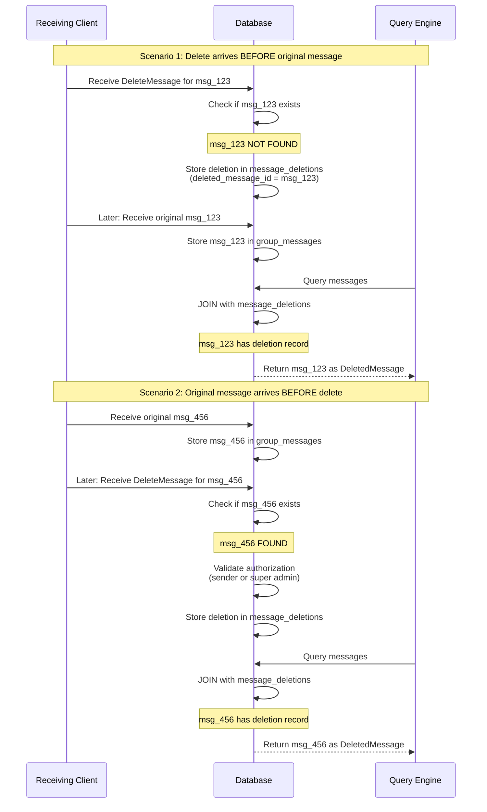

## Abstract

This proposal specifies a best-effort mechanism for deleting messages in XMTP group conversations. It enables original message senders and super admins to request deletion of messages, with proper authorization checks and query-time message filtering to present deleted messages to users.

## Motivation

Users need the ability to delete messages they accidentally sent or to remove harmful, inappropriate, or policy-violating content from group conversations. In group chat moderation scenarios, super admins require the authority to delete any member's message to maintain community standards. This feature enhances user experience and provides essential moderation capabilities for group administrators.

## Specification

### Delete message content type

A new app-level content type `DeleteMessage` will be introduced:

```protobuf
message DeleteMessage {
  // The ID of the message to be deleted
  string message_id = 1;
}
```

Content type identifier:

- Authority ID: `xmtp.org`
- Type ID: `deleteMessage`
- Version: `1.0`

### Authorization rules

A `DeleteMessage` can be sent by:

1. **Original sender**: The inbox that sent the original message
2. **Super admin**: Any super admin of the group chat

Any other inbox attempting to send a `DeleteMessage` MUST receive an authorization error.

### Message deletion workflow

#### 1. Send a delete message

When a user or super admin initiates a delete:

```rust
// Validates authorization and sends delete message
// Returns error if:
// - message_id doesn't exist in the group (MessageNotFound)
// - sender is not the original message sender AND not a super admin (NotAuthorizedToDelete)
// - message is a transcript/membership change message (CannotDeleteTranscriptMessage)
conversation.delete_message(message_id).await?;
```

The SDK:

1. Validates the message exists in the group
2. Checks authorization (original sender OR super admin)
3. Creates and sends a `DeleteMessage` with the target `message_id`
4. Locally marks the message as deleted in the database

#### 2. Receive a delete message

When a client receives a `DeleteMessage`:

1. **Attempt to locate the original message** by `message_id`
   - If found: Proceed with validation
   - If NOT found: Still store the deletion (see "Handle out-of-order delivery" below)

2. **Validate the delete request:**
   - If original message exists AND sender's `inbox_id` matches original message's `sender_inbox_id`: Mark as deleted by sender
   - Else if sender is a super admin at the time of deletion: Mark as deleted by super admin
   - Otherwise: Ignore the delete message (invalid authorization)

3. **Store the deletion in `message_deletions` table:**
   - The `DeleteMessage` itself is stored in `group_messages` (like any other message)
   - Create a record in `message_deletions`:
     - `id`: The `message_id` of the `DeleteMessage` itself
     - `deleted_message_id`: The target message to be deleted
     - `deleted_by_inbox_id`: Who sent the `DeleteMessage`
     - `is_super_admin_deletion`: Whether they were a super admin
     - `deleted_at_ns`: When the deletion was processed

4. **Handle out-of-order delivery:**
   - If the original message hasn't arrived yet, the deletion record is still stored
   - When the original message eventually arrives, queries will automatically filter it
   - This prevents race conditions in decentralized message delivery

#### 3. Database schema

Add a new table to track deletions:

```sql
-- Deletions table
-- The id is the message_id of the DeleteMessage itself (from group_messages table)
-- The deleted_message_id references the original message being deleted
CREATE TABLE message_deletions (
  -- Primary key: the ID of the DeleteMessage in the group_messages table
  id BLOB PRIMARY KEY,
  -- Group this deletion belongs to
  group_id BLOB NOT NULL,
  -- The ID of the original message being deleted
  deleted_message_id BLOB NOT NULL,
  -- The inbox_id of who sent the delete message
  deleted_by_inbox_id TEXT NOT NULL,
  -- Whether the deleter was a super admin at deletion time
  is_super_admin_deletion BOOLEAN NOT NULL,
  -- Timestamp when the deletion was processed
  deleted_at_ns BIGINT NOT NULL,
  -- Foreign key to the DeleteMessage in group_messages
  FOREIGN KEY (id) REFERENCES group_messages(id),
  -- Note: We don't use a foreign key for deleted_message_id because:
  -- In a decentralized network, the DeleteMessage might arrive before the original message.
  -- This allows us to store the deletion intent even if the target message hasn't arrived yet.
  UNIQUE(deleted_message_id, id)
);

CREATE INDEX idx_message_deletions_deleted_message_id ON message_deletions(deleted_message_id);
CREATE INDEX idx_message_deletions_group_id ON message_deletions(group_id);
```

### Handle out-of-order message delivery

Since XMTP is a decentralized network, messages may arrive in different order. The implementation MUST handle these scenarios:

1. **Delete arrives before original message:**
   - Store the deletion in `message_deletions` table with the `deleted_message_id`
   - When the original message arrives later:
     - Check if a deletion exists for its `message_id`
     - If found, immediately mark it as deleted in queries
     - The original message is stored normally in `group_messages` but will be filtered at query time

2. **Original message arrives before delete:**
   - Standard flow: original message exists, deletion is applied when DeleteMessage arrives

3. **Multiple deletes for the same message:**
   - The `UNIQUE(deleted_message_id, id)` constraint allows multiple delete attempts
   - Only the first valid deletion (by sender or super admin) should be honored
   - Subsequent deletes from unauthorized users are ignored

### Query-time filtering

#### Message queries

When querying messages (e.g., `conversation.messages()`), the SDK MUST:

1. Check if each message has an associated valid deletion
2. Replace deleted messages with a placeholder:
   - If `deleted_by_inbox_id` matches `sender_inbox_id`: Return `DeletedMessage(deletedBy: "sender")`
   - If `deleted_by_super_admin` is true: Return `DeletedMessage(deletedBy: "superAdmin")`
3. NEVER return the `DeleteMessage` itself in message lists
4. NEVER return the original message content if deleted

Example message structure:

```rust
// Extended MessageBody enum to include DeletedMessage variant
#[derive(Debug, Clone)]
pub enum MessageBody {
    Text(Text),
    Reply(Reply),
    Reaction(ReactionV2),
    Attachment(Attachment),
    RemoteAttachment(RemoteAttachment),
    MultiRemoteAttachment(MultiRemoteAttachment),
    TransactionReference(TransactionReference),
    GroupUpdated(GroupUpdated),
    ReadReceipt(ReadReceipt),
    WalletSendCalls(WalletSendCalls),
    Custom(EncodedContent),
    // New variant for deleted messages
    DeletedMessage { deleted_by: DeletedBy },
}

#[derive(Debug, Clone, PartialEq, Eq)]
pub enum DeletedBy {
    Sender,
    SuperAdmin(String), // inbox_id of the super admin who deleted the message
}
```

#### Conversation list

The `ConversationListItem` MUST handle deleted messages:

1. If the last message is deleted:
   - Show placeholder: `DeletedMessage(deletedBy: ...)`
   - Preserve the message timestamp and count
2. Future iteration: Find the most recent non-deleted message to display

#### Pagination considerations

When paginating messages, the SDK MUST:

1. Load deletion records for the entire group (or a sufficiently large window)
2. Apply deletion filtering to ALL messages in the paginated result
3. Ensure deletions that occurred after the pagination window are still applied
4. This may require loading deletion metadata separately from message content

### Restrictions

#### Non-deletable messages

The following message types CANNOT be deleted:

- **Group update messages** (`GroupUpdated` content type)
- **Membership change messages** (transcript messages)
- Any message where `kind == GroupMessageKind::MembershipChange`

Attempting to delete these messages MUST return an error: `CannotDeleteTranscriptMessage`

### Error types

New error types:

```rust
#[derive(Debug, Error)]
pub enum DeleteMessageError {
    #[error("Message not found: {0}")]
    MessageNotFound(String),
    #[error("Not authorized to delete this message")]
    NotAuthorizedToDelete,
    #[error("Cannot delete transcript/membership change messages")]
    CannotDeleteTranscriptMessage,
    #[error("Message already deleted")]
    MessageAlreadyDeleted,
}
```

### API examples

```rust
// Delete a message (sender or super admin)
match conversation.delete_message(message_id).await {
    Ok(_) => {
        // Message deletion initiated successfully
    }
    Err(DeleteMessageError::NotAuthorizedToDelete) => {
        // Handle authorization error
    }
    Err(DeleteMessageError::CannotDeleteTranscriptMessage) => {
        // Handle transcript message error
    }
    Err(e) => {
        // Handle other errors
    }
}

// Query messages (deletions applied automatically)
let messages = conversation.find_messages(None).await?;
for message in messages {
    match message.content {
        MessageBody::Text(text) => display_message(&text.content),
        MessageBody::DeletedMessage { deleted_by } => {
            match deleted_by {
                DeletedBy::Sender => show_placeholder("Message deleted"),
                DeletedBy::SuperAdmin(admin_inbox_id) => {
                    show_placeholder(&format!("Message deleted by admin: {}", admin_inbox_id))
                }
            }
        }
        _ => {
            // Handle other message types
        }
    }
}

// Conversation list with deleted last message
let conversations = client.conversations().list(None).await?;
for item in conversations {
    if let Some(last_message) = item.last_message {
        if matches!(last_message.content, MessageBody::DeletedMessage { .. }) {
            show_preview("Message deleted");
        }
    }
}
```

## Future iterations

### V2: Message retraction

A future version will support message retraction where:

- The `DeleteMessage` is kept in `group_messages` and `message_deletions` tables (same as V1)
- The original message's encrypted content is retracted (removed) from the database
- Message metadata is preserved (message ID, sender `inbox_id`, sender `installation_id`, timestamp, etc.)
- The message remains visible in queries but the body is permanently removed
- A background worker process will retract messages that arrived before the deletion
- For messages that arrive after a `DeleteMessage`, they are retracted immediately upon arrival
- This provides stronger deletion semantics while maintaining audit trail and message continuity

### Admin permissions

Currently, only super admins can delete any message. Future versions will:

- Introduce a `DELETE_MESSAGES` permission
- Allow super admins to grant this permission to regular admins
- Enable role-based message moderation

### Smart conversation previews

Enhance conversation list to:

- Traverse backwards to find the last non-deleted message
- Display the most recent visible message as preview
- Update counts to exclude deleted messages

### Bulk deletion

Enable deletion of multiple messages:

- Batch delete by message ID array
- Delete by time range
- Delete by sender

## Backward compatibility

Clients that do not support the `DeleteMessage` content type:

- Will see the delete message as an unknown content type
- Will NOT have their local messages deleted
- Will continue to display the original message content

This is expected behavior as deletion is a best-effort mechanism that requires client cooperation.

## Security considerations

### Not a security feature

> [!IMPORTANT]
> Message deletion is NOT a security or privacy feature.

Users MUST be informed that:

1. **No guarantee of deletion**: Once a message is delivered and decrypted by a recipient, there is no technical guarantee that it will be deleted from their device.

2. **Custom clients**: Recipients using custom or malicious clients may:
   - Ignore `DeleteMessage` requests entirely
   - Cache message content before deletion
   - Export or backup messages externally

3. **Message history**: Recipients may have:
   - Taken screenshots before deletion
   - Copied message content
   - Forwarded messages to other conversations

4. **Network retention**: The original message remains on XMTP network nodes until expiration (currently 6 months) and is not deleted by this mechanism.

### Original message preservation

The deletion mechanism does NOT remove the original message from:

- Local databases (the encrypted message bytes remain)
- Network nodes
- Backup systems

It only affects the presentation layer, replacing content with a placeholder in queries.

### Authorization validation

Super admin status MUST be validated at the time of deletion, not at query time:

- When receiving a `DeleteMessage`, check if sender has super admin privileges
- Store the `deleted_by_super_admin` flag based on this real-time check
- This prevents privilege escalation if admin status is later revoked

### Audit trail

Implementations SHOULD maintain audit logs of deletions:

- Who deleted the message
- When it was deleted
- Whether it was a super admin deletion
- Original message metadata (sender, timestamp)

## Privacy considerations

Users should be informed through UI/UX that:

- Deleted messages show a placeholder indicating deletion
- The sender or super admin who deleted the message may be visible
- Deletion does not guarantee removal from all recipients
- Message metadata remains accessible

## Implementation notes

### Enrichment layer

The message enrichment process (similar to reactions and replies in `enrichment.rs`) should:

1. Load deletion records for the queried message set
2. Apply deletion filtering during the enrichment phase
3. Replace message content with `DeletedMessage` placeholders
4. Maintain consistent behavior across all query paths

### Message processing flow

The following diagram illustrates how delete messages are processed, including out-of-order delivery scenarios:



### Database indexes

Indexes are already defined in the schema above:

```sql
CREATE INDEX idx_message_deletions_deleted_message_id ON message_deletions(deleted_message_id);
CREATE INDEX idx_message_deletions_group_id ON message_deletions(group_id);
```

These indexes enable efficient:

- Lookup of deletions when querying messages
- Checking if an incoming message has a pending deletion
- Group-wide deletion queries for pagination

## Test cases

Tests MUST cover:

- Original sender can delete their own message
- Super admin can delete any message
- Regular members cannot delete others' messages
- Transcript messages cannot be deleted
- Deleted messages appear as placeholders in queries
- Pagination correctly applies deletions
- Conversation list handles deleted last message
- **Out-of-order delivery scenarios:**
  - `DeleteMessage` arrives before the original message
  - Original message arrives after `DeleteMessage` (must still appear deleted)
  - Multiple `DeleteMessage`s for the same original message
  - `DeleteMessage` references a message that never arrives (orphaned deletion)

## Copyright

Copyright and related rights waived via [CC0](https://creativecommons.org/publicdomain/zero/1.0/).
